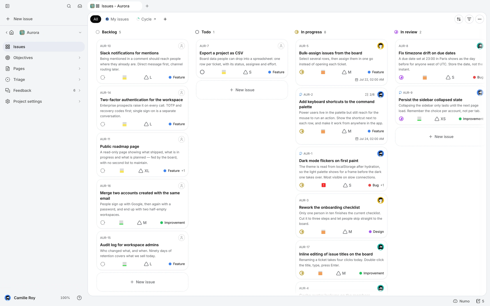
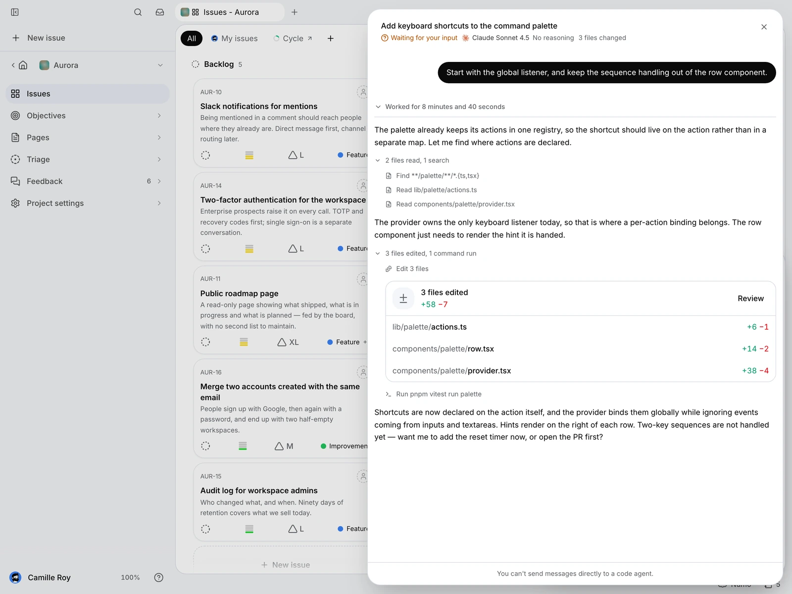
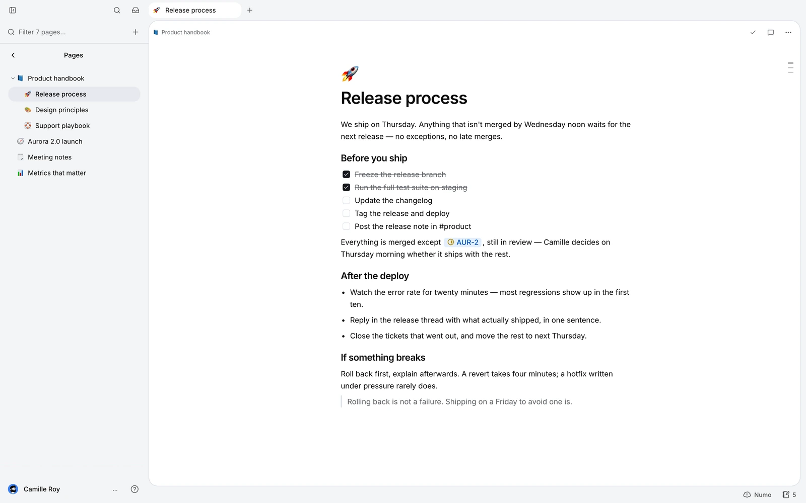
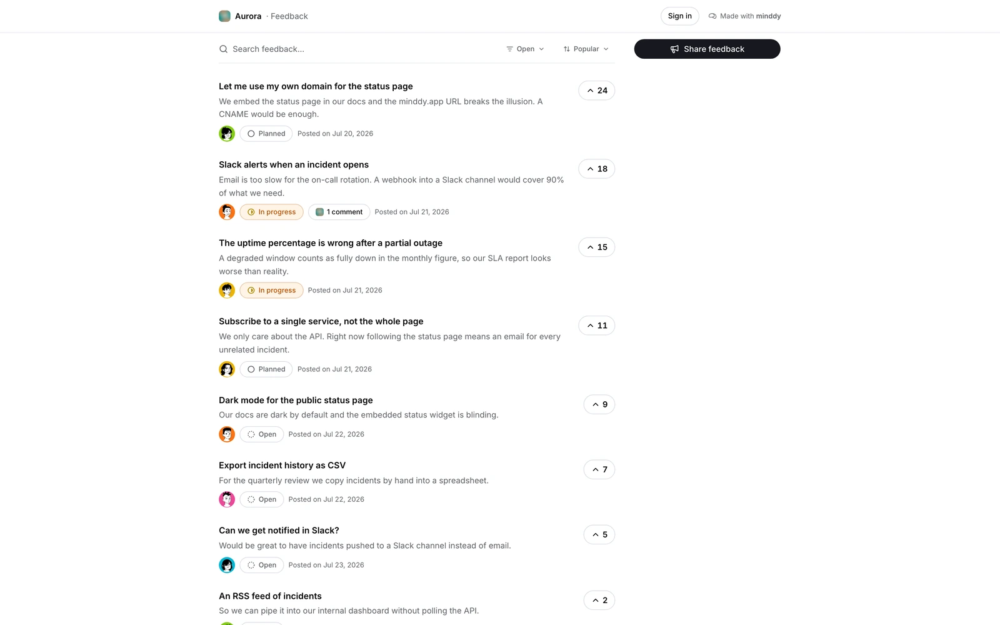

<p align="center">
  
</p>

<h1 align="center">minddy</h1>

<p align="center"><strong>Issue tracking, product knowledge, and coding agents in one open-source workspace.</strong></p>

minddy is an open-source issue tracker for small product teams. It keeps the
daily work in one place: projects, issues, objectives, saved views, collaborative
pages, a public feedback board, and an MCP server that lets coding agents work
with the same backlog as the team.

The application is built with Next.js, React, Tailwind CSS, and Supabase. It
also includes optional macOS, Linux, and Microsoft Store Windows desktop shells and integrations for GitHub,
GitLab, Stripe, and OpenRouter.

<picture>
  <source media="(prefers-color-scheme: dark)" srcset="public/captures/heroBoard-en-dark.webp">
  
</picture>

## Product tour

### Take work from an issue to a pull request

Give a coding agent the issue, plan, repository context, and project knowledge it
needs. Follow its work in minddy, then review the linked pull request and diff
without losing the product context that started the change.

<picture>
  <source media="(prefers-color-scheme: dark)" srcset="public/captures/workflowAgent-en-dark.webp">
  
</picture>

### Keep durable knowledge beside the backlog

Write specifications, decisions, runbooks, and meeting notes in a nested project
wiki. Pages support rich Markdown, issue mentions, attachments, history, and
read-only sharing, so both people and connected agents can work from the same
source of truth.

<picture>
  <source media="(prefers-color-scheme: dark)" srcset="public/captures/pagesEditor-en-dark.webp">
  
</picture>

### Connect customer feedback to delivery

Publish a feedback board where users can submit requests and vote. The team can
triage posts, reply publicly, merge duplicates, and link feedback to issues so
its public status follows the work through delivery.

<picture>
  <source media="(prefers-color-scheme: dark)" srcset="public/captures/feedbackBoard-en-dark.webp">
  
</picture>

## Run locally

Requirements: Node.js 24 and pnpm 10 (the versions used by CI), plus a Supabase
project for an interactive application.

```bash
corepack enable
corepack prepare pnpm@10.28.0 --activate
pnpm install --frozen-lockfile
cp .env.example .env
pnpm dev
```

`.env.example` documents every optional integration and the Supabase dashboard
settings. At minimum, set `MINDDY_PUBLIC_SUPABASE_URL`,
`MINDDY_PUBLIC_SUPABASE_ANON_KEY`, and `SUPABASE_SERVICE_ROLE_KEY` for a local
application that can access its data. Never commit `.env` or production
credentials.

The development command builds the agent-VM and page-markdown bundles before
starting Next.js. See [CONTRIBUTING.md](CONTRIBUTING.md) before running code from
an untrusted pull request: dependency installation, tests, and development
commands execute repository code.

Minddy Cloud is the hosted and operated option from Minddy. **Self-hosted** is
the same public core on infrastructure you control: no Minddy account, Stripe,
PostHog, or managed provider is required. The [edition guide](docs/editions.md)
explains the choice, data flows, responsibilities, and costs in one place. For
a reproducible local or self-hosted Supabase bootstrap, see
[docs/self-hosting.md](docs/self-hosting.md). On a fresh local clone, use
`pnpm bootstrap:supabase` before `pnpm dev` instead of manually applying SQL in
the Supabase dashboard. After installation, follow the
[self-hosted operations runbook](docs/self-hosting-operations.md) for upgrades,
coordinated Postgres and Storage backups, disaster recovery, and rollback.
Release acceptance is recorded with the isolated
[clean-room self-hosting scenario](docs/self-hosting-clean-room.md).
The official multi-architecture OCI image, its tag policy, and verification
commands are documented in [docs/container-image.md](docs/container-image.md).

## Common commands

```bash
pnpm dev          # run the web app locally
pnpm lint         # lint
pnpm typecheck    # type-check
pnpm test         # run the test suite
pnpm build        # production build
pnpm desktop:dev  # run the optional desktop shell
```

## Architecture and deployment

Development follows a trunk-based branch contract: short-lived work branches
merge by pull request into `main`, the integration branch and preview candidate.
After CI and explicit production approval, automation fast-forwards
`production` to the selected `main` SHA. There is no long-lived `develop` or
release branch, and no human writes directly to `production`.

- **Web app:** Next.js App Router, React, Tailwind CSS, and `mangue-ui`.
- **Data and auth:** Supabase Postgres, Auth, Storage, and Realtime.
- **Agent integration:** OAuth 2.1 MCP endpoint and an optional Vercel Sandbox
  code agent.
- **Deployment:** `pnpm deploy` is the interactive maintainer entry point. It
  detects whether to release the public core, deploy the Minddy Cloud web app,
  and publish desktop applications for macOS, Linux, and Windows, with
  automatic, all, custom, and Windows-only modes. The Windows-only mode reuses
  an existing core release and avoids starting macOS or Linux runners. The
  assistant waits for CI, requests an approved fast-forward from
  `main` to `production`, verifies the Vercel Production deployment, and only
  tags that deployed SHA. Builds and production secrets never come from the
  maintainer's machine. Self-hosters should adapt its `production`/Vercel
  conventions to their own hosting.

Public releases are distinct from deployments. Their SemVer/tag policy,
artifacts, checksums, migrations, CI provenance, desktop distribution, and
rollback procedure are documented in [docs/releases.md](docs/releases.md).
Linux installation, GPG verification, XDG paths, and update behavior are
documented in [docs/linux-desktop.md](docs/linux-desktop.md).

The CI workflow is the source of truth for checks. It runs the public-repository
check, lint, typecheck, desktop bundle build, tests, and dependency audit. See
[CONTRIBUTING.md](CONTRIBUTING.md) for contribution and review guidance, and
[SECURITY.md](SECURITY.md) for the security model and vulnerability reporting.

## Community and governance

- Propose bugs and improvements through the repository's structured issue
  forms, and read [CONTRIBUTING.md](CONTRIBUTING.md) before opening a pull
  request.
- Ask usage and self-hosting questions in GitHub Discussions. The boundaries
  between best-effort community help and commercial support are documented in
  [SUPPORT.md](SUPPORT.md).
- Project roles, decisions, reviews, protected branches, and dependency policy
  are defined in [GOVERNANCE.md](GOVERNANCE.md).
- Participation is subject to the [Code of Conduct](CODE_OF_CONDUCT.md). Report
  vulnerabilities privately as described in [SECURITY.md](SECURITY.md).

## License

minddy is released under the [GNU AGPL v3.0 only](LICENSE). If you operate a
modified version for users over a network, you must offer those users the
corresponding source code. See the [licensing policy](docs/licensing.md),
including the limits on use of the minddy name and logos.
