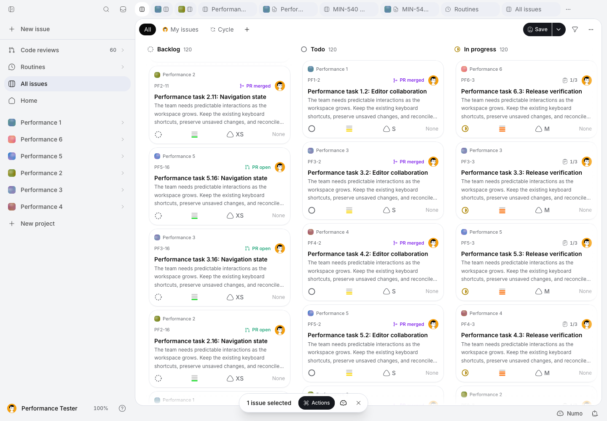

# MIN-614, pass 2: retained boards and tab activation

Measured on October 2, 2026. This pass improves retained-board navigation; it
does not close MIN-614 or establish coverage of the complete desktop application.
The full ordinary samples, requests, errors, diagnostic experiment results and
functional checks are in [the evidence file](desktop-perf-min-614-pass-2-results.json).

## Baseline and dependency

The baseline includes **all** first-pass changes at
`66886c54c1b37521f64f98ddc52643fa752fbacf`. [PR #342](https://github.com/mangue-dev/minddy/pull/342)
was still open during measurement. The initial pass-2 branch
`codex/min-614-retained-board-performance` started from that commit and was
submitted as dependent PR #343.

After measurement, the user requested one cumulative PR for MIN-614. Both
original pass-2 commits (`e08051839177e66b69b251c2cc871884367b091c` and
`1d3fb577cd5e5d338a3a619e0d75f8e8590647b1`) were integrated by fast-forward
into `codex/min-614-encryption-performance`, preserving the first-pass commit
and all measured source SHAs. PR #342 is now the cumulative delivery; PR #343
is superseded. Subsequent passes reuse #342 and its existing branch, while
retaining separate audits and evidence files. This consolidation changes no
product code or measurement results.

The historical 1,108–1,151 ms board-return medians are context, not new
measurements. This audit establishes its own active-view baseline.

The measured candidate is `e08051839177e66b69b251c2cc871884367b091c`. Later commits
contain measurement metadata, verifier corrections, evidence and this audit;
they do not change the compiled product fix. Baseline instrumentation changes
were present in the working tree, with the baseline product build unchanged.
Build IDs and each runner's source SHA/dirty flag are retained in the evidence.
The original baseline build ID is `EnUbFSBvNcNXWF2sXhPCW`; the reference rebuild
is `iFjHzrUK1P-WzB9IJVyVU`; all three candidate launches use
`q-MIA1GdgUiRLsuMX_0qY`. The harness's optional `MINDDY_PERF_BUILD_SHA` declares
the served product SHA independently of its own checkout SHA. The reference
rebuild's product tree was checked against the baseline; the restored candidate's
four changed product files were verified by SHA-256 and its original build reused.

## Runtime, dataset and readiness

Production Next builds run on localhost:3111 against the same configured remote
Supabase, with encryption enabled and no network or CPU throttling. The machine
is a Mac16,8 ARM64 with 24 GiB RAM, macOS 27.0 (26A428), Node 24.11.1. Native
measurements use unpackaged Electron 43.7.5 / Chromium 150.0.7871.250, the real
preload bridge, a 1280 × 860 CSS-pixel window and the account's dark theme.
LaunchServices starts a new temporary profile for each launch; only that profile
is removed. No installed account profile is copied. This is native production
web code in Electron, not verification of a shipped, signed release package.

The existing migrated MIN-540 fixture contains six projects, 600 issues, 120
Pages of 80 blocks, 1,200 issue comments, 480 page comments and 180 stored PRs.
`run-min614-repositories.mjs` validates the account marker and project identifiers
through authorized repositories. No legacy plaintext seed is applied. There are
no connected forge credentials or populated live agent/feedback workloads.

Each ordinary series uses three fresh Electron launches and ten warm repetitions
per launch for each of seven return variants. A global board has 600 cards, its
filtered state 480, and the project board 100. Timing starts before the real tab
click or Escape dismissal. Completion requires the target pathname, the target
tab's `aria-selected=true`, exactly one visible, non-inert active retained root,
the expected card count, no open visible blocking dialog, and two animation
frames. Hidden duplicate cards cannot finish a measurement. For hidden updates,
the active root must also contain the exact new fixture issue title.

After readiness, a real click opens the active board's Filters menu; its visible
Hide done issues item and two frames establish the separate input-probe duration.
Escape closes the menu. This is an automation input-response measurement, not
field INP or a guarantee that every background operation has completed. Scrolled
returns assert the exact per-column offsets (180 px where content permits it).
Filtered returns assert 480 cards. Hidden updates use the real authenticated
issue PATCH while a Page is active, wait 700 ms for realtime propagation, require
the new title on return, and restore the original title through the same API.
The temporary pinned project tab is removed in `finally`; existing tabs remain.

The existing desktop trace flag, CDP script/style/layout counters and server
timings remain enabled. Long tasks and frame stalls above 50 ms are recorded.
Counters include the input probe and a 350 ms observation tail; readiness excludes
both. Counters overlap and must not be added together. Cross-document PR
navigation resets CDP counters, so its deltas are omitted. CPU profiles and
compiled/CSS experiments use separate launches with one repetition per variant;
their readiness timings are never pooled with ordinary results. Builds, tests,
repository probes and functional UI runners do not run concurrently with the
ordinary series.

## Results

Each row pools 30 observations per implementation (ten in each of three fresh
launches). Required baseline files are `pass2-before-2`, `pass2-before-3-complete`
and `pass2-before-4`; candidates are `pass2-after-1` through `pass2-after-3`.
The last reference is rebuilt from the original product source after the three
candidate launches, checking drift with the current instrumentation. The early
complete `pass2-before-1` is supplemental because it predates individual
long-task/frame and request-duration capture. It remains in the evidence.
All medians use the mean of the two middle observations for an even sample count.

| Return scenario | Before ready ms | After ready ms | Reduction | Input probe before → after ms |
| --- | ---: | ---: | ---: | ---: |
| Close issue → global board | 201 | 198 | Essentially unchanged | 84 → 90 |
| Page editor → global board | 1,217 | 682 | 44% | 217 → 152 |
| Global → project board | 529 | 399 | 25% | 173 → 172 |
| Project → global board | 972 | 701 | 28% | 229 → 210 |
| Page → scrolled global board | 1,371 | 786 | 43% | 230 → 173 |
| Page → filtered global board | 1,066 | 544 | 49% | 208 → 148 |
| Page → board with a hidden update | 897 | 650 | 28% | 224 → 238 |

Page-return launch medians are 1,178 / 1,264 / 1,228 ms before and
661 / 664 / 726 ms after. Global-board return medians are 910 / 976 / 1,026 ms
before and 709 / 895 / 570 ms after; this case has greater variability.
Scrolled medians are 1,293 / 1,372 / 1,441 ms before and 803 / 802 / 669 ms after.
Filtered medians are 1,053 / 1,146 / 1,068 ms before and 590 / 589 / 444 ms after.
The input probe does **not** improve in every case: hidden-update input increases
by 14 ms, project input is unchanged, and issue-dismissal input increases by 6 ms.
The separately timed ready + input phases still shorten from approximately
1,121 to 888 ms for hidden updates; that sum excludes the instrumentation gap
between phases and is not a separate INP measurement.

| Return scenario | Median script ms before → after | Median style ms before → after | Median long-task total ms before → after | Median worst frame ms before → after |
| --- | ---: | ---: | ---: | ---: |
| Page → global | 1,345 → 497 | 142 → 144 | 588 → 371 | 608 → 400 |
| Global → project | 700 → 594 | 62 → 61 | 281 → 228 | 208 → 158 |
| Project → global | 1,049 → 579 | 135 → 134 | 627 → 449 | 592 → 425 |
| Scrolled return | 1,480 → 612 | 147 → 146 | 671 → 430 | 696 → 453 |
| Filtered return | 1,250 → 422 | 118 → 117 | 559 → 323 | 525 → 342 |
| Hidden-update return | 1,041 → 453 | 137 → 144 | 509 → 420 | 483 → 433 |

The major reduction is script work; layout medians remain around 41–42 ms on the
600-card returns and style remains around 135–147 ms. Several-hundred-millisecond
stalls remain. Total observed long-task counts for Page/global return are 41 → 30;
scrolled returns are 32 → 33 despite shorter task durations. Do not equate lower
median latency with removal of all frame stalls. The evidence contains every
ordinary task/frame sample, per-launch medians, observed ranges, response lists
and request status/duration/failure records. The 4,960 ms hidden-update baseline
outlier and 6,776 ms candidate cold-board observation are retained. All six
required ordinary launches have zero renderer `pageerror` exceptions. They still
record PR detail HTTP 500s where those requests finish; aborts during navigation
are recorded separately. Whole-server upstream operation counts are labeled as
including preparation/diagnostics rather than misrepresented as per-return reads.

## Attribution and retained fix

Profiling started at `AppTabViewHost`, `KanbanBoard`, `restoreBoardScroll` and
retained effects. The 600-card scenario actually renders `GlobalKanbanBoard`.
`Activity` reconnects effects and callback refs when a board becomes visible;
React reconciliation, Radix trigger/provider work, style/layout and GC remain
substantial. A baseline Page-return CPU capture attributes approximately 145 ms
to the style/layout flush triggered by `restoreBoardScroll` reading `scrollLeft`,
and approximately 80 ms to GC. These are profiler observations, not ordinary
end-to-end timings. The scroll helper's first-pass early return still avoids
repeat content-dimension reads; a necessary offset read can nevertheless force
style/layout after visibility changes.

Next's public `useRouter` reads both AppRouterContext and the changing
LayoutRouterContext to provide its contextual bfcache ID. Before this pass,
each card subscribed from `IssueCardContent`, `IssueCardBody` and
`useIssueMenuActions`, replaying expensive interactive content despite stable
navigation actions. On a 600-card board, these are 1,800 router subscriptions.

The fix reads the public router once per status column and passes `router.push`
as a stable `onNavigate` prop. `IssueCardContent` uses that action for PR and
objective destinations. `IssueCardBody` receives an optional objective callback,
so the public read-only card body needs no router subscription.
`useIssueMenuActionsWithNavigation` builds the same actions without subscribing
each card; the existing `useIssueMenuActions` wrapper still supplies Next routing
for the issue panel. No private Next context is imported or frozen. Menus,
current/new-tab PR navigation, objectives and browser fallback remain supported.

`AppTabViewHost`, React Activity suspension, the two-board LRU, scroll helpers,
repositories, query policies and subscriptions are unchanged. Authentication,
project/user isolation, AES, key registry checks, revocation and rotation are
unchanged. No plaintext cache is introduced. These gains are attributable to
renderer navigation work, not to removing encrypted reads.

Rejected experiments are retained in the evidence:

- Card `content-visibility` / intrinsic-size containment worsened several returns
  and input probes, including approximately 445 ms scrolled input. It was removed.
- Keeping Activity permanently visible in a temporary compiled-bundle experiment
  did not improve returns. The bundle was restored before ordinary measurements;
  the source still suspends hidden effects and portals.
- An initial context diagnostic compared inherited Intl values with a different
  root consumer. That comparison was invalid for cause attribution. The
  catalog-only candidate did not improve returns; its source/test changes were
  removed. The final product change contains no translation-catalog cache.

## First-pass checks and remote costs

The first-pass CSS presence marker, OneLine size observation, scroll early return,
operation-local repository decoder and immutable version-one blind-index
verification remain present. The agent activity store keeps stable issue-scoped
snapshots; assistant actions remain separate from changing panel state. A slow
board return is not evidence that these optimizations disappeared.

Warm authorized repository rounds 1–3, excluding initial round 0:

| Operation | Before ms | After ms | Upstream calls before → after |
| --- | ---: | ---: | ---: |
| Six visible repositories | 143.4 | 185.9 | 7 → 7 |
| 51 stored PRs with linked issues | 378.8 | 444.3 | 11 → 11 |
| Open/draft PR count | 148.9 | 162.3 | 7 → 7 |
| Six repository sync states | 293.1 | 255.8 | 13 → 13 |
| Authorized 600-issue read | 446.1 | 463.7 | 1 → 1 |
| Warm-key 600-issue decode | 16.7 | 18.3 | 0 → 0 |
| Warm-key 20-Page decode | 3.7 | 4.0 | 0 → 0 |
| Ten in-memory issue writes | 603.1 | 559.3 | 10 → 10 current-key checks |

The first-pass deterministic call reduction survives; no additional server gain
is claimed here. Repeated native issue opening is 338 → 360 ms (30 samples),
with median style 132.5 → 133.6 ms and script 54.0 → 54.3 ms. The large first-pass
style reduction remains, but the 22 ms readiness increase is reported rather
than called an improvement. Stored PR-list API readiness is 862 → 859 ms (nine
samples per implementation); visible PR-list navigation is 1,672 → 1,662 ms
(three per implementation). Supplemental cold-board readiness is 2,264 → 2,416 ms
(three first-card observations, weaker than the main active-return predicate),
including the candidate startup outlier. Startup needs the later common-shell pass.
Repository codec timing separates warm AES and registry calls from complete
authorized remote reads; the renderer improvement does not justify eliminating
writer rotation checks or authorization. PR list timing varies with remote
transport despite the deterministic first-pass repository-call reduction.

## PostHog and failures

Read-only inspection used the PostHog MCP for Minddy EU project 231975 over
September 29–October 2 UTC, including internal/test accounts. No error status,
capture setting or suppression was changed. Relevant existing groups include
[forge identity lookup](https://eu.posthog.com/project/231975/error_tracking/01a0f3ec-a470-7f90-b7cb-3f35a808cb84)
(22 occurrences),
[key-version lookup](https://eu.posthog.com/project/231975/error_tracking/01a0f44a-a694-7651-8dbc-42c0de4a5e3e)
(19), and
[current-key lookup](https://eu.posthog.com/project/231975/error_tracking/01a0f3d2-20d2-7a83-b4c1-cbf44254c294)
(17). The schema-cache PR-link group and a Cloudflare 522 group remain relevant
to the broader issue. Missing route/release dimensions prevent correlating these
server failures with a specific production board-return version.

A repeated check of
[missing GitHub installation ID](https://eu.posthog.com/project/231975/error_tracking/01a0fd86-47a5-7e12-a8a3-3af4a78bf1ac)
reported 126 occurrences, first seen at 16:50 and last seen at 18:34 UTC. Its
breakdown contains only posthog-node 5.54.0, without path, application release or
session IDs. Its reported user count is not evidence of 126 affected customers.
The fixture has no forge installation; local PR detail/comment/commit/review
requests return 500. Time alignment is compatible with the benchmark but does
not prove event-level correlation. Stored PR-list readiness remains measurable;
successful connected-forge detail/diff coverage is explicitly absent.

A reference launch failed before UI measurement on a local-snapshot API 503.
Another fresh launch collected issue and Page samples before an 8.6-second Page
read and other 503s prevented the editor becoming ready. Those samples and errors
are preserved separately rather than treated as completed ten-return series.
Early harness attempts exposed inactive-tab restoration, updated menu roles,
overflow-hidden temporary tabs and access to storage on `about:blank`; the
encrypted snapshot setup, scoped readiness and current menu selectors correct
these measurement problems. One early complete baseline retains its cleanup-only
storage error. It is not a timed board-return error. Functional verifier failures
from obsolete Sort/close-button selectors are retained alongside the passing
run. No application exception or failed HTTP response is suppressed to improve
the reported latency.

## Reproduction and verification

Use the configured encryption-enabled environment and existing marked fixture;
keep credentials/root keys out of logs and commits. Run no legacy seed.

```sh
MINDDY_PERF_LABEL=pass2-repositories-baseline node scripts/performance/run-min614-repositories.mjs
npm run build
NODE_OPTIONS='--max-http-header-size=32768 --import=./scripts/performance/server-timing.mjs' \
  MINDDY_PERF_SERVER_LOG=output/playwright/performance/pass2-upstream.jsonl \
  npm run start -- -p 3111
# In a separate terminal; serialize all UI runners.
MINDDY_PERF_BUILD_SHA=66886c54c1b37521f64f98ddc52643fa752fbacf MINDDY_PERF_LABEL=pass2-before-2 \
  node scripts/performance/measure-min614.mjs --electron --retained-returns
# Repeat with a different label in three fresh launches, then rebuild candidate
# and repeat identically as pass2-after-1, pass2-after-2 and pass2-after-3.
MINDDY_PERF_LABEL=pass2-profile-clean \
  node scripts/performance/measure-min614.mjs --electron --retained-returns --profile
MINDDY_PERF_LABEL=pass2-retained-final node scripts/performance/verify-retained.mjs
npm run lint
npm run typecheck
npm run check:owned-english
npm run check:encrypted-access
npm run check:encryption-schema
git diff --check
```

Run the updated harness from this branch. For a separately built baseline
checkout, set `MINDDY_PERF_REFERENCE_ROOT` to that checkout so its build ID is read,
and set `MINDDY_PERF_BASE_URL` to that server's local origin. For the candidate,
declare `MINDDY_PERF_BUILD_SHA=e08051839177e66b69b251c2cc871884367b091c` with the
after labels. This flag records provenance; it does not independently verify
that arbitrary served code matches the declared SHA.

The correctness runner is supplemental Playwright Chromium coverage, not native
latency evidence. It confirms retained DOM identity, selection and filters,
scroll restoration, issue panel dismissal, active-only shortcuts with duplicate
issue IDs, a real optimistic drag followed by persisted confirmation and reversal,
rapid roundtrips, the two-view bound, LRU eviction and closing a hidden pinned tab
through its context menu. Original issue fields and all existing tabs are checked
after cleanup. Native ordinary runs independently assert scrolled/filtered returns,
hidden-title freshness and actual menu input response.

Validation: 136 focused tests across 19 files, production build, TypeScript,
lint, owned-English prose, encrypted-column access policy, encryption-schema
inventory and `git diff --check`. Tests include navigation actions and browser
fallback, public card projection, retained scroll/Activity, board drag geometry,
panel isolation, card animation, and encryption access guards, registry, rotation,
store and row codec. Final audit and verifier changes are checked again. No
Mangue-ui package, patch, lockfile, migration or excluded encryption boundary is
changed in this pass. Commits carry matching DCO author sign-offs.

The focused Vitest command covers `issue-menu-actions`, `issue-card-prompt-relations`,
`public-board-projection`, `board-dnd-dom`, `use-retained-board-scroll`,
`retained-app-views`, `global-board-render`, `board-scroll`, `use-board-card-animations`,
`app-tabs-context`, `app-top-bar`, `desktop-drag-band`, `one-line`,
`server/git/repository-name-content`, and encryption `access-guard`, `registry`,
`rotation`, `store`, `row-codec` tests under `lib/`. Run them with `npx vitest run`
and their `.test.ts` paths. The late browser correctness run additionally checks
that focus never remains in a hidden board. The archived candidate build and
source copies were moved outside TypeScript's input set after a temporary
baseline-rebuild setup failed typechecking; candidate source hashes and its
original build were verified on restoration.



## Cumulative coverage and next passes

Measured does not mean improved, fully covered or verified on a shipped release.

| Area | Measured / improved / reverified | Remaining coverage |
| --- | --- | --- |
| Encryption and repository identity | Pass 1 measured and improved PR identity reads; pass 2 rechecks call counts, access and rotation tests | Production transport/key errors, migration state, cold and interrupted rotations |
| Boards and retained tabs | Pass 2 measures issue dismissal, Page return, both board directions, scroll, filters and hidden updates; improves route-return renderer work | Large multi-project combinations, cycle/saved-view variants, prolonged backgrounding, release package |
| Issues | Native opening and dismissal reverified; selection and drag/write reversal checked | Loaded details, activity, comments, relations, attachments, optimistic failures, deletion/restore, offline/reconnect |
| Pages | Fixture Page editor reached repeatedly before returns; pass 1 encrypted read checked | Lists, rich editor/blocks, databases, views, saves/autosave, concurrent edits, import/export, public/print/share |
| Forge and PRs | Stored list and authorized identities measured/reverified | Connected-account details, diffs, review/comments/checks, linking, sync and errors |
| Feedback | Pass 1 repository probe only | Loaded internal and public boards, comments/votes, SSO, reads/writes |
| Agents / Numo | Stable activity and assistant actions inspected; pass 1 repository probe only | Active streams, sessions/history, composer/mentions/uploads, VM persistence and recovery |
| Common desktop shell | First-pass style optimization reverified; tab retention/navigation checked | Startup/auth/MFA, home, search/palette, inbox/notifications, shortcuts, scratchpad, background/network recovery |
| Project planning | Main project board measured | Objectives, cycles, triage, routines, statistics, smart sorting and bulk actions |
| Account/project administration | Route inventory completed; no latency claim | Settings, membership/invitations, integrations, billing, admin, trash, permissions/revocation UX |
| Integrated application | No closure claim | Representative loaded-account journeys, interaction stalls and signed release package after authorized deployment |

The route inventory shows that the original nine-pass roadmap omits explicit
planning and administration workloads. Split out objectives/cycles/triage/routines/
statistics and account/project administration rather than hiding these under a
generic final check. Public/shared/print views belong to their domain passes.
There is no fixed pass count that closes MIN-614.

Next: the issue-details/activity/comments/relations/mutations pass, including
overlay dismissal and keyboard/focus behavior on a loaded retained board. Keep
remaining Activity reconnection, style/layout and GC stalls on the board backlog;
this pass reduces navigation cost but does not establish smooth interaction.
Connected-forge, loaded feedback and active-agent work require representative
authorized workloads. MIN-614 remains in progress; no deployment, merge or
`work:done` is performed by this pass.
