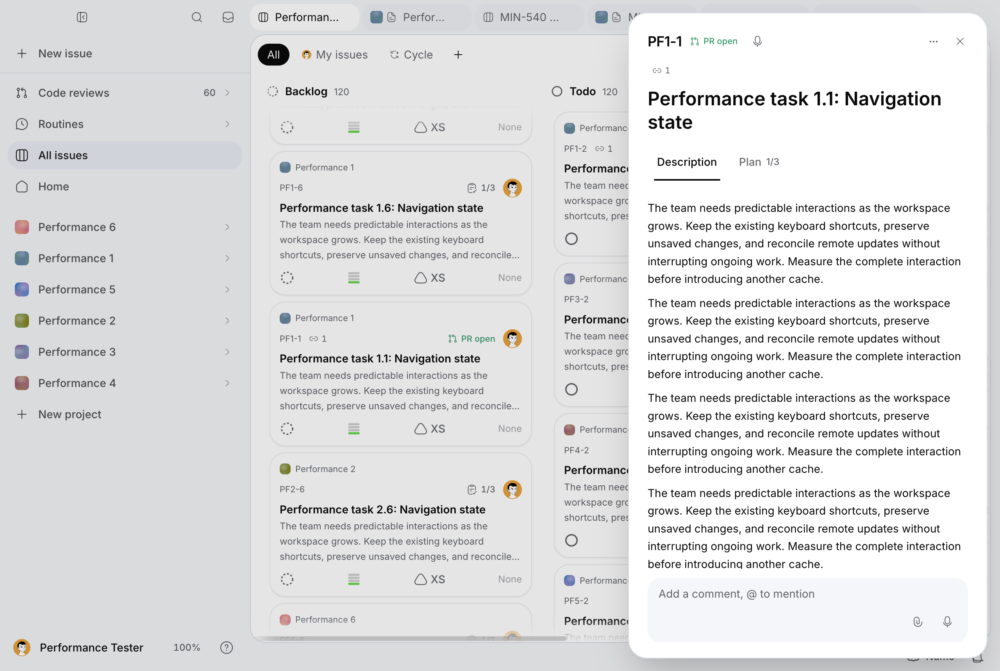
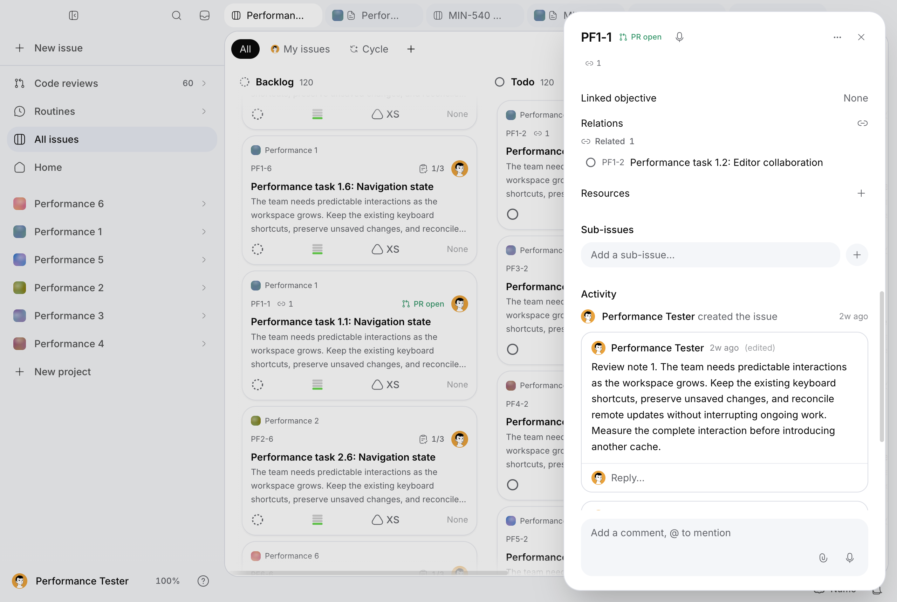

# MIN-614, pass 3: loaded issue details and mutations

Measured on October 2, 2026. This is a partial delivery of the issue workload,
with explicit remaining coverage; MIN-614 remains in progress. All ordinary
samples, request timings, long tasks, frame stalls, failed calibration runs,
diagnostic summaries and repository probes are in
[the evidence file](desktop-perf-min-614-pass-3-results.json).

## Exact cumulative baseline

The baseline is `7099e970d4c009b8591cfd7d10112a28f882068d`, verified against local
HEAD, `origin/codex/min-614-encryption-performance` and open
[PR #342](https://github.com/mangue-dev/minddy/pull/342) before changes. It contains
both previous passes, including their separate audits and original measured
commits. The working tree was initially clean and remote references were
refreshed. This pass uses that same branch and PR. No earlier audit or evidence
file is rewritten. The PR has no automatic issue-closing references.

The baseline production build was rebuilt at that exact HEAD before modifying
product code; build ID `eKj8MI5NLaFpLumYTeF9W`. Its running production server
served that compiled build while instrumentation and candidate
sources were edited. Optional `MINDDY_PERF_BUILD_SHA` declares served provenance
independently of runner HEAD/dirty state. It does not verify an arbitrary server.
For the strengthened full-content readiness check, the baseline was rebuilt
again with build ID `2W3L5f055xnpxI3AbbMAG`. The four changed product files were
temporarily restored from `7099e970`, byte-checked against it, then restored to
the candidate. Candidate-only tests were preserved outside TypeScript's input
while rebuilding the reference; a setup build initially failed because those
new tests referenced APIs absent from the old product. The corrected reference
build succeeded. No baseline product edit is committed.

The candidate product SHA is `71428008c11375ef0559c34c3019761ad17663f7`, build ID
`sKPIW-DCFDzULd3escXB9`. Its original compiled build is archived outside the
repository's TypeScript input and restored without rebuilding. SHA-256 hashes
of all four product files prove both reference selection and candidate source
restoration. Subsequent commits `f165cba98`, `e35ed9c8b`, `161c02bf0` and `b49100b92` change benchmark
readiness, failure records and cleanup only; they do not change the compiled product. Runner SHA/dirty state and the
declared served SHA are retained separately. Final labels appear in the results.

## Runtime, dataset and measurement boundary

The machine is Mac16,8 ARM64, 24 GiB RAM, macOS 27.0 (26A428), Node 24.11.1.
Production Next runs on localhost:3111 against the configured remote Supabase,
with encryption enabled, no CPU/network throttling and ordinary network
variability retained. Native measurements use the actual unpackaged Electron
43.7.5 shell, Chromium 150.0.7871.250, real preload bridge, a 1280 × 860 CSS-pixel
window and the fixture account's dark theme. LaunchServices starts a new
temporary profile for each launch. This verifies native Electron with production
web code, not a signed release artifact or a deployed production release.

The existing migrated MIN-540 fixture contains six projects, 600 issues, 120
Pages with 80 blocks each, 1,200 issue comments, 480 page comments and 180 stored
PRs. The authenticated fixture marker, account and project IDs are checked.
Content reads and mutations use authorized repositories or authenticated routes.
The old plaintext seed is never reapplied. The imported `seed.mjs` supplies
deterministic identifiers and fixture constants only.

The primary loaded issue has a 1,038-byte description, two original comments,
a stored PR affordance and more than 230 audit events accumulated by earlier
synthetic runs. Events are initially grouped/collapsed; expansion asserts the
rendered event count. A related fixture issue supports switching. A third issue
receives temporary effort, comment and hidden-title mutations, keeping most
measured activity stable. Temporary relations add normal audit events; activity
counts per launch are retained. Third-issue history grows as real writes occur.
Cleanup restores original titles, effort, comment membership and relations;
it does not erase legitimate audit history through unapproved table writes.

Three fresh native launches per implementation each provide ten warm repetitions
of every primary scenario. Cold issue opening has one observation per launch,
after the loaded board is ready; it is renderer-cold, not an empty server key
cache. Scrolled and related targets are primed outside warm timings. The filtered
board contains 480 cards; the complete board contains 600. Heavy CPU profiles
and trace captures use separate launches and never enter ordinary medians.
Builds, tests, repository probes and other UI runners are sequential with the
ordinary series. Static code inspection and audit writing do not exercise the
application during timings.

Issue readiness requires exactly one visible, non-inert panel, the selected
board tab, expected title, the entire visible description text and original
comment bodies (with whitespace normalized), confirmed original comment
rows, Activity and Resources sections, and completed successful requests for
comments, events, agent state, automation, feedback and resources. Readiness
then waits two animation frames. A hidden panel, incomplete description/comments
or stale title cannot finish it. Activity expansion additionally checks all
events. Board readiness checks the target pathname/tab, exactly one visible,
non-inert active retained root, expected card count and no blocking dialog.
Hidden updates require the exact changed title in both board and reopened issue.

The separate input probe opens the real Issue actions menu, checks visibility,
waits two frames and dismisses it. It is an automated interaction response,
not field INP. Effort/comment optimistic display and persisted confirmation
have separate clocks. Comment edit readiness waits for successful PATCH body,
editor removal and updated rendered text; a draft cannot finish that measurement.
Authenticated GETs verify persisted values and exact comment identity.

Existing desktop trace instrumentation is enabled with `minddy.trace=1`.
CDP script/style/layout counters, long tasks and frame stalls over 50 ms, ordinary
API timings and the existing server upstream observer are reused. Counter deltas
include the input probe and a 350 ms observation tail; readiness excludes both.
Counters overlap and must not be summed. API metadata contains operation paths,
statuses and durations, never bodies, cookies, credentials or content keys.
Browser request `at` is the observer notification time, while duration comes
from protocol timing; adding them is not an exact completion timestamp because
a busy renderer can delay event delivery. Primary opening samples additionally
assert a newly observed successful automation request during their opening
window; the in-page fetch state checks its pending count and response status.
Verification requests have their own channel, attempt, duration and status in
the evidence. The complete upstream JSONL logs are retained losslessly as gzip
artifacts under `docs/audits/assets`; the results contain their byte sizes and
SHA-256 hashes. Decompress with `gzip -dc` to filter by each sample timestamp.
They include diagnostic/setup traffic and must not be summed as ordinary requests. Transient verification reads get at most three attempts, each
bounded to 15 seconds with a 500 ms pause; those retries occur outside readiness
and mutation-confirmation clocks. Normal measured writes get no automatic
replay. Cleanup attempts every tracked restoration independently and verifies
the original state afterward. Failed calibration cleanup needed one guarded
manual restoration of the marked fixture's effort and temporary relation; it
used only authenticated APIs. Detailed transport headers are excluded from
error records; only diagnostic headlines and safe operation metadata survive.

## Failed runs and measurement validity

Primary baseline labels are `pass3-before-9`, `pass3-before-10` and
`pass3-before-12`. Earlier complete runs are retained as calibration, because
the description checker originally accepted a prefix and some primed targets
had only nine warm repetitions. They are excluded from the final comparison.
The full-content predicate is identical across both primary implementations.
Later comment-UUID tracking strengthens cleanup outside the measured clocks;
request `variant` metadata also does not change readiness or product behavior.

Transport errors affect both implementations. Baseline attempts include 503
comment/issue reads, a delayed comment POST ending 500, and incomplete cleanup
verification; the metadata and samples survive in supplemental records. Candidate
`pass3-after-2` contains 96 measurements before a comment PATCH takes 32.4 s and
ends 500, alongside 503 automation/local-snapshot/verification requests. Its
cleanup confirms original fixture membership. Failed runs are not successful
primary launches, but their error rates and outliers remain visible in evidence.
No write is silently retried to produce a favorable latency.

`pass3-after-4` reaches 125 samples, including an 8.85 s successful comment edit
and an 8.28 s hidden-issue activation, before further reads fail. Cleanup PATCH
and relation DELETE each exhaust three 503 attempts. A guarded authenticated
recovery restores the original third-issue title/effort, verifies its exact two
original comment IDs and deletes only the recognized synthetic related edge
(with normalized endpoint order). Ten recovery requests, including one failed
attempt, are retained separately. Failed recovery setup assertions are also
retained. `pass3-after-5` was interrupted before mutation scenarios to stop a
replacement launched before that recovery verification; its 71 emitted samples
survive, but its global browser request inventory is incomplete. This launch is
explicitly excluded and is not presented as complete evidence. The upstream
observer log still includes its requests. The collector now preserves both the
original journey error and cleanup error if they occur together.

A CPU diagnostic before the change also failed while waiting for the UI to
remove a deleted comment. The persisted operation and UI readiness are separate
observations; the exact cause of that stale display is not established here and
is not claimed fixed. The supplemental baseline correctness harness initially
used the wrong retry label and later attempted a tab-strip click blocked by the
modal. Those failures are retained as harness/unsupported-action evidence;
the supported rollback/retry/resource/child checks are recorded individually.

The collector now stores only error headlines and safe operation metadata.
One earlier verification timeout exposed Playwright transport headers in local
console output; saved evidence and retained failure text were sanitized. Raw
server/application console logs are excluded from committed evidence. This is
a capture hardening change, not a claimed runtime performance improvement.

`pass3-after-6` fails after 87 samples when comment edit returns 503. Its
journey/cleanup failures and all nine failed cleanup attempts are separately
recorded. A second scoped recovery restores the same fixture invariants in ten
successful requests. The observed 503 intervals match failed
`rest/v1/rpc/auth_authorization_state` fetches at the existing 8 s deadline;
`getAuthedUser` returns 503 when that live-session lookup fails. This establishes
the failed authorization operation, not the underlying transport/database cause.
The check remains intact. Before `pass3-after-7`, the local candidate server is
restarted with the same compiled build; provenance records that condition.
Renderer-cold issue timing still follows authorized fixture preparation and a
loaded board. No production service is restarted or configured differently.

## Inventory of the actual issue surface

`IssueSidePanel` contains title editing, the deferred markdown Description
editor, a separate Plan/checklist tab, status/priority/effort/assignee/category/
due-date/recurrence/objective properties, parent navigation and child creation.
`IssueTimeline` combines audit events and comments, with compose, editing,
deletion, delivery/retry controls, reactions and comment resources. Relations
mix issue and objective targets, support blocking/blocked-by/related directions,
and include linked feedback. Resources support uploaded files, resolved links
and internal Pages at both issue and comment scope. The header exposes agent
state, a real stored PR link and dictation; menus include prompt/agent/cycle
actions. Chain controls include start/resume/stop when applicable.

The fixture exercises only a subset of these real features. Loaded descriptions,
original comments, activity and stored PR state appear in primary runs; real
new comments/property writes and related navigation are exercised repeatedly.
Native supplemental tests populate a Page resource and child and inject explicit
write failures. They do not fabricate an active automation/agent, connected
forge, objective hierarchy or uploaded file. The modal blocks pointer clicks
on tabs behind it; the failed attempt to test that action is retained rather
than forcing a hidden click. Retained issue-specific tabs and native window
suspension need a separate supported navigation/background scenario.

## Ordinary before/after results

The primary comparison uses baseline `pass3-before-9/10/12` and candidate
`pass3-after-1/3/7`: 396 observations per implementation, including three initial
board loads, three complete cold issue openings and 30 samples in each of 13
warm scenarios. There are also 30 persisted property confirmations and 30
persisted comment confirmations per implementation. All six launches have
successful cleanup, no runner errors, no HTTP statuses of 400 or higher and no
failed verification attempts. Browser cancellations remain recorded separately. The evidence generator checks these sample counts and
153 fresh status requests observed during issue openings per implementation.

Values are milliseconds. Medians average the two middle observations; warm p95
uses nearest rank over 30 samples. Three cold observations do not support a
stable tail estimate. The evidence retains per-launch medians, every outlier,
request/error metadata, long-task samples and frame stalls.

| Scenario | Before median | After median | Before / after p95 | Interpretation |
| --- | ---: | ---: | ---: | --- |
| Complete cold issue | 655.7 | 673.3 | Three samples only | No cold improvement |
| Complete warm issue | 387.3 | 318.1 | 571.4 / 406.9 | 17.9% faster availability |
| Open from scrolled board | 384.4 | 295.5 | 3,472.8 / 362.3 | 23.1% lower median; baseline has large transport outliers |
| Open from filtered board | 389.6 | 276.6 | 432.0 / 319.7 | 29.0% faster availability |
| Related issue switching | 88.1 | 88.8 | 101.2 / 99.5 | Revalidated; no gain |
| Retained board return from Page | 727.9 | 681.2 | 964.8 / 851.3 | Previous gain holds; pass-3 attribution not established |
| Reopen issue after retained return | 393.7 | 351.2 | 555.6 / 867.8 | 10.8% lower median; tail gets worse |
| Expand full activity | 126.4 | 128.2 | 208.1 / 196.2 | Revalidated; no gain |
| Dismiss issue to board | 200.7 | 198.6 | 210.3 / 211.2 | Revalidated; no gain |
| Effort optimistic display | 315.6 | 315.3 | 327.9 / 325.5 | Includes opening/selecting the property menu |
| New comment optimistic display | 64.6 | 64.2 | 132.3 / 73.6 | Revalidated; no median gain |
| Persisted comment edit | 750.0 | 792.9 | 1,291.7 / 3,115.9 | No gain; network/server tail remains |
| Activate board after hidden update | 817.7 | 805.6 | 1,108.0 / 884.2 | No attributed gain |
| Open updated hidden issue | 942.1 | 930.3 | 4,174.3 / 1,257.8 | No attributed median gain; history/network drift remains |

Warm opening per-launch medians are **400.4 / 417.7 / 369.1** before and
**330.2 / 317.7 / 318.2** after. Filtered opening is **382.1 / 415.3 / 363.3**
before and **281.6 / 272.2 / 276.6** after. Scrolled opening is
**378.3 / 924.9 / 370.7** before and **321.1 / 295.9 / 288.8** after.
Retained reopen is **396.5 / 439.7 / 384.6** before and
**349.8 / 351.8 / 350.0** after. Every candidate launch's median is below every
baseline launch's median for these four opening variants. Large tail reductions
are descriptive, not proof that the change fixes remote transport.

Persisted effort confirmation is **475.6 → 481.6 ms** and comment confirmation
is **524.1 → 529.6 ms**. These independent clocks wait for the write response and
verify persisted identity/value; they are not merged with optimistic display.
The primary candidate's largest successful comment edit is **5,703.5 ms**.
The 8.85 s edit belongs to the failed supplemental launch and remains retained.

The menu input probe is **119.9 → 121.9 ms** after ordinary warm opening and
**100.8 → 133.6 ms** after filtered opening; retained reopen is
**131.5 → 139.4 ms**. It includes menu opening, two frames and dismissal, not
just the first visible response. No input-latency improvement is claimed;
the filtered-probe increase needs isolation rather than an invented cause.
Warm opening still has **30 / 30 long tasks**, median total **176.0 / 176.5 ms**,
and **32 / 30 frame stalls**. Retained reopen has **30 / 31 long tasks** and
**37 / 42 stalls**. Style medians remain **143.9 / 144.0 ms** for warm opening
and **152.9 / 153.3 ms** for retained reopening. Hidden-board activation still
has median maximum-frame stalls of **429.0 / 429.2 ms**. Faster availability
therefore does not imply a smooth or cheaper renderer.

Across the primary launches, all browser/preparation/verification request records
number **2,852 before / 2,843 after**; **225 / 228** are explicitly verification
requests. These whole-launch totals include untimed setup/restoration and must
not be presented as a causal request reduction. There are **62 / 66**
`net::ERR_ABORTED` records for board/view/app-tab/project-list reads during
navigation and teardown, and **three / three** still-unsettled records at capture
end. They are preserved, not relabeled as successful requests. No automation
request is canceled in the primary runs, and none of the required detail API
states can be pending or non-200 when readiness completes. Total recorded long
tasks are **291 / 294**; the change does not reduce that renderer burden.

The first issue's audit history grows from **248/250/254** events in the primary
baseline launches to **256/260/266** in the candidate launches as related edges
are created/restored. Its description and original comments remain identical.
The third issue's real mutation history also grows. That drift limits causal
claims about activity/hidden-update costs; no history is erased to improve them.
The remote database/network is shared and phase order is sequential, not a
randomized field experiment. Initial board loading is **2,354 → 2,823 ms**
(with a 6,271 ms candidate outlier) and is not an attributed pass-3 improvement.

## Attribution and retained change

Opening traces follow `GlobalIssuePanel`, project data hooks, `IssueSidePanel`,
the description editor, `IssueTimeline`, `RelationsSection`, resources and
`ChainStatusBar`, then their authenticated API/repository reads. React mounting
and modal style work remain visible; the first-pass stylesheet fix is present.
The automation request is repeated even on a warm opening because its query
deliberately refetches on mount for fresh chain state.

Before this change, the status bar consumes only `chain`, while GET automation
also reads encrypted issue simulation inputs and project configuration,
categories, the owner's preset metadata, simulates rules and potentially
estimates launch cost. The retained change adds `?view=chain` to that same route
and uses it only for the status bar. It reads issue metadata through caller RLS
before looking up the latest chain, and returns the existing public projection.
The default route retains full simulation/estimation for its consumers.

Targets: `app/api/issues/[id]/automation/route.ts:GET`,
`lib/agent-api.ts:fetchIssueChainStatusApi`,
`lib/use-agent-runs.ts:issueChainStatusQueryKey/useIssueChainStatusQuery`,
and `components/automations/chain-status-bar.tsx:ChainStatusBar`.
The new query is under the existing chain prefix, preserving realtime and
resume/start/stop invalidation, and still uses `refetchOnMount: "always"`.
Related switching can reuse an already-fresh query within the mounted panel;
it is not a claim that every issue-ID change performs a new database read.
There is no persistent plaintext cache, removed permission check, key-registry
change, writer current-key cache, or disabled feature.

The upstream observer records authorization RPC, database/repository and
envelope-key reads. It does not observe every service-auth owner lookup; its
counts describe the monitored subset, not every upstream HTTP operation. CDP distinguishes renderer script, style/layout and GC in
heavy profiles. Network request durations include server execution and transport;
they are not an AES CPU estimate. Warm authorized repository decode probes
separately measure issue/Page crypto with warm keys. No entire opening delay is
attributed to encryption or React alone. Production CPU frames are minified;
they are not converted into unsupported per-component duration claims. Script
counters include automated readiness DOM queries and the input probe as well
as app work. Separate cold diagnostics sample about **34 / 60 ms** of GC CPU
before/after and largest `UpdateLayoutTree` events of **129 / 131 ms**; these
captures retain profiling overhead and differing histories, and do not establish
a GC or style gain. Those largest style events visit 28,100 / 28,099 elements.

### Controlled server attribution

A sequential probe against the candidate production server alternates the
unchanged full route and the new `view=chain` route, with one warm-up pair then
30 pairs. It is outside native measurements and heavy captures, with no writes
or other benchmark client active. Both variants succeed 30/30 times and return
their expected contracts. Median end-to-end reads are **262.4 → 196.6 ms**
(25.1% lower); p95 is **301.5 → 219.6 ms**. Every warm full read has **five**
monitored REST operations; every chain read has **three** (40% fewer).

Both paths retain `auth_authorization_state`, caller-RLS issue visibility and
latest `agent_chains` lookup. The dedicated path omits `projects` and
`issue_categories`, the unmonitored service-auth owner lookup, simulation-input
issue/project decode and rule/estimate computation. The fixture has automation
disabled and no active chain, so it does not measure an active estimate or
resume/stop interaction. Cold key misses are not represented by this warmed
control. All 62 samples and their operation-level records remain in the results.
The measured approximately 66 ms server saving supports the warm opening change;
it does not establish a fix for transport errors, GC or input response.

## Revalidation and functional checks

A separate fresh native `pass3-retained-after` launch repeats ten observations
of every pass-2 variant: issue dismissal **197.4 ms**, Page return **668.8 ms**,
project-to-global return **630.9 ms**, global-to-project **374.0 ms**, scrolled
return **660.9 ms**, filtered return **485.8 ms** and hidden-update return
**593.5 ms**. There are 85 observations including initial load, ten issue opens,
three actual stored-PR API reads and one PR-page load; no runner errors occur.
It is supplemental revalidation, not a new three-launch paired claim for all
pass-2 variants. The primary pass-3 series independently has 30 Page returns and
30 dismissals per implementation. Compared with historical pass-2 medians
(682/701/786/544/650 ms for Page/project-global/scrolled/filtered/hidden returns),
these show that the earlier gains still hold under this fixture; they do not
attribute further return improvement to the chain-read change.

The warm authorized repository probes retain pass-1 monitored REST counts:
visible repositories **7 → 7**, PR list **11 → 11**, PR count **7 → 7**, sync
**13 → 13**. Historical pre-pass-1 PR-list count was 111. Warm issue decode of
600 rows is **13.6 → 15.9 ms** and Page decode of 20 rows **3.1 → 3.8 ms**, both
with zero monitored REST requests in those decode windows. Authorized 600-row
issue read is **453.3 → 526.6 ms**; ten in-memory encodes are
**618.7 → 576.7 ms**, each retaining ten writer-key reads and persisting no row.
These are three warm probe repetitions plus a cold/preparation run, not native
UI measurements or proof of a crypto gain. The production server's normal
per-row audit remains enabled; only this existing standalone probe suppresses
its console-info audit during diagnosis.

Pass-1 issue style work remains around **144 ms**, versus the historical
**785 → 138 ms** result. The old first-pass readiness metric was dialog-oriented;
this pass waits for complete content and fresh detail API state. Its 673 ms
cold availability must not be compared directly with the old dialog-only time.
No historical stylesheet or encrypted-read fix is removed.

Native issue correctness checks before/after revalidate MIN-630 without editing
its implementation: a held real relation POST shows the optimistic edge before
persistence, canonical ID reconciliation survives reload, deletion persists and
injected failure rolls it back. Effort write failure restores the visible and
persisted value. A failed comment remains retryable; retry uses its original UUID,
persists exactly once and preserves a newer unsent draft. A populated internal
Page resource resolves to its actual href and a child opens with correct content;
focus is never left inside a hidden/inert root. These are supplemental functional
checks, not repeated relation mutation latency benchmarks. Existing relation
unit coverage also checks objective endpoint kinds, parallel writes and absent
caches. MIN-630 work is preserved.

The separate production-browser retention checks pass active-root/inertness,
modal focus restoration and shortcuts, filter/selection retention, unchanged
column offsets, actual project-board drag persistence and reversal with a hidden
duplicate, rapid round trips, the two-board memory bound, LRU eviction and close
eviction. It is explicitly browser correctness coverage, with no native timing
claim. Saved checks and cleanup status are included in the evidence.

## PostHog inspection

Read-only MCP inspection of project 231975 (`minddy`) covered September 29 through
October 3, 2026. The default top-error query showed 155 missing GitHub installation
events and smaller upstream HTML and missing-key groups. Including internal/test
accounts showed identity errors in groups of 22 events/two users and eight
events/one user, and nine schema-cache errors for `pull_request_issues`.
These aggregate counts are different query populations and are not added.

Representative server events for
[key lookup](https://eu.posthog.com/project/231975/error_tracking/01a0f3d2-20d2-7a83-b4c1-cbf44254c294),
[repository identity](https://eu.posthog.com/project/231975/error_tracking/01a0f3ec-a470-7f90-b7cb-3f35a808cb84),
and [schema cache](https://eu.posthog.com/project/231975/error_tracking/01a0f801-26ee-7483-8f6e-973156e2c3a5)
were inspected with requested exception/navigation/release/stack dimensions.
They reported `posthog-node` 5.54.0 but no usable page URL, app release or session.
There is no established correlation to an issue-detail route or this measured
candidate. These errors remain investigation leads; none is marked fixed or
suppressed by this pass. No customer event payload or identifier is committed.

## Reproduction and verification

Use the already migrated marked fixture and existing benchmark tabs. Run from
this branch against an already built local production server, with environment
credentials loaded by existing helpers. Commands and final outcomes follow.

```sh
npm run build
NODE_OPTIONS='--max-http-header-size=32768 --import=./scripts/performance/server-timing.mjs' MINDDY_PERF_SERVER_LOG=output/playwright/performance/pass3-upstream-before.jsonl npm run start -- -p 3111
MINDDY_PERF_LABEL=pass3-before node scripts/performance/run-min614-repositories.mjs
MINDDY_PERF_BUILD_SHA=7099e970d4c009b8591cfd7d10112a28f882068d MINDDY_PERF_LABEL=pass3-before-9 node scripts/performance/measure-min614.mjs --electron --issue-journeys
MINDDY_PERF_LABEL=pass3-profile-before node scripts/performance/measure-min614.mjs --electron --issue-journeys --profile
MINDDY_PERF_LABEL=pass3-trace-before node scripts/performance/measure-min614.mjs --electron --issue-journeys --trace --inventory
MINDDY_PERF_BUILD_SHA=71428008c11375ef0559c34c3019761ad17663f7 MINDDY_PERF_LABEL=pass3-after-1 node scripts/performance/measure-min614.mjs --electron --issue-journeys
MINDDY_PERF_LABEL=pass3-correctness-after node scripts/performance/measure-min614.mjs --electron --issue-journeys --correctness
MINDDY_PERF_LABEL=pass3-retained-after node scripts/performance/measure-min614.mjs --electron --retained-returns
MINDDY_PERF_LABEL=pass3-retained-correctness node scripts/performance/verify-retained.mjs
MINDDY_PERF_LABEL=pass3-after node scripts/performance/run-min614-repositories.mjs
MINDDY_PERF_SERVER_LOG=output/playwright/performance/pass3-upstream-after.jsonl MINDDY_PERF_LABEL=pass3-chain-control-after node scripts/performance/min614-chain-read-probe.mjs
MINDDY_PERF_LABEL=pass3-profile-after node scripts/performance/measure-min614.mjs --electron --issue-journeys --profile
MINDDY_PERF_LABEL=pass3-trace-after node scripts/performance/measure-min614.mjs --electron --issue-journeys --trace --inventory
MINDDY_PERF_LABEL=pass3-correctness-final node scripts/performance/measure-min614.mjs --electron --issue-journeys --correctness
node scripts/performance/summarize-min614-pass3.mjs
npm run typecheck
npm run lint
npm run check:owned-english
npm run check:encrypted-access
npm run check:encryption-schema
git diff --check
```

Focused regression command (214 tests in 29 files, all passed):

```sh
npx vitest run lib/server/issue-chain-status-route.test.ts lib/issue-chain-status-query.test.ts lib/optimistic/relation-writes.test.ts lib/use-issue-relations-query.test.ts lib/optimistic/issue-writes.test.ts lib/optimistic/pending-writes.test.ts lib/optimistic/remote-echo-encrypted.test.ts lib/comment-delivery.test.ts lib/comment-cache.test.ts lib/server/comment-store.test.ts lib/server/comment-idempotency.test.ts lib/server/comment-idempotency-route.test.ts lib/server/comment-lifecycle.test.ts lib/server/issue-events-route.test.ts lib/server/issue-store.test.ts lib/realtime-keys.test.ts lib/retained-app-views.test.ts lib/issue-menu-actions.test.ts lib/use-retained-board-scroll.test.ts lib/public-board-projection.test.ts lib/server/git/repository-name-content.test.ts lib/server/encryption/access-guard.test.ts lib/server/encryption/registry.test.ts lib/server/encryption/rotation.test.ts lib/server/encryption/store.test.ts lib/server/encryption/row-codec.test.ts lib/use-issue-panel-tab.test.ts lib/issue-panel-relations.test.ts lib/global-board-render.test.ts
```

Production reference/candidate builds and typecheck passed. Final lint,
owned-English, encrypted-column access and encrypted-schema checks passed;
schema coverage is 203 tables, 1,798 classified columns, 173 encryption targets
and 1,781 consumer candidates. An initial final lint check flagged the collector's
throw inside cleanup `finally`; cleanup was factored into a named async function,
retaining both failure records, and lint passed. The failed lint output is
preserved with the successful verification outputs. The existing Node warning
about the module type of `oxlint.config.ts` remains; no dependency/configuration
change is made to silence it. Node syntax checks and `git diff --check` pass.
The product is unchanged after its 214-test run; later changes affect only
measurement capture and audit files.

Previous four audit/results files, dependencies/lockfiles, vendor patches,
migrations and Mangue-ui are unchanged against `7099e970`. All non-merge commits
in the cumulative branch have author-matching DCO trailers. The final delivery
commit and current PR head are recorded in the cumulative PR description and
MIN-614 outcome; a document cannot embed its own final commit hash.

Repeat native labels for three fresh launches and use the candidate SHA for after
runs. The evidence generator enforces ten observations of each warm scenario
and ten mutation confirmations per launch, successful cleanup and no runner
errors for every primary run. Heavy raw CPU/trace files stay in ignored local
output; their filenames, byte sizes, SHA-256 hashes and attribution summaries
are committed. The candidate CPU diagnostic also freezes the existing
`lib/desktop/trace.ts` ring through its dump shortcut after measurements,
intercepting only that write to keep the system clipboard intact; its 1,240
trace rows are retained in the supplemental result. That 90 s ring is not an
archive of every ordinary launch. Per-scenario long-task/frame records provide
the complete ordinary series. Ordinary samples, including outliers, are committed in full.

## Native screenshots

The following light-mode screenshots were taken after an ordinary native run,
outside its timed observations. Only marked synthetic fixture content is shown.





## Cumulative coverage and next work

Measured, improved, reverified and uncovered are separate states. No claim of
complete application coverage or smoothness follows from this partial issue pass.

| Journey | Pass 3 coverage | Remaining coverage |
| --- | --- | --- |
| Loaded issue open | Full cold/warm, filtered/scrolled, related switching and retained reopen measured | Saved views/cycles, prolonged backgrounding, signed package |
| Description and activity | Loaded description readiness and full expanded audit history measured | Description autosave, long rich documents, plan edits, very large history |
| Comments | Optimistic create, persisted confirmation, edit and deletion/restoration exercised | Large threads, concurrent edits, mentions/reactions, uploaded files, ambiguous/offline retries |
| Properties | Effort optimism, persisted confirmation, restoration and injected rollback | Every field, bulk mutations, deletion/trash restoration, cross-project moves |
| Relations | Related switching measured; MIN-630 optimistic implementation revalidated | Loaded objectives, inherited objective relations, large relation lists and undo/remove races |
| Resources and children | Empty sections loaded in primary runs; populated Page resource and child tested supplementally | Binary upload/download, previews, link resolution, large child trees |
| Stored PR integration | Real fixture PR affordance and encrypted repository/list paths rechecked | Authorized connected-forge detail/diff/review/checks/sync |
| Hidden updates/navigation | Fresh hidden remote titles, board activation, dismissal and column offsets measured | Offline/reconnect, revocation/rotation UI, multiple sessions, longer suspension |
| Previous deliveries | First-pass style and encrypted PR counts; second-pass return and tab behavior rechecked | Residual renderer/layout/GC stalls and application-wide acceptance |
| Other application areas | Earlier cumulative inventory preserved | Pages, loaded feedback, active agents/Numo, planning, shell, administration |

Next work should finish issue mutation/freshness gaps with loaded comments,
description/plan autosave, populated objectives and attachment workloads, and
interrupted/ambiguous writes before calling the issue area complete. Board
reconnection and modal style/layout stalls remain a separate renderer backlog.
Then prioritize the next domain from measured remaining cost rather than a fixed
number of passes. MIN-614 remains in progress. This pass does not merge, run
`work:done`, deploy or add an automatic closing reference.

## PR lifecycle and issue status

GitHub reports no closing-issue references for #342. Commit messages and this
PR's description use references, never automatic closing instructions. MIN-614
is checked as `in_progress` after the update. The PR remains open and is not
merged, closed or completed by this pass.

The application has its own lifecycle synchronization: `lib/pr-issue-status.ts`
maps merged PRs to `done`, independently of GitHub closing keywords;
`lib/server/agent/issue-status-sync.ts` applies that mapping on linked PR state
changes. Updating an open PR does not constitute a merge and cannot request
`done` through that mapping. There is no per-issue opt-out in the reviewed sync
API. A later merge of the cumulative PR must explicitly preserve/reopen MIN-614
while program acceptance remains incomplete; absence of GitHub closing keywords
is not a promise that the Minddy integration ignores a future merge.
