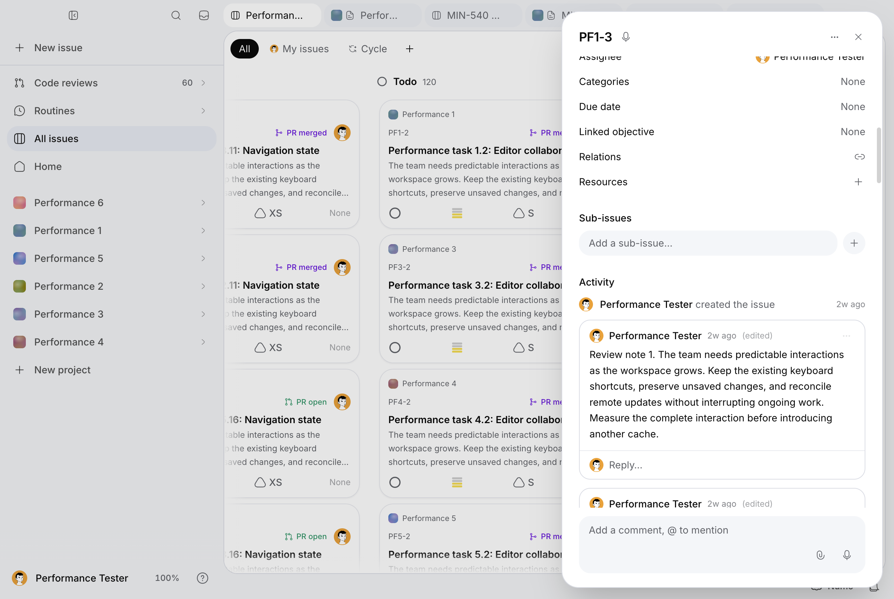

# MIN-614, pass 3b: loaded comments and mutation freshness

Measured on October 3, 2026. Creation acknowledgement improves from **462.2 to
412.2 ms**, persisted verification from **780.5 to 669.4 ms**, and exact visible
reconciliation from **1,100.1 to 885.2 ms**. Optimistic creation remains about
61 ms. Editing, deletion, properties, cold opening and frame stalls have no
established gain. A paired mounted remote-delete failure is corrected; slow
hidden-view reads still produce failed availability samples. MIN-614 remains
in progress.

Complete samples, failures, request records, mutation UUID journals, recovery,
commands/build logs and hashed compressed profiles/upstream evidence are in
[the distinct results file](desktop-perf-min-614-pass-3b-results.json).

## Baseline and scope

The clean local, origin and cumulative PR #342 HEAD was verified as
`b0f7f46e58e2cda575d207e558237fc041683e3b`, not assumed from the supplied SHA.
The PR is OPEN with no GitHub closing references and no auto-merge request.
All previous pass audits, results, compressed upstream logs and screenshots are
preserved. No new branch or PR, merge, work:done or deployment is authorized.

Read MIN-614, its complete plan and cumulative matrix, MIN-630 and its relation
implementation/review evidence through the Minddy MCP before modification.
The issue plan records this pass and its measured function targets.

Native production reference build: `Xf2qAxtlwDLcaCv7IiwzH`. Candidate product
commit: `b135cc3f22d1263bde321a7c373a60641139143c`; build:
`AHDP6i5_HKeY1jC6woUPN`. Subsequent harness/evidence changes do not change the
served product. The results retain actual checkout SHA/dirty state separately
from the declared served SHA, source hashes and build ID. The runner extends
measure-min614.mjs with min614-mutation-journeys.mjs and reuses the native launcher,
CDP counters, server-timing.mjs and desktop trace ring. Ordinary runs and heavy
profiles/failure injections are separate.

The existing marked MIN-540 account has six projects, 600 issues, 120 Pages of 80 blocks,
1,200 original issue comments, 480 Page comments and 180 stored PRs. Preparation
uses authenticated API routes backed by authorized encrypted repositories.
No plaintext seeding or installed profile copying is performed. Each new native
launch adds 24 scoped synthetic comments to an existing issue: 18 roots and six
replies, plus its two original roots, for 26 loaded comments. Every launch restores
original comment identities/content, title and effort. Issue audit history is
retained and its growth is recorded, never erased to improve latency.

Actual supported issue features include description and Plan editors with save
boundaries, property pickers, activity expansion, threaded comment create/edit/
delete/reply, mentions, reactions and uploaded/file/link/Page resources; relation,
objective and child navigation; automation/agent and forge affordances. Measuring
an empty section does not cover a populated or authenticated workload.

## Clocks and readiness

First visible response stops when the requested menu/editor/comment state is
visible. The existing availability clock adds two frames; the historical menu
probe still includes two frames and Escape closure. These are automation clocks,
not field INP. Locator polling and actionability can delay the observed state;
the acknowledgement-to-editor observation gap is not assigned to React. A DOM
frame/input-dispatch clock remains useful in the next pass. Server acknowledgement is recorded separately from an authenticated
persisted read and exact visible reconciliation. The persisted verification starts
after the runner's existing 350 ms observation tail: it is not a minimum database
commit latency. Script/style/layout counters include that tail and the legacy
probe; their durations overlap and must not be added.

Availability requires the selected board tab, one active visible non-inert view,
the correct issue title and full description, exact confirmed comment identities
and bodies with no duplicates, and successful completed required detail requests.
A hidden panel, old content or merely successful mutation HTTP status cannot
finish a scenario. Hidden changes are independently verified through APIs before
return/reopen. Reload recovery is outside timings and leaves the failed observation
in the results.

## Restoration and early diagnostics

UUIDs are captured at dispatch before acknowledgement, persisted into a scoped
journal, and inspected through the authorized comment list before cleanup.
Timed writes run once. A failed cleanup blocks the launcher before any subsequent
measurement or new profile; manual restoration must verify the initial state.
Scenario and cleanup failures remain separate.

Primary ordinary labels are `pass3b-before-2/4/5` and `pass3b-after-1/2/4`:
three fresh LaunchServices Electron profiles per implementation, ten attempted
warm repetitions in each of eleven main scenarios, 120 mutation-stage records
and 348 observations per implementation. Candidate after-2 contains one failed
hidden-comment attempt followed by successful untimed reload recovery. Its
success clock is null, the 5,278.1 ms failed duration and all frames/tasks/requests
remain, and the failure counts as **1/30**. Successful-readiness medians exclude
that null success clock, not its failure record. Baseline primary has 0/30 such
failures. Failed incomplete launches are supplemental, never relabeled successful.

The original `pass3b-before-1` calibration used only one filtered opening and no
scrolled block. It remains supplemental. `pass3b-before-3` stopped after its tenth
mutation cycle during hidden reopen and failed reload recovery; the browser comment GET has no recorded completion at the five-second bound. Do not attribute this
to deletion routing merely because the persisted API read was correct. The
isolated mounted DELETE in `pass3b-profile-before` instead retained the deleted
UUID visibly without the necessary refresh, while an authorized GET established
its absence. The paired `pass3b-profile-after` reconciles it successfully. Profiles
are heavy, single-repeat diagnostics, not ordinary latency evidence.

Candidate `pass3b-after-3` stops after five cycles in an untimed preparation
reopen. Required detail requests finish 200 but several take 5.0–5.3 seconds;
upstream successful issue/Page header observations reach 6.1/6.2 seconds. Its
47 observations, 20 mutation stages and screenshot remain. Neither this nor the
pending GET in after-2 establishes a network, transport or SQL cause. The pass-3 500/503 failures and eight-second auth_authorization_state timeout
remain unresolved; this pass changes neither that control nor its deadline.
No threshold
was raised, authorization timeout bypassed, timed write replayed or failure erased.

The first heavy diagnostic stopped after DELETE response-body observation stalled.
Its collected samples/profiles remain diagnostic evidence, not ordinary timings.
The acknowledgement clock does not need that response body. Scoped manual cleanup
initially received 404 for replies already deleted with their root; persistence
was re-read, all original membership/content/fields were verified, and only then
did the next launch start. No timed write was replayed. The interrupted diagnostic has no finalized
browser request JSON; its emitted observations, UUID journal, profiles and
upstream records survive. Missing early request details are not fabricated.

The first supplemental correctness run passed failure/draft/ambiguity/concurrency
and property checks, then incorrectly searched a related relation in the sent
endpoint order. The server correctly normalizes that tuple. Scenario and cleanup
both fail independently; all new launches stop. `restore-min614-mutations.mjs`
reads authorized persistence, finds the normalized tuple from its journaled request scope, resolves its
persisted identity, removes it and all owned comment rows, and verifies original relationships, child
parent, fields and exact original comment IDs/bodies. Both original error fields
remain beside `manualRestoration.verified = true`. The corrected fresh run matches
either normalized endpoint order and verifies complete cleanup. This is a probe
repair, not a MIN-630 product repair.

## PostHog investigation

Read-only MCP inspection of Minddy EU project 231975 covers September 29 through
October 3, including test/internal accounts. Top groups retain missing GitHub
installation ID (164 events), repository identity (22 and eight), key version
(19), current key (17 in the inspected group) and PR-link schema cache (nine).
These are separate groups/query populations, not a summed customer impact.

Representative [current key](https://eu.posthog.com/project/231975/error_tracking/01a0f3d2-20d2-7a83-b4c1-cbf44254c294),
[identity](https://eu.posthog.com/project/231975/error_tracking/01a0f3ec-a470-7f90-b7cb-3f35a808cb84)
and [schema cache](https://eu.posthog.com/project/231975/error_tracking/01a0f801-26ee-7483-8f6e-973156e2c3a5)
events were read with navigation/release/correlation/stack dimensions requested.
They expose posthog-node 5.54.0 and minified stacks but no usable route, application
release or session dimensions. No event-level correlation to this candidate is
established; no status, capture setting or suppression was changed. The
[exception capture documentation](https://posthog.com/docs/error-tracking/capture)
was checked through the connector; project-owned learning topics were unavailable
because its connection lacks llm_skill:read. No reconnection was needed to perform
the permitted read-only inspection.

## Lifecycle

Minddy independently maps a linked merged PR to done in lib/pr-issue-status.ts and
lib/server/agent/issue-status-sync.ts. There is no reviewed per-issue opt-out.
Absence of GitHub closing keywords is not protection against that application
integration. Keep #342 open and MIN-614 in_progress; any later authorized merge
must explicitly preserve/reopen program status while acceptance remains incomplete.


## Runtime and interpretation

Mac16,8, 24 GiB, 12 logical CPUs, macOS 27.0 (26A428), Node 24.11.1,
Electron 43.7.5 / Chromium 150.0.7871.250 with the native preload bridge,
1280 × 860 CSS pixels. Main mutation/menu/hidden blocks start in dark mode;
filtered/scrolled blocks run in light mode after the screenshot. This change
is identical before/after and does not alter account preferences.

One local production Next server restart separates the two builds. Electron
profiles/caches are fresh at each launch, server key/cache state stays warm
within each series, and preparation reloads between mutation cycles are outside
clocks. Requests go over loopback to the local server and then to live hosted
Supabase. Physical link quality, provider load and SQL timing are uncontrolled;
no ordinary throttling, offline injection or synthetic latency is applied.
Tests, builds, other UI runners and repository/server probes do not overlap the
ordinary series. The observation harness itself adds DOM/CDP work. Heavy CPU
profiles and injected failures are separately labeled.

The mutable issue has a 1,038-byte description. Activity history is retained:
primary baseline starts/ends **586→606, 628→648, 648→668** events;
candidate **668→688, 688→708, 718→738**. The incomplete after-3 adds ten events.
Later diagnostics/correctness/retained checks grow history further; every
restoration journal retains its final count. Restoring data does not undo these
legitimate events or delete encryption audit logs. Per-row decryption audit
remains enabled in the production server. The existing standalone repository
probe suppresses console-info only within its diagnostic process.

## Ordinary measurements

All values are milliseconds. Each mutation row has 30 observations per side.
Visibility is the actual changed state: optimistic row for create, editor closure
for edit, row removal for delete and selected effort for the property. Edit/delete
remain acknowledgement-based; this pass does not introduce optimistic versions.
The persisted and reconciliation clocks include the 350 ms observation tail.
For effort the primary last clock is a post-read two-frame checkpoint, not a
second label predicate. A separate fresh native `pass3b-property-verification`
executes ten full L/original cycles and explicitly verifies the visible label
again after acknowledgement and persisted GET for both values (20 checks), then
verifies restoration. Do not treat that supplemental check as a new paired
primary latency series.

| Mutation | First visible before→after | Server acknowledgement | Persisted read | Visible reconciliation / checkpoint |
|---|---:|---:|---:|---:|
| Create comment | 61.2→61.6 | 462.2→412.2 | 780.5→669.4 | 1,100.1→885.2 |
| Edit comment | 879.9→886.2 | 387.1→397.4 | 1,558.4→1,505.4 | 1,576.1→1,534.4 |
| Delete comment | 443.6→452.9 | 359.1→367.8 | 1,110.8→1,063.2 | 1,136.7→1,087.2 |
| Effort | 335.5→348.7 | 469.4→468.7 | 949.0→961.5 | 965.3→978.5 (checkpoint) |

Creation acknowledgement improves 10.8%, persisted verification 14.2% and
visible reconciliation 19.5%. Per-launch acknowledgement medians are
456.5/449.7/560.6 before and 407.8/411.8/415.7 after; reconciliation medians are
1,051.3/1,100.1/1,157.3 and 884.8/893.5/884.9. Its acknowledgement p95 decreases
612.3→542.1 and reconciliation p95 1,413.7→1,025.5.
Actual authenticated verification GET medians, without the preceding observation
tail, are **286→227** ms after create, **299→233.5** after edit, **287→230** after
delete and **232→223** for effort. The baseline effort GET maximum is **5,461 ms**;
it remains in the samples and is not trimmed. That consistency and the
removed operations justify retaining the creation optimization. Edit/deletion
read clocks benefit modestly from cheaper reads, but first visible and server
medians do not improve. Delete reconciliation p95 worsens **1,196.0→1,237.8**;
effort reconciliation p95 **1,085.3→1,147.7**. No general mutation-speedup claim.

| Scenario | Complete availability before→after | Legacy full menu probe before→after | Result |
|---|---:|---:|---|
| Loaded cold opening (three only) | 1,655.2→1,661.9 | — | No cold gain |
| Loaded warm opening (30) | 307.2→313.8 | 125.6→136.8 | Small regression retained |
| Filtered loaded opening (30) | 288.4→285.4 | 115.3→115.1 | No attributed gain |
| Scrolled loaded opening (30) | 361.3→349.9 | 124.4→129.2 | Variable; scroll setup limitation below |
| Hidden board return (30) | 575.2→592.2 | — | No return gain |
| Hidden comment reopen (30 attempts) | 723.3→848.0 | — | Regression; candidate 1 failed attempt, 29 success clocks |
| Stored encrypted PR API (nine) | 792.6→806.2 | — | No gain, correct nonempty rows |
| PR page (three) | 1,854.3→1,733.5 | — | Supplemental navigation improvement; not attributed to this change |

Separate first menu visibility is **102.1→97.3** ms, editor visibility
**228.2→235.5**. No menu/editor product optimization is retained. The filtered
legacy probe still includes two frames and closure, so this does not resolve
or reinterpret the pass-3 100.8→133.6 ms probe regression as first response.
Isolated first-visibility probes inside filtered/scrolled states remain a next-pass
measurement gap; their full legacy probes are preserved in all 30 samples.

Warm opening style medians are **143.6→145.8** ms and median largest frame
**169.2→175.0**; hidden return frame medians **396.3→416.6**. Heavy profiles
retain style and GC work. No frame-stall, GC or React-render improvement is
established. CPU frames are partly minified; do not assign anonymous self time
to a component without source mapping. Effects/catch-up/refetch and board render
remain distinct from the server's operation/header observations.

The loaded scrolled probe requests 160 px in each scrollable column, but the
chosen mutable card requires the browser to scroll its column to about 723 px
on its first click. Requested/actual offsets are retained; that block does not
prove exact 160 px preservation. The older opening probe uses a card already
visible and asserts exact offsets after each dismissal, separately reverified.

## Retained changes and attribution

- `app/api/issues/[id]/comments/route.ts:GET`: caller-RLS encrypted thread and
  issue-project scope reads run concurrently; actor and GitHub sidecar reads then
  run concurrently after scope validation. Scope, actor-specific decryption,
  legacy sidecar fallback and errors remain. The loaded fixture has no API-key
  actors or forge-comment sidecars; their concurrency is covered by deferred
  scheduling tests, not claimed as a populated forge timing gain.
- `lib/server/add-comment.ts:addCommentToIssue`: when every possible mention,
  owner/assignee/thread recipient is the author, skip notification membership
  reads. Observed create acknowledgement windows usually have eight operations
  before and six after: auth state, issue, project, issue, envelope writer key,
  encrypted comment remain; redundant project/member notification reads disappear.
  Windows may include background calls and are not correlated SQL spans. Actual
  other-user recipients still require current membership; access checks always
  precede the write. Tests cover permitted members, outsiders and self-only cases.
- `lib/realtime-keys.ts:routingRecord`: metadata-only DELETE may have a non-null
  all-null NEW record; use OLD parent metadata for invalidation. The SQL trigger
  is inspected but unchanged. Focused tests cover issue/objective/feedback/Page
  routing and preserve INSERT/UPDATE behavior. Paired native isolated DELETE
  verifies visible disappearance. The collector captured no usable broadcast
  payloads, so native payload-level causation is not claimed beyond the source,
  deterministic tests and paired outcome.
- `lib/use-issue-timeline.ts` / `lib/issue-timeline-queries.ts`: refresh comments
  and events on observer activation even when the five-minute cache is recent;
  preserve pending/failed UUID overlays and streaming polling. Observer tests
  independently establish hidden-cache correctness. Necessary reads can delay
  activation; slow pending reads remain failures, including the observed candidate
  hidden timeout. This correctness change is retained without a return-speed claim.

Encryption, caller authorization, project/user isolation, key registry/revocation/
rotation, notifications, realtime, focus, selection and existing optimistic writes
remain. No plaintext persistent cache, removed control, feature disabling,
migration, dependency or Mangue-ui change is introduced.

## Verification and remaining coverage

The fresh native supplemental run verifies pre-write 503 retention/explicit retry,
newer composer draft, failed edit/delete draft/body preservation, successful
server commit followed by injected 503 acknowledgement (read reconciliation without
replay), two composer writes acknowledged in reverse order with exact unique IDs,
property rollback, MIN-630 held relation/canonical identity/failed relation rollback,
one populated encrypted Page resource and child navigation/focus, actual renderer
freeze/resume and actual CDP offline/online remote edit plus deletion. These are
correctness observations with injections, not ordinary performance samples.
Binary attachments, attachment partial-upload retry, recipient notifications on
another live account, conflicting multi-client edits and key rotation during
suspension remain uncovered natively; relevant unit/security tests are preserved.

The 232 focused tests in 33 files pass, including comment store/lifecycle/
idempotency/cache/delivery, deferred route scheduling, recipient filtering,
metadata routing, activation, MIN-630 relation/pending-write/remote-echo behavior,
retained board/focus/scroll/menu, automation chain and encryption access/registry/
rotation/store/row-codec. Production builds, types, lint, owned-English,
encrypted-access and encrypted-schema checks pass. Schema policy remains 203
tables, 1,798 classified columns, 173 encryption targets and 1,781 consumer
candidates. Initial route-test and lint failures and their successful repairs are
retained. The initial lint file was overwritten by a rerun; its actual diagnostic
output was recovered from this chat's original tool observation, with that
provenance recorded, rather than reconstructed. The existing Node module-type warning is unchanged. Final checks and
excluded-path review are recorded with delivery evidence.

Delivery CI at `6582b8dacf7c361ba5971729eb5b7806da5a2331`
([run 37123932807](https://github.com/mangue-dev/minddy/actions/runs/37123932807))
stopped before tests: Gitleaks reported two occurrences of the independently
verified SHA-256 of `lib/realtime-keys.ts` in this results manifest. The follow-up
allows only that exact digest, exact manifest path and generic API key rule;
three policy regressions and a reachable-HEAD history scan pass. A broader local
`--all` scan also sees unrelated local refs and retains ten findings; it is not
represented as a passing scan of the PR. CI performs its own all-history scan.
The full local suite passes **9,453 tests**, with **112 skipped**, in **1,048
passing files and 19 skipped files**. No production source changed after the
measured `b135cc3f22d1263bde321a7c373a60641139143c` commit.

The separate dependency job fails on the desktop packaging tree's
[GHSA-ch52-4w7c-c8xp](https://github.com/advisories/GHSA-ch52-4w7c-c8xp).
Its manifests and lockfiles are byte-for-byte unchanged from the baseline;
the previous baseline CI audit passed. The current advisory lists no patched
version, and the audit suggests a breaking builder downgrade. This pass neither
suppresses the advisory nor changes the packaging dependency tree. The failing
dependency check remains an integration blocker, not a resolved security issue.
Failed CI logs, baseline audit output, redacted checksum findings, local scanner
outputs and complete local test output are retained in the results.

Supplemental previous-gain revalidation uses one fresh native launch per older
probe with ten warm repeats, compared to preserved pass-3 evidence rather than
claimed as another three-launch causal experiment. Complete opening medians are
**324.2 ms** standard, **299.1** scrolled, **276.0** filtered, close-to-board
**205.8**, and fully expanded activity **133.6**. Exact scrolled offsets and
filtered counts pass. Compared with pass-3 318.1/295.5/276.6, the structural
opening gains remain broadly present; the ~6 ms standard regression is retained.
Current standard issue style is **144.3 ms**, consistent with the preserved
pass-3 ~144 ms and well below the historical pre-pass-1 785 ms; no new style
gain is claimed. The historical full menu probe is **122.0/121.6/129.1** ms respectively; its
scope still includes closure and does not isolate first menu feedback.

The older native retained probe measures Page return **693.3 ms**, project-to-global
**583.7**, scrolled **581.7**, filtered **467.0**, hidden-title return **566.6**,
and issue dismissal **204.4** (ten each). Its journal verifies original title,
all temporary-tab removal and history **292→312**. These are current supplemental
observations with a different workload/history, not attributed new gains. The
separate 1440×1000 headless browser check passes global/project filter-selection-
scroll-hotkey, dismissal, drag with hidden duplicate and reversal, rapid returns/
memory bound and LRU/close eviction. It verifies original fields and removal of
only deterministic temporary tabs. The real modal blocks tab-strip navigation;
portal suspension and Plan retention remain component-test coverage.

Authorized warm repository probes (three repetitions plus preparation) keep the
pass-1 monitored REST counts: visible repositories **7**, PR list **11**, PR count
**7**, sync **13**; medians **148.4/413.3/157.8/258.4 ms**. The 600-issue read
uses one request (**1,615.7 ms**); warm 600 issue and 20 Page decode are
**18.1/4.2 ms** with zero monitored REST calls. These decode probes include
repository/cache/crypto overhead and are not pure AES timing.

The alternating chain/full route control keeps all 62 samples, including warmup.
Thirty successful ordinary route observations each: chain **202.5 ms / three
operations**, full simulation **274.4 ms / five operations**, no failed control
requests. Authentication and authorization remain in both. Every chain is null:
this revalidates avoiding an unused full simulation; it does not cover active
chain execution, agent streams or paid integrations.

| Cumulative area | State after pass 3b | Remaining scope |
|---|---|---|
| Issue/board opening, styles, retained views, stored encrypted PRs, chain-status read | Measured again; previous structural gains reverified, with current regressions and stalls explicit | Broad React/effect/style/GC and reconnect wave attribution; packaged deployed verification |
| Comment create/edit/delete and acknowledgement/read/visible reconciliation | 30 attempts each per implementation on 26 comments/six replies; create improved; edit/delete not improved | Much longer threads, autosave/editor debounce, conflicting writers, optimistic edit/delete design |
| Hidden comment edit/create/delete and reactivation | Exact identities/content gated; paired mounted deletion fixed; activation freshness covered; slow reads still fail | Provider/transport/authorization tails and a reliable stale-loading/error experience |
| Menus/editors | Separate standard first visibility and preserved filtered/scrolled legacy probes | Isolated filtered/scrolled first visibility and input latency; no current optimization |
| Properties | Effort timed, native failure restored; hidden title/status/drag correctness rechecked | Comprehensive property cost ranking, rich description/Plan saves, assignee/cycle/category concurrency |
| Relations, children, resources | MIN-630 native and unit revalidation; normalized relation, populated Page resource and child exercised | Objective relation mutation, binary upload/download/retry and broader resource types |
| Active chains, feedback, agents, connected forge | Explicitly not covered by empty fixture state | Populated chains, long feedback, actual streams, connected authenticated PR detail/diff/comment sync |
| Production errors and program acceptance | PostHog read with unavailable correlation dimensions; authorization guard intact; issue stays open | Route/release correlation, transport/SQL diagnosis, production schema cache and deployment validation |

Next pass: **3c, mutation editors and read/reconnect tails**. Start with the
~886 ms observed edit-visible path (including locator polling/actionability), ~453 ms deletion path, ~848 ms successful hidden
reopen plus its timeout, and ~417 ms hidden-return frame stalls. Isolate actual
UI/editor work from observer cancellation/reconciliation, queued reads and
upstream headers; profile field debounce/commit behavior and filtered/scrolled
first input. Then add populated objective/binary resources and conflicting writers.
A distinct authorized workload is needed for active chains, feedback, agents and
forge; missing credentials/population are real coverage gaps, not passing states.

## Reproduction

Use the already migrated marked fixture; never run seed.mjs to reapply plaintext.
The serialized launcher verifies prior restoration journals and refuses existing
log labels. The audit/results generator preserves failed attempts in complete
runs as well as incomplete runs and guards repetition counts.

```sh
npm run build
NODE_OPTIONS='--max-http-header-size=32768 --import=./scripts/performance/server-timing.mjs' MINDDY_PERF_SERVER_LOG=output/playwright/performance/pass3b-upstream-before.jsonl npm run start -- -p 3111
node scripts/performance/run-min614-mutations.mjs pass3b-before b0f7f46e58e2cda575d207e558237fc041683e3b 2 3 4
# That batch stopped at label 3; recovery was verified before this replacement batch.
node scripts/performance/run-min614-mutations.mjs pass3b-before b0f7f46e58e2cda575d207e558237fc041683e3b 4 5
MINDDY_PERF_BUILD_SHA=b0f7f46e58e2cda575d207e558237fc041683e3b MINDDY_PERF_LABEL=pass3b-profile-before node scripts/performance/measure-min614.mjs --electron --mutation-journeys --profile --freshness-check
# Rebuild the candidate and restart the local production server with its own log.
node scripts/performance/run-min614-mutations.mjs pass3b-after b135cc3f22d1263bde321a7c373a60641139143c 1 2 3
# After the incomplete label 3 restored the fixture, label 4 replaced it.
node scripts/performance/run-min614-mutations.mjs pass3b-after b135cc3f22d1263bde321a7c373a60641139143c 4
MINDDY_PERF_BUILD_SHA=b135cc3f22d1263bde321a7c373a60641139143c MINDDY_PERF_LABEL=pass3b-profile-after node scripts/performance/measure-min614.mjs --electron --mutation-journeys --profile --freshness-check
MINDDY_PERF_BUILD_SHA=b135cc3f22d1263bde321a7c373a60641139143c MINDDY_PERF_LABEL=pass3b-correctness-after-2 node scripts/performance/measure-min614.mjs --electron --mutation-journeys --mutation-correctness --freeze --reconnect
MINDDY_PERF_BUILD_SHA=b135cc3f22d1263bde321a7c373a60641139143c MINDDY_PERF_LABEL=pass3b-property-verification node scripts/performance/measure-min614.mjs --electron --mutation-journeys --property-correctness
MINDDY_PERF_LABEL=pass3b-openings-after node scripts/performance/measure-min614.mjs --electron --issue-journeys --openings-only
MINDDY_PERF_LABEL=pass3b-retained-after node scripts/performance/measure-min614.mjs --electron --retained-returns
MINDDY_PERF_LABEL=pass3b-retained-verification node scripts/performance/verify-retained.mjs
MINDDY_PERF_LABEL=pass3b-after node scripts/performance/run-min614-repositories.mjs
MINDDY_PERF_SERVER_LOG=output/playwright/performance/pass3b-upstream-after.jsonl MINDDY_PERF_LABEL=pass3b-chain-after node scripts/performance/min614-chain-read-probe.mjs
node scripts/performance/summarize-min614-pass3b.mjs
```

Actual commands, extra labels, interruptions, baseline/candidate build logs,
verification outputs and recovery records are retained in results/provenance.
Recovery is explicit (`node scripts/performance/restore-min614-mutations.mjs LABEL`)
and verifies persistence rather than replaying a timed write. Documentation
cannot embed its own final commit hash; the cumulative PR and MIN-614 result
comment identify the final delivery HEAD with its matching author DCO sign-off.


