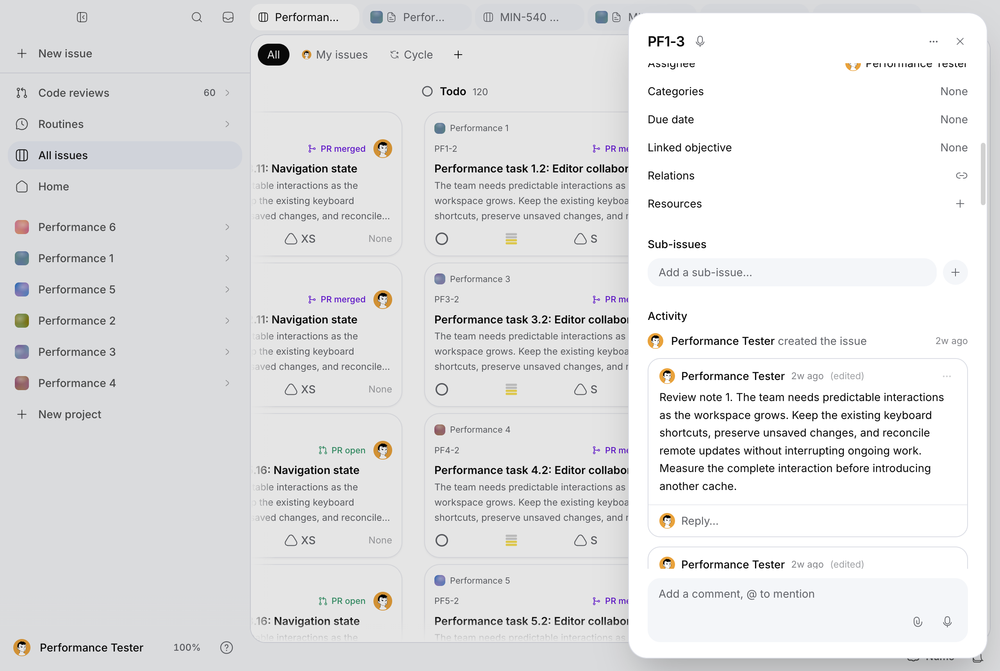
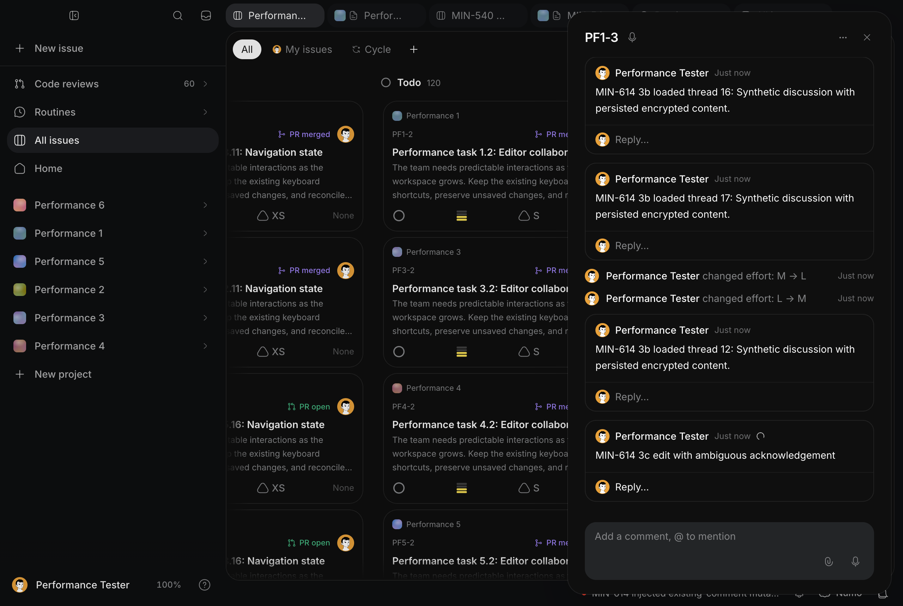

# MIN-614 — desktop performance, phase 3c

Phase 3c targets the interval between a loaded issue interaction, exact visible
feedback and authoritative persistence. The cumulative work remains on
`codex/min-614-encryption-performance` in [PR #342](https://github.com/mangue-dev/minddy/pull/342).
MIN-614 remains in progress. This document supplements the previous audits and
preserves their results, profiles, screenshots and checksums.

## Provenance and measurement contract

The fetched local/origin/PR baseline was
`3a9b37e89c3b448d8062676656bd90ca30774a3b`; the previously measured 3b product was
`b135cc3f22d1263bde321a7c373a60641139143c`. The candidate product is signed commit
`67ecf4847e45ab134ab2d9431676750fd5aa7d18`. Baseline production BUILD_ID is
`T_i_EvPvgh6TRd04GFESs`; candidate BUILD_ID is `-v-9hoe7QlIKTgcgQ73wc`.
The baseline build is preserved outside the checkout at
`/tmp/minddy-min614-pass3c-baseline-build-3a9b37e`.

Runtime: Mac16,8, 24 GiB, 12 logical CPUs, macOS 27.0 (26A428), Node 24.11.1,
Electron 43.7.5 / Chromium 150.0.7871.250. macOS LaunchServices launches the native
unpackaged shell with its real preload, a fresh unique temporary desktop profile
and a production Next server on localhost:3111. This is native production-renderer
evidence, not a packaged release or a production deployment. Viewport is 1280×860.
Initial native theme is dark; the existing journey changes to light for its
screenshot and subsequent filtered/scrolled observations, identically in both series.

The migrated encrypted MIN-540 workload remains six projects, 600 issues,
120 Pages and 180 stored encrypted PRs. Each primary mutation launch builds a
synthetic persisted thread of 26 comments, including six replies, through the
authorized APIs; the original two comments are restored. Description is 1,038
characters and the Plan contains 374 characters. No plaintext seed, copied
account profile or persistent plaintext cache was introduced. Ordinary samples
use the actual upstream service without throttling. Heavy CPU profiles, injected
503/delayed reads, reverse-order writes, freeze and offline diagnostics are separate.

The same ordinary journey and predicates are used before and after. Complete
readiness requires the correct issue title/description, one visible active
non-inert panel and board, every expected confirmed comment ID/body exactly once,
and completed necessary comments/events/agent/automation/feedback/resources reads.
The complete-issue deadline remains five seconds. Board readiness still checks
600 cards, or 480 with the existing filter, with the proper selected tab.

Historical driver clocks remain intact, including polling, locator actionability,
two frames and the 350 ms observation tail. The historical menu clock also
includes closure and is not called first visible response. New probes record
trusted click/keyboard dispatch, the first matching visible DOM predicate for the
correct issue, and the following animation-frame checkpoint. Driver preparation
is separate. A frame checkpoint alone is not a pixel-paint or persisted-value
assertion. These new clock definitions are compared only within the paired 3c
series, not against historical menu probes. Menus that open on pointerdown can
already be present at captured click; these renderer menu probes observe the first
matching DOM after click, not the earliest pointerdown-to-paint interval.

For each create/edit/delete/effort mutation, the results retain interaction and
first feedback, server acknowledgement, explicit authorized persisted GET and
exact visible reconciliation. Effort now requires the selected label again after
the persisted GET in both 3c implementations. Its reconciliation is not compared
directly to 3b's frame-only checkpoint. Earlier 3b supplemental value checks are
preserved but do not replace that historical timer's missing predicate.

## Paired ordinary results

Complete baseline launches are `before-1`, `before-2`, `before-5`; complete
candidate launches are `after-3`, `after-4`, `after-7`. Each has ten warm
repetitions, 40 mutation stages and 100 renderer probes, with no missing DOM
observation. All thirty samples per scenario, extrema, requests, long tasks,
frame stalls and per-launch medians are retained in the separate results manifest.
Two initial failed baseline launches and four failed/partial candidate launches
remain supplemental attempt evidence; successful-block medians are not failure
rates across all attempts. None of the four candidate readiness failures is
removed or turned into a success by extending the deadline.

All values below are milliseconds; medians pool thirty paired observations.

| Mutation | Click/keydown→matching visible DOM, before→after | Driver first feedback, before→after | Server confirmation, before→after | Persisted GET, before→after | Exact visible reconciliation, before→after |
| --- | ---: | ---: | ---: | ---: | ---: |
| Create comment | 28.3→26.7 | 63.6→61.4 | 444.9→422.8 | 732.8→677.8 | 949.6→860.6 |
| Edit comment | **401.5→15.4** | **883.9→55.8** | 423.0→406.6 | 1,505.3→687.6 | **1,548.6→877.7** |
| Delete comment | 170.4→163.2 | 452.0→449.0 | 373.4→364.3 | 1,070.5→1,060.4 | 1,095.0→1,084.6 |
| Effort | 58.6→57.5 | 333.6→372.7 | 472.9→507.7 | 1,005.3→987.1 | 1,049.1→1,025.8 |

The edit result is immediate **optimistic feedback**, not persistence in 15 ms.
Canonical server confirmation remains approximately 0.4 s. No server edit API
was changed and the small confirmation difference is not claimed as a backend
speedup. Persisted/reconciliation timers include the historical observation tail
and driver: sending verification earlier after optimism accounts for much of
the observed end-to-end reduction. They are not minimum database commit times.
Create optimism and deletion are essentially stable; effort's driver first
feedback regresses despite a stable direct DOM response. No field-specific
optimization is claimed.

| Availability/return | Ready median before→after | Median maximum frame before→after |
| --- | ---: | ---: |
| Loaded warm issue | **323.1→478.1** | 175.0→175.0 |
| Filtered loaded issue | **306.3→492.4** | 150.0→150.0 |
| Scrolled loaded issue | **311.7→490.5** | 183.3→183.3 |
| Hidden board return | 607.5→576.6 | **417.1→392.3** |
| Reopen after hidden mutations | 801.7→834.4 | 283.4→266.7 |

Warm/filtered/scrolled availability regresses by roughly 155–186 ms. Required
comment/event reads now run on actual retained-panel re-enabling; that independent
freshness repair is retained despite its availability cost. Layout/style medians
remain close (warm style 150.2→147.1 ms, filtered 125.5→126.3 ms, scrolled
152.4→150.9 ms), supporting no claim of a renderer/style optimization. Hidden
return frame stalls remain around 0.4 s. The maximum baseline direct delete
observation is 9,607.1 ms and the maximum baseline edit observation is 1,669.4 ms;
neither is discarded. All other extrema and long-task samples are in the results.

Primary audit-event volumes are **774→794, 794→814, 814→834** before and
**874→894, 894→914, 920→940** after. Partial launches and diagnostics grow history
between these blocks, and the final diagnostic volume is retained separately.
This growth can influence timeline grouping, rendering and cold/read costs;
openings are not treated as perfectly stationary samples. The much smaller edit
DOM response is observed despite the larger retained history.

## Changes and attribution

`editCommentOptimistically` in `lib/optimistic/comment-edits.ts` immediately
updates only the loaded comment row, sends one PATCH, deduplicates an identical
in-flight submission, merges canonical acknowledgement and reconciles with GET.
The registry is in memory, scoped to the QueryClient and exact query owner.
Pre-acknowledgement reads cannot overwrite the pending body; independently newer
server timestamps remain authoritative after acknowledgement. Missing/deleted
rows are not resurrected. Account/cache replacement forgets the overlay.

`CommentBlock` keeps its local draft/editing state while showing the submitted
Markdown and a saving indicator. A failed acknowledgement restores the editing
surface and draft. Rollback only changes the failed matching body, preserving
other rows and newer cache edits. Ambiguous writes are reconciled by read, never
by automatic PATCH replay. Unconfirmed edits are excluded from sealed query
snapshots alongside existing failed/pending comment deliveries.

The baseline profile spends most edit-window samples idle or in generic runtime
work; ordinary direct dispatch→DOM feedback is hundreds of milliseconds while
menu/editor DOM changes occur in a few milliseconds. This supports separating
visible optimism from server acknowledgement. It does not establish that React,
AES, layout or SQL consumed the full historical editor timer.

A separate read diagnostic reproduced an immediate close/reopen defect: the
comments observer remained mounted with its recent cache, so no new necessary
GET started. The injected 503 never ran and the diagnostic failed instead of
claiming read-error coverage. `IssueSidePanel.open` now controls timeline query
activity. Timeline queries are stale on activation, read again when a retained
observer is re-enabled, consume AbortSignals, and cancel pending comments/events
when closed. The previous `refetchOnMount: always` guarantee remains.

`timelineReadState`, `useIssueTimeline` and `IssueActivity` distinguish loading,
refreshing previous data, paused/offline, failed reads and fresh data. Previous
rows and composer drafts stay present; a failed read offers explicit GET retry.
The new read-state feedback covers comments/events; feedback/resources/agent
error UI is not validated by these injected timeline failures. An empty timeline
is meaningful only after both reads succeed. Network status
also marks an idle cached timeline paused while offline. All six locale catalogs
include the read feedback. No read failure becomes a successful empty result.

## Restoration and failed attempts

No timed writes are replayed. Created UUIDs are journaled before acknowledgement;
after ambiguity cleanup first reads persistence and removes only owned rows.
The original title, effort, comment IDs/bodies, scoped relations, parent and Page
resources are explicitly verified. Audit events are retained.

Baseline ordinary launches 1, 2 and 5 complete ten repetitions each. Launches 3
and 4 fail the initial complete-read predicate and retain screenshots, requests,
frames and journals; cleanup succeeds. The same baseline build/server is restarted
before launch 5. Both failed launches remain part of the attempt accounting.

An initial property diagnostic uses an exact Plan tab name that misses the task
count in its accessible label. The next diagnostic records all 90 picker/editor
observations, then an asynchronous route-continuation error terminates the driver
before automatic cleanup. Measurements stop. Explicit API restoration verifies
the original state before another launch. The interrupted log and journal remain.
The driver now waits for held handlers before unrouting and records an absent
read-state element immediately; these diagnostics do not alter primary clocks.
The subsequent baseline immediate-reopen diagnostic fails because no GET is
started, with successful automatic cleanup. Candidate read diagnostics pass:
previously unopened timelines show loading or error rather than successful empty
activity, release/retry shows exactly their two expected comment IDs, cached slow
refresh labels previous data and preserves the composer draft, injected 503 shows
error and explicit retry, closing aborts the real request (`net::ERR_ABORTED`),
and reopening shows exact fresh content. The abort evidence concerns the renderer
fetch; it does not establish cancellation of upstream SQL execution.

The first candidate ordinary launch records five repetitions before an unmeasured
preparation reopening fails availability; cleanup then receives HTTP 500 on a
comment DELETE. Scenario and cleanup errors are distinct. Measurements stop;
explicit restoration performs persistence reads, removes the remaining nine owned
rows, verifies the two original comments/fields and retains both prior errors.
The same candidate build/server is restarted before resuming. Candidate launch
2 stops after nine repetitions, launch 5 fails initial readiness, and launch 6
stops after two repetitions; all three verify automatic cleanup. Launches 3 and
4 and 7 complete all ten repetitions. These partial/failed attempts are preserved and
are not counted as complete launches. Server evidence
identifies aborted authorization/deletion operations and a project-members 500;
it does not distinguish database execution, transport, service or network cause.
The historical 500/503 and auth_authorization_state delays remain unresolved.

The first candidate build failed because archiving generated baseline TypeScript
inside the checkout made its types match the existing compiler glob. The build
archive was moved outside the checkout and the unchanged source built successfully.
No compiler exclusion or product check was weakened.

## Coverage and remaining work

The property ranking separates picker/editor opening from property persistence.
It includes status, priority, effort, assignee, categories, due date, objective,
description focus and the populated Plan editor. It does not establish successful
writes for fields other than the separately verified effort. The fixture has zero
objectives, zero initial relations/resources/comment attachments, zero active
chains/agent runs/feedback; the loaded issue carries a stored PR link. Its empty
objective picker is not populated-objective coverage. No field-specific patch is
retained on the strength of these small opening costs alone.

MIN-630 is read and reverified through held relation POST, canonical persisted
identity and failed POST rollback. Its implementation is unchanged; unit coverage
continues to exercise canonical endpoint kinds, echoes, cache absence and races.
The native correctness journey also populates an encrypted Page resource and
opens an actual child issue with exact title/comments/focus restoration.
Editing-row deletion/draft recovery lacks a native populated concurrency check.
Binary upload/download/retry, objective relations and larger resource volumes
remain explicit gaps, not successful empty-state scenarios.

Real CDP renderer freeze/resume and native offline/online transitions exercise
remote edits and deletion. These are renderer lifecycle/network emulation, not
an OS sleep/resume test. Existing snapshots retain navigator.onLine assertions
and exact persisted/visible IDs/content after restoration. Concurrency probes
hold two actual composer writes and settle them in reverse order, preserve a
newer unsent draft and reject duplicates. Pre-write 503/retry and post-commit
acknowledgement-loss scenarios verify persistence before recovery; a lost edit
acknowledgement produces one PATCH and one persisted row, retaining the draft.

Active chains, long feedback histories, actual agent streams and authenticated
connected-forge detail/diff/comment synchronization are not populated in this
fixture. Available stored encrypted PR list/read evidence is distinct from live
forge integration coverage. A separate representative authorized workload is
required; paid agent work or external forge activity was not fabricated to turn
empty data into coverage. No missing credentials are represented as success.

## PostHog and CI boundaries

Read-only MCP investigation covers 2026-09-29 through 2026-10-03 with test-account
filtering disabled. Separate error groups include GitHub installation (252
occurrences), forge identity (22 and 8), version key (19), current key (17 and 17),
HTML (10) and schema (9). These separate groups are not summed into a user/session
count. Sampled current-key/identity/schema events expose posthog-node 5.54.0 and
minified stack data but lack usable route, release/build or session dimensions.
No correlation to these local benchmark failures is established. The results
export aggregate counts/links only, without raw distinct IDs, fingerprints or
private customer stacks/content.

The desktop packaging dependency audit still reports
[GHSA-ch52-4w7c-c8xp](https://github.com/advisories/GHSA-ch52-4w7c-c8xp), affecting
http-cache-semantics ≤4.2.0. The reviewed advisory lists no patched version on
2026-10-03; npm proposes an electron-builder downgrade to 26.5.0. That proposal
is not applied. Packaging manifests/lockfiles and the scanner policy are unchanged.
A first directory scan omitted the explicit root policy and flagged only its
two unchanged historical checksum entries; the checked-in-policy scan passes.
The failed redacted log/report are retained. Policy tests pass.
The previous Gitleaks exception remains restricted to the exact 3b checksum;
there is no audit-directory exclusion.

All commits carry exact-author DCO. Publishing uses `npm run work:pr` on #342;
cumulative evidence is appended without removing earlier proofs. The PR remains
open, with no merge, work:done or deployment. Absent GitHub closing keywords or
auto-merge are not protection against Minddy's linked-PR merged→done integration.
MIN-614 must remain in_progress after the update and would need explicit lifecycle
handling at a later authorized merge.


## Property ranking and previous guarantees

These supplemental diagnostic openings contain ten observations per item in one
fresh launch per implementation. They rank opening costs; they are not the
three-launch primary mutation series or successful writes for every property.
The corrected baseline observations survive in the interrupted diagnostic log
and journal; they are included in the results rather than discarded.

| Picker/editor, driver first visible (ms) | Before | After |
| --- | ---: | ---: |
| Status | 54.4 | 56.4 |
| Priority | 57.8 | 55.6 |
| Effort | 54.3 | 58.0 |
| Assignee | 55.4 | 56.5 |
| Categories | 56.0 | 55.1 |
| Due date | 56.5 | 61.2 |
| Objective, empty inventory | 53.0 | 56.7 |
| Description focus | 38.4 | 40.4 |
| Populated Plan editor | 88.9 | 84.2 |

The Plan is the largest median opening cost in this ranking, still below the
loaded issue/readiness and hidden-return costs. No description/Plan persistence
optimization is justified by this opening-only ranking. Effort separately has
30 paired primary persisted GET/exact-label checks per implementation and twenty
additional candidate persisted/visible value checks.

The native opening reverification completes ten warm, filtered, scrolled,
activity-expanded and board-return observations each. Candidate median complete
availability is 449.4 ms warm, 410.6 ms filtered and 399.3 ms scrolled; expanded
activity is 136.1 ms and issue-to-board return is 210.6 ms. These use the historical
opening journey and are supplemental checks, not an additional paired gain claim.
The native retained-tab journey completes ten returns each: board 611.0 ms,
scrolled 699.2 ms, filtered 498.2 ms and hidden-update 700.3 ms. It verifies the
remote title before restoration. Board-return median maximum frame is 374.8 ms,
scrolled 391.7 ms and hidden-update 408.3 ms: retained-return stalls remain.
The retained fixture's audit events grow 314→334; the main mutation fixture ends
the later ranking/correctness diagnostics at 970 events. No history was cleared.

A separate browser correctness run passes seven checks covering 600/480 cards,
selection/filter/scroll preservation, duplicate retained issue views, keyboard
focus/hotkeys, dismissal, active drag-and-drop with a hidden duplicate, reversal,
rapid activation, LRU eviction and close eviction. Its durable journal records
owned tab IDs and original issue fields before changes. Final authorized GET
verifies status, position, assignee and cycle; temporary tabs are absent and all
protected tab fields are restored. This is correctness evidence, not native timing.

Authorized encrypted repository probes retain all 32 samples (four per workload).
Candidate medians are: six visible repositories 291.9 ms; stored PR list (51
visible rows) 1,651.4 ms; PR count (60) 363.8 ms; PR synchronization settings (six)
487.9 ms; 600 issue reads 559.7 ms; issue decode 20.9 ms; twenty Page decode 4.1 ms;
ten in-memory issue encodes 629.4 ms. These preserve access/registry/AES paths and
do not write a seed. The stored PR screen also opens successfully in the native
journeys. PR list read tails remain visible; this does not prove live forge sync.
The automation control retains 62 alternating full/chain reads, including two
warmups: thirty successful observations each, median 273.7/203.7 ms. Chain is null
in every sample. This rechecks the authorized status-read path; active chain
execution remains uncovered. Native issue readiness requires its automation GET
alongside the other five required reads, without accepting a hidden view.

## Verification and evidence package

Local candidate checks pass: 18 targeted test files / 136 tests covering comment
edits, reads, delivery/idempotency, retained views, relation echoes and encryption
access/registry/rotation/codec, plus four automation/menu files / 20 tests.
Typecheck, full lint, check:owned-english, check:encrypted-access,
check:encryption-schema and git diff --check pass. The existing Node typeless
configuration warning is retained in the lint log. Product hashes are reverified
against the measured signed candidate; no product source changed after measurement.
Previous audit/result/profile assets, packaging dependencies, Mangue-ui patches
and Gitleaks policy are untouched. Heavy profiles are separate, including the
candidate isolated remote DELETE check that preserves the 3b routing guarantee.
The candidate edit profile's top self samples are program 381.7 ms and idle
278.6 ms; minified frames do not establish a React-specific bottleneck.

The [complete results](desktop-perf-min-614-pass-3c-results.json) contain raw
measurements, all HTTP requests/errors, every primary DOM probe, long tasks/frame
stalls, per-launch and pooled medians/p95/maxima, verification GETs, inventories,
property/correctness checks, cleanup/manual-recovery journals, interrupted
observations, commands, source/build SHAs, hardware, PostHog aggregates and log
checksums. Compressed server/upstream/CPU/trace assets and every screenshot have
individual checksums and paths. Ordinary attempt accounting keeps all five
baseline and seven candidate launches: three complete blocks each, two/four
failed or partial blocks. Including partial candidate blocks gives 46 observed
mutations per kind, versus thirty before; these unequal-size summaries are
separate from the matched 3×10 series and do not hide failed preparation.

Representative native screenshots:





Primary reproduction uses the preserved migrated workload and local authorized
runtime, never the historical plaintext seed:

```sh
node scripts/performance/run-min614-mutations.mjs pass3c-before 3a9b37e89c3b448d8062676656bd90ca30774a3b 1 2 3 --phase3c
node scripts/performance/run-min614-mutations.mjs pass3c-after 67ecf4847e45ab134ab2d9431676750fd5aa7d18 1 2 3 --phase3c
node scripts/performance/summarize-min614-pass3c.mjs
```

These are command shapes, not an instruction to overwrite existing evidence.
The actual complete labels are before-1/2/5 and after-3/4/7; every intervening
failed attempt/restart/recovery command remains in provenance. Diagnostic flags
include --cold-read-correctness --read-correctness --require-read-states,
--mutation-correctness --freeze --reconnect, --property-ranking
--property-correctness, and separately --profile --freshness-check. The local
server is stopped only after all diagnostics/reverification finish and cleanup
is explicitly verified.

## Evidence-driven next pass

The next pass should address the additional 155–186 ms of complete availability
on retained warm/filtered/scrolled issue reopening, while retaining authoritative
freshness; correlate the required reads with pending feedback/resources and the
observed authorization/deletion timeouts using real request/session dimensions.
Do not infer SQL or transport cause from operation names. The remaining
392–408 ms median maximum frames justify focused retained activation/style/layout
profiles with request waiting separated. A distinct populated authorized dataset
is required for active chains, agent streams, long feedback, connected forge,
objectives and binary attachments. OS suspension/reconnection should be measured
on a real supported lifecycle path. None of these unresolved items closes MIN-614.


## Published CI checkpoint

Evidence commit `9307e52897dcb1b83902690e3be715358f58e0ce` was pushed with
`npm run work:pr` to the existing #342. Its full Tests & typecheck job passes,
including the unchanged pinned all-history Gitleaks scan, encrypted checks,
desktop bundle and complete test/release/self-hosted/edition pipeline. Exact-author
DCO, all three CodeQL analyses/CodeQL and Vercel preview pass. No check is still
running at this checkpoint. The CI workflow overall fails because Dependencies
audit still reports eight high transitive desktop packaging vulnerabilities for
GHSA-ch52-4w7c-c8xp; its failed job log is retained. The preview is not a production
deployment. The subsequent evidence-only commit records this exact-head checkpoint;
its checks are refreshed again before delivery, without changing measured product.

The original PR title and full description prefix are verified unchanged; phase
3c evidence/screenshots are appended. PR is open, autoMergeRequest is null and
closingIssuesReferences is empty. Minddy nevertheless changed MIN-614 to in_review
on push; it is explicitly restored to in_progress and rechecked after delivery.
All fifteen non-merge commits through this checkpoint have exact-author sign-offs;
the changed-range local Gitleaks scan reports no leaks with unchanged policy.
