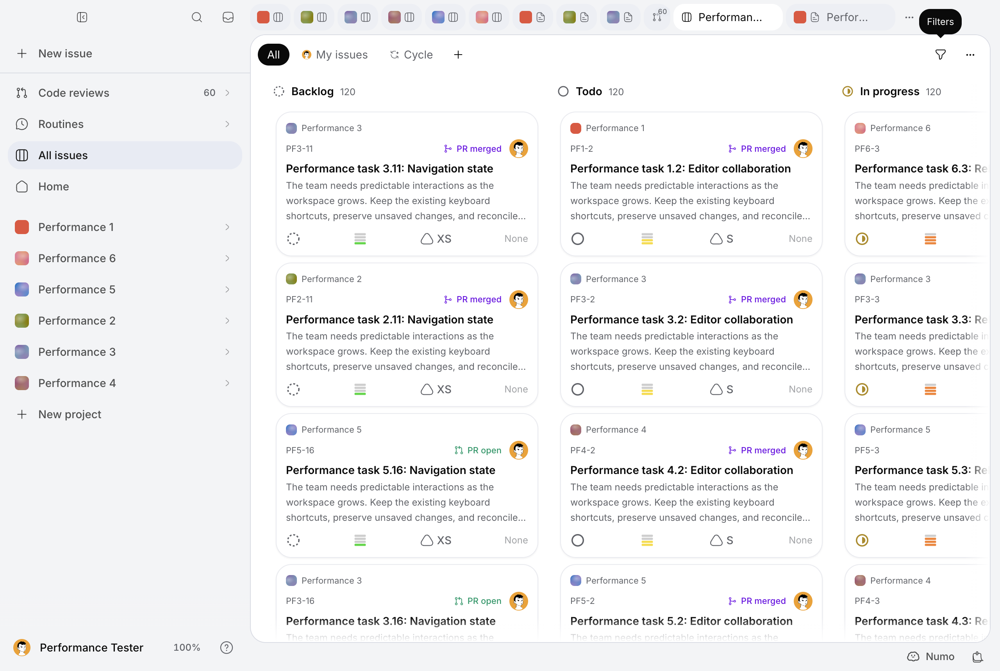

# MIN-614 — desktop performance, phase 3d

The measured project-board → global-board return falls from **1,243 to 673 ms
median (−45.9%)**, with p95 **1,431 → 778 ms**. Repeated local snapshot opens
fall **200 → 9** across the three matched launches. This is a substantial gain
on one dominant path, not completion of the instant-navigation objective.
Page → global remains about 630 ms, startup does not improve, and exact remote
changes immediately before activation remain slow. Median heap rises 24%.
The user additionally identified live PR/GitHub reads as the highest priority:
independent forge reads now overlap, and selected PR tabs use the existing
intent-prefetch mechanism, with one speculative detail per account client.
**Live authenticated GitHub detail latency is still unmeasured by this fixture.**

Work continues on `codex/min-614-encryption-performance` and
[PR #342](https://github.com/mangue-dev/minddy/pull/342). Previous audits, including
[3c](desktop-perf-min-614-pass-3c.md) and its result manifest, are untouched.
The issue remains in progress. No merge, `work:done` or production deployment.

## Provenance and clocks

Fetched local/origin/PR HEAD before editing:
`980f0b223e0734684074727b31a705c7946c751c`. The original production artifact has
BUILD_ID `-v-9hoe7QlIKTgcgQ73wc`, identical to the 3c measured product
`67ecf4847e45ab134ab2d9431676750fd5aa7d18`. Intervening changes contain audits and
measurement scripts, not application code. Baseline run environments report the
verified checkout HEAD `980f0b223`; that is an effective source reference, not a
claim that the unchanged artifact was rebuilt at that commit. Its complete
`.next` copy remains outside the checkout at
`/tmp/minddy-min614-pass3d-baseline-980f0b2/.next`.

The paired board candidate is signed product
`3b5acd337af924a40e169359b81c32f6bd057a26`, BUILD_ID
`Wd901lylWWDwlKdQupgje`. PR changes were subsequently built and tested at
`ca4209fc9`; title repair and the client runtime-config correction were built at
`05c69168e39aa8369cf4fcbc83dd5e3a41abf3f2`. Those later changes have separate
native/browser correctness evidence. They are not relabeled as the original
paired product. The final build identifier is `sii2TG6an7DIIeXDU7nBR`, also
recorded in the native final smoke JSON. That native smoke reports no errors and
verifies cleanup of its dispatch-journaled incidental PR tab. Evidence-only/harness
commits do not constitute new product measurements.

Runtime: Mac16,8, 24 GiB, 12 logical CPUs, macOS 27, Node 24.11.1,
Electron 43.7.5 / Chromium 150. Native unpackaged Electron starts through macOS
LaunchServices with its real preload, a new temporary profile per launch and a
production Next server on localhost:3111. Native viewport: 1280×860. This is a
production renderer, not a packaged release or a deployment. No account profile
is copied. The migrated encrypted MIN-540 workload remains six projects,
600 issues, 120 Pages and 180 stored PRs. The old plaintext seed is never run.

The ordinary cohorts use the same journey and predicates:
`pass3d-baseline-{3,4,5}` versus `pass3d-after-{3,5,6}`, three complete fresh
launches × ten cycles. Twelve explicit destinations cover a global board,
six project boards, four Page bodies and the stored PR list. Existing account
surfaces are preserved. Late project boards 5/6 dominate; older boards are
visited on only every third cycle. This is not a first-tabs or uniform
round-robin policy test.

Historical `measure()` clocks stay intact: driver click/actionability, selected
tab, expected URL, one visible non-inert board with exact expected cardinality,
then two frames. `firstVisibleMs` is the driver's first matching observation,
not the earliest painted pixel or a trusted-event clock. `inputMs` separately
opens Filters and checks its menu. Script/style/layout counters include that
probe and the historical 350 ms observation tail. Ordinary unchanged-workload
membership does not certify every object/version. `hidden-exact-*` instead
requires the deliberately changed unique title, including a write immediately
before the click. Cached old content is never substituted for that predicate.

The added `cold-exact-board` records all 600 cards plus two frames, after the
unchanged `cold-board` first-card clock. Both exclude native process launch,
fixture login and cookie injection. All profiles are process/profile-cold, but
these are **renderer navigation startup clocks**, not end-to-end process-start
measurements. Three cache restart diagnostics are supplemental, not paired
before/after evidence. CDP document counters reset on reload and stay null.

Quantiles use the midpoint median and nearest-rank p95. Three-sample startup
and hidden-update p95 is simply the largest observed sample. There is no claim
of statistical confidence from that small sample.

## Short exploration and selected costs

The initial heavy retained-return profile found about 125–150 ms of styles,
large React effect/ref reconnection work and substantial GC. Its Page-return
profile includes 121.5 ms sampled GC. The final heavy hot Page-return profile
includes 29.4 ms sampled GC, but these different heavy diagnostic journeys are
not a controlled GC speedup comparison. Production minified functions cannot
support precise per-provider attribution. The profiles are preserved separately.

Inspection and real imported-icon observation classified the main costs:

| Cost | Finding and decision |
| --- | --- |
| Initial usable board | Many parallel authorized reads, query restoration, aggregate data and rich-card rendering. No demonstrated startup win; no provider-count-based rewrite. |
| Repeated unchanged reads | Each app-tab collection refresh reopened the same encrypted window snapshot even after session initialization. This is removed. |
| Authorization / keys / AES | Live authorization and registry requests are counted upstream. No wall-clock delay is labeled AES without evidence. Snapshot opens have a known single decrypt call; repository-wide AES timing remains uninstrumented. |
| React / layout / GC | Reconnecting hundreds of field popover primitives and rebuilding evicted global boards dominate. Use the existing retained host, weighted visit history and deferred closed field popovers. |
| Protected imported icons | Real multipart import → protected versioned route → data URL succeeds. Baseline already has zero ordinary hot downloads. Preserve its cache instead of inventing another. |
| Live PR detail | Independent review/actor work unnecessarily precedes policy/checks; deployment follows diff/readiness. Preserve policy → checks, overlap the independent branches, and prefetch the specifically selected PR. |

Only the three hot board transitions receive full ordinary before/after cohorts.
Cold clocks accompany each fresh launch; profiles, failures, injections and
cache restarts remain separate. Intermediate window-only candidates are retained
because they improved project returns but regressed Page returns. They are not
pooled into the final comparison.

## Topology and actual changes

`AppProviders` has one `AccountQueryProvider` and one `QueryClient` per account,
with `RealtimeProvider`, `ProjectsProvider`, `AppTabsProvider`, undo and editor
state owners above the retained host. Realtime uses one shared socket with
project topics, per-key invalidation coalescing and existing resume/rekey catch-up.
The six-project fixture is within the existing 25-topic warm perimeter. Larger
accounts exceeding that perimeter remain a coverage gap; hidden observers do
not create subscriptions to otherwise-unjoined projects.

The change does not merge providers or introduce another data store:

- `lib/app-tabs-context.tsx` skips reopening the window snapshot when the session
  is already initialized. Qualified retained board selections use local history;
  cold/other routes keep their established navigation. Consumed `?view=`
  selections are matched to the published tab href, not a different working view.
- `lib/local-snapshots.ts` shares only identical **in-flight** opens in the same
  Storage, slot/key, ciphertext and account generation. Every caller rechecks
  generation, revision and ciphertext. Settled results, including plaintext,
  are removed; future reads authorize again. No persistent plaintext cache.
- `lib/retained-app-views.ts` extends the existing retention policy with a
  32-visit recency/frequency history independent of eviction. The active view is
  reserved; a maximum of six views and six weighted units bounds retention.
  Actual issue count costs one unit per 200 cards, rounded up. The measured
  workload settles at global + three project boards: 900 retained cards versus
  the baseline's 700. Unknown global/project weights are conservative. Heap
  usage above 70% of the JS limit lowers the budget to three on navigation.
  This is a heap-pressure fallback, not a measured operating-system memory
  availability protocol. Unit simulations compare two/four/six bounds and a
  nonuniform twelve-tab history; only the chosen weighted policy is native-tested.
- `lib/retained-board-data.ts` retains observers of already-loaded prerequisite
  queries above React Activity. It copies the owner's real key/queryFn and
  reconciliation, joins existing in-flight work and starts no independent
  timer, channel or speculative fetch. Existing targeted events/resume catch-up
  can therefore refresh hidden prerequisites while view effects are suspended.
  Removal/account teardown releases those observers.
- `components/search-menu.tsx`, `components/search-select.tsx` and
  `components/issue-card.tsx` defer the five closed field popovers. The actual
  button and tooltip stay mounted; the open overlay uses its virtual anchor.
  Keyboard opening, Escape and focus return use the same retained button.
  Mangue-ui and its patches remain untouched.
- `lib/retained-board-read-state.ts` and the host expose loading, refreshing,
  paused and error states; previous data is explicitly named, with retry.
  This is known cache uncertainty, not proof that no event was missed. Existing
  reconnect/resume/rekey authority is retained. 3c timeline stale-on-activation
  and authoritative read logic are untouched.
- `components/retained-board-title.tsx` restores localized metadata on local
  retained navigation from the existing project cache and public runtime config.
  Activity suspends its observer; issue panels retain their title ownership.
  A project rename received while a panel owns the title is adopted on dismissal.
- `lib/prefetch-tab-destination.ts` extends existing intent prefetch to a selected
  PR detail and its pinned list using the foreground keys. One speculative
  detail per account client bounds this work; skipped destinations may be tried
  after the slot settles. There is no idle polling. AbortSignal now reaches
  `fetchPullRequestApi` and its foreground query too.
- `lib/server/agent/pr-actions.ts` overlaps reviews/threads/actor with the
  policy → checks chain, and overlaps live-head deployment with diff/readiness.
  Authorization, live head, fork qualification, required-check semantics,
  unknown/forbidden states, stable preview preference and four-PR batch bound
  remain intact. Gated tests prove independent reads start before a held review
  returns, and checks wait for their policy. **They do not measure live GitHub.**

Pages, issues, PR detail and other surfaces keep their existing data/state
mechanisms. The new DOM window still retains boards only. PR foreground reads
can join an in-flight prefetch, but live freshness, state/scroll restoration and
exact first actionable PR view are not established by this stored-PR fixture.
The existing list `refetchOnMount: always` remains; a completed prefetch can
still be followed by its authoritative list read. Background PR history is not
kept continuously fresh by a new scheduler.

## Measured results and tradeoffs

| Ordinary path | Baseline median / p95 | Candidate median / p95 | Assessment |
| --- | ---: | ---: | --- |
| Page → global, 30 samples each | 622 / 714 ms | 633 / 722 ms | No improvement; median +1.7% |
| Late project board, 30 each | 420 / 471 ms | 357 / 415 ms | Median −15%; below the 30% aim |
| Project → global, 30 each | 1,243 / 1,431 ms | 673 / 778 ms | Median −45.9%, p95 −45.6% |
| First cold card, three each | 2,285 / 2,378 ms | 2,413 / 2,567 ms | No startup gain |
| All 600 cold cards, three each | 2,448 / 2,577 ms | 2,587 / 2,719 ms | Median +5.7% |
| Exact hidden update, 700 ms preparation, three each | 878 / 882 ms | 856 / 927 ms | No substantial improvement |
| Exact hidden update, immediate click, three each | 1,890 / 2,207 ms | 2,239 / 2,365 ms | Median +18%; objective fails |

Driver first matching response for project → global is 1,183 → 632 ms median.
Its script counter falls 972 → 435 ms, while styles remain 136 → 147 ms and
layout remains necessary. The Page-return style floor alone is about 149 ms;
React reconnects hundreds of cards before actionability. **No measured hot path
meets median ≤50 ms / p95 ≤100 ms.** Larger render reduction/virtualization and
representative live PR measurement remain higher-value next work than another
campaign seeking a few milliseconds on these unchanged paths.

The all-observed candidate, including the failed fourth launch's 27 completed
warm samples, has project → global **673 / 796 ms**, 39 observations. Three
complete launches contribute 90 ordinary warm samples; the fourth stops before
cycle ten when its Page prelude times out. It leaves three scheduled warm samples
unattempted, not invented successes. Preserve the failure and its preceding
8-second Page-body read; do not extend the readiness deadline to hide it.

Across the matched full launches:

- Snapshot opens: 70/66/64 → 3/3/3; all are actual page-origin HTTP operations.
  Successful opens execute one `store.decrypt` in `openLocalSnapshot`, so the
  191 removed opens remove those redundant snapshot decrypt operations and
  access-fingerprint scans. This is not a 95.5% reduction of all app decryptions.
- Snapshot seals remain 500 → 494. App-tab GETs remain 491 → 493. This pass does
  **not** claim structural deduplication of every tab mutation/echo refetch.
- Page-origin requests: 2,080 → 1,878; body bytes: about 298.4 → 278.4 MB.
  These include preparation/reloads/navigation and encrypted snapshot bodies,
  not only hot clicks. Context-request setup/cleanup is separately observable
  in journals/upstream logs. Query parameters are not fully captured; same-path
  overlap counts are diagnostics, not proof of identical reads.
- Aggregate board GETs increase 27 → 31. Hidden authority has a real traffic
  cost. Key-registry HTTP consultations are 1,220 → 1,232 within launch request
  windows; authorization RPC calls are 2,172 → 1,984. AES duration and complete
  repository decrypt-call attribution remain unavailable. No encryption
  algorithm, registry security check or authorization check is weakened.
- Each launch downloads the imported icon once initially and once after the
  controlled reload: **zero hot unchanged-icon downloads before and after**.
  Recorded hot image checks remain complete with nonzero natural width. These
  checkpoints are not frame-by-frame proof that no compositor flicker exists.
- Heap median: 498 → 617 MiB (+24%); p95 1,026 → 891 MiB; observed peak
  1,126 → 907 MiB. More DOM is retained; the memory tradeoff is explicit.
  Late-project script time including the input/tail increases 302 → 578 ms,
  despite lower driver readiness. Do not call that a universal CPU win.
- Fifteen-second idle script time is 111/89/105 → 97/103/96 ms, about 0.6–0.7%
  renderer script utilization. Each idle window has three page requests; actual
  upstream operations are 34/28/25 → 24/24/25. This short window does not prove
  all-day CPU, native process RSS or long-duration background-network behavior.

## Correctness, failures and restoration

Native `pass3d-native-regressions` verifies populated encrypted comments/replies,
pre-write failures, edit/delete failure drafts, lost post-commit acknowledgements
by GET without replay, two real composer writes settling in reverse order,
visible/persisted effort rollback, hidden updates and 3c read-state recovery.
It also verifies MIN-630 relation visibility before a held POST, canonical
persisted ID and failed-POST rollback, plus a linked encrypted Page resource and
actual child issue navigation. Original comments and issue/child fields,
relations and resources are verified restored. The existing audit event history
is preserved: that issue grows from 970 to 976 events. One recorded column
restore differs from its requested offset (160 → 723); no claim that every
panel-driven auto-scroll offset is byte-identical is made.

`pass3d-hot-correctness-2` verifies explicit hidden-board 503 uncertainty and
retry to exact data, two real acknowledged hidden writes with the latest exact
persisted title at activation, and a second protected icon version. Its final
icon-delete assertion mistakenly also included unrelated data-URL avatars.
The preserved failure is corrected by targeting the imported decoded source.
`pass3d-hot-correctness-remaining` then verifies that image disappears on delete,
and present/absent/invalid encrypted-cache reload recovery. The timings are
supplemental and not comparable to the primary cold clock.

`pass3d-hot-correctness` fails during project-board preparation on long upstream
reads. `pass3d-hot-correctness-3` encounters live authorization failure, then its
cleanup GET returns 503. **Measurements and launches stop immediately.** The
original failed journal remains false; independent restoration proofs show the
conditional original-title PATCH and icon DELETE followed by verified GETs.
The first recovery helper attempt has a Response API implementation error,
performs only a GET, and is preserved. The corrected attempt verifies cleanup
before any subsequent launch. No timed write is replayed.

Baseline attempt 1 preserves a harness URL/predicate error; baseline 2 is
supplemental earlier instrumentation. Candidate calibrations 2/3 are separate;
candidate 1 fails its malformed SHA assertion before launch. `pass3d-after-1`
refuses an occupied diagnostic port. `pass3d-after-2` has a manually copied wrong
source SHA and a separate explicit provenance correction; it is excluded from
the paired cohort. No sample or failure artifact is removed.

Browser correctness is labeled separately from native timing. The first
`pass3d-browser-retained` finds the stale document title on local-history return.
After repair, `pass3d-browser-retained-final` passes seven checks: DOM identity,
working filters, selection, direct scroll restoration, inert/accessibility/focus,
shortcuts, panel dismissal, drag persistence/reversal with duplicate hidden
cards, rapid roundtrips, weighted bounds and close eviction. The first title
repair build also catches an accidental server-only configuration import; the
final implementation uses the established public runtime-config provider.

Review of account-wide restoration identifies two incidental unpinned PR tabs
created by diagnostic direct URL navigation, outside the original primary
hot-journey owned-tab list. Persisted creation timestamps match the two captured
POST windows in exploration and native regression. Their IDs are recovered by
GET and conditionally deleted; the separate proof verifies all **65** prior
account tabs remain. This late recovery is explicitly distinguished from
pre-ack identity capture. The parent harness now journals incidental UI tab
creation IDs at dispatch and verifies their cleanup too. Earlier cumulative
account tabs and all audit history are preserved.

## Verification, cumulative matrix and remaining gaps

Targeted coverage includes 219 security/cache/realtime/timeline/optimistic tests
in 24 files, 44 PR/prefetch/readiness tests in five files, and retained title/menu
and state tests. Typecheck, lint, owned English, encrypted access, encryption
schema, public repository publication and diff checks are retained in evidence.
The unchanged desktop dependency audit still reports
[GHSA-ch52-4w7c-c8xp](https://github.com/advisories/GHSA-ch52-4w7c-c8xp) through
`http-cache-semantics`, with eight high transitive findings. The production-only
`--omit=dev` audit is not evidence that the desktop builder audit passed.
No force fix, dependency churn, scanner exception or Gitleaks expansion.

| Cumulative area | 3d state |
| --- | --- |
| Dominant retained project return | Measured large gain, 46%; still much slower than 50/100 ms targets |
| Snapshot duplicate reads/decrypts | Measured elimination of redundant opens; future reads still authorize |
| Imported protected icons | Existing zero-download hot guarantee reverified; real version/delete recovery passes |
| Startup / Page return | No gain; cold regression and remote tail failures retained |
| Exact hidden/concurrent board freshness | Exact controlled writes recover; immediate-click latency regresses; known uncertainty is explicit |
| 3b/3c / MIN-630 | Relevant native failures, drafts, acknowledgement/reordering, timeline reads and relations reverified |
| Adaptive retention | Weighted frequent late boards, bounded DOM and shared hidden data; heap +24%; OS-pressure behavior unmeasured |
| Live PR/GitHub | Waterfalls removed and selected-tab prefetch added with unit evidence; real forge latency/freshness acceptance still open |
| Non-board warm surfaces | Existing mechanisms inventoried; no claim of universal DOM/state retention |
| Publication / dependency audit | Compact evidence preserves all samples; inherited desktop advisory remains a blocker |

The plan's earlier broad acceptance items remain pending. Missing work includes
representative live GitHub detail/readiness/diff measurements, exact PR tab state
and background freshness, accounts exceeding the warm-topic perimeter, complete
end-to-end process startup, long-duration CPU/RSS/network and pressure tests,
full per-key/per-version decrypt attribution, and universal immediate freshness.
These gaps are not converted into passes by longer staleTime or removed 3c reads.

All 3d output files, failures, profiles, journals, restorations, upstream
records, screenshots and command logs are preserved in
[the separate result manifest](desktop-perf-min-614-pass-3d-results.json). Large
logs are compressed individually with stored and original SHA-256 checksums.
The first raw Gitleaks scan identifies private LAN addresses advertised by Next
in five startup banners. Only those addresses are omitted from published copies;
the complete originals remain in local diagnostic output. The manifest records
each redaction and both original and published checksums. Performance observations
are unchanged. Published decompressed copies and Git history are scanned with
the existing policy; no exception is added.
The manifest remains far below the existing 10 MiB publication-buffer limit.
The analyzer also publishes all-observed statistics. Previous evidence and
publication/scanner barriers stay unchanged.

