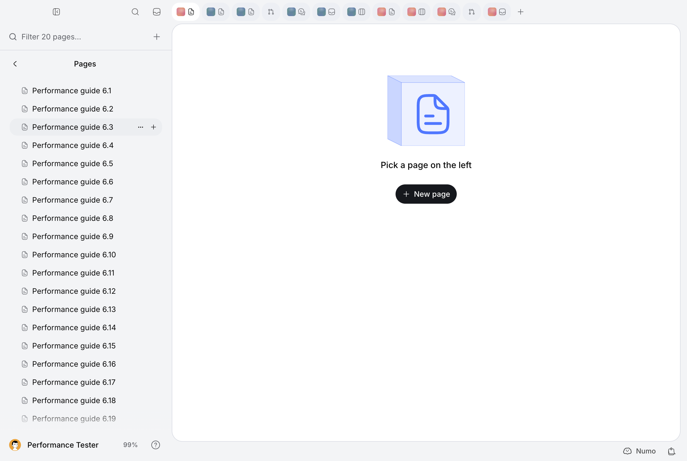

# MIN-614 — desktop performance, phase 3f

This pass extends the existing bounded navigation owners across boards, PRs,
Pages, Feedback and Triage. It measures a populated, encrypted fixture in native
Electron against explicit gesture, route-frame and exact-scenario content
predicates. It does not establish instantaneous navigation throughout the
application or complete MIN-614. The cumulative issue remains in progress.

Branch: `codex/min-614-encryption-performance`; cumulative
[PR #342](https://github.com/mangue-dev/minddy/pull/342). Earlier audits, matrices,
samples and security proofs are preserved. No new branch/PR, merge, `work:done`
or production deployment belongs to this pass.

## Provenance and measurement boundary

The initial clean checkout, fetched origin and actual PR HEAD were
`73f3ec10c0e5c2a4942d9e16ccb388e51259fd66`. The PR was open, with no auto-merge
request or GitHub closing references. Its desktop dependency audit was already
blocked. The initial 3e final product is included in this baseline; intermediate
3e timings are not relabeled as final-product evidence.

Baseline source: `73f3ec10c0e5c2a4942d9e16ccb388e51259fd66`, production BUILD_ID
`Jtz_MqO6lPIHAI6Y8M8JS`. Final product source:
`70f772c4ba31f3b484ebb214674f843a7e42f872`, BUILD_ID
`SYcNM1eOhXLmKqR1MP290`. Build IDs and checkout/dirty metadata
for every launch are in the separate results manifest. Baseline builds were
served after temporarily restoring the baseline application sources on the same
branch; the manifest's checkout HEAD is therefore intentionally different from
its explicit build source. Saved builds and source restores did not create
branches or discard edits. Audit/harness follow-ups do not change that product
tree.

Both cohorts use localhost port 3111, production Next.js 16.3.6, native Electron
43.7.5/Chromium 150, macOS LaunchServices, a 1280×860 native viewport, dark mode,
and a fresh temporary desktop profile/account QueryClient per launch. This is
the unpackaged native shell with the production web build, not a signed packaged
release. The production server is restarted for each implementation, not for
every desktop launch; installation/key/authorization process caches can be warm.
No heavy profiling or checks run during the accepted ordinary cohorts. Hardware
recorded after the campaign: Apple M4 Pro, Mac16,8, 24 GiB, macOS 27.0
(26A428). Power and thermal state were not captured.

The performance tester uses the **migrated MIN-540 encrypted fixture**: six
projects, 600 issues, existing page documents and stored synthetic PR metadata.
The old plaintext seed is never executed. Read setup verifies the fixture marker
and owner. Two captured existing issue IDs are moved to Triage, reducing the
ordinary board total to 598 (99 in each selected project). Six private synthetic
Feedback posts are created through authorized APIs during untimed setup. Normal
automatic review merges them into two visible posts, one per selected project;
all matched runs verify that same populated canonical state. The journal keeps
all attempt titles/returned IDs before another action. Cleanup restores original
issue fields and visible Feedback/user collections, retaining normal history and
tombstones rather than deleting audit evidence.

Twelve mixed tabs are supplied through a measurement-only virtual tab transport.
Selection, route/context ownership, query consumers and React trees remain real;
tab-row writes are virtual and are **not evidence of server tab-write latency**.
The original persistent performance tabs must match their captured identities,
URLs, order, pin and custom names before a run may report cleanup success.

The PR adapter is confined to `scripts/performance/min614-navigation-journeys.mjs`.
Stored authorized Minddy PR list/metadata reads remain real. Only forge detail and
secondary endpoints are replaced with synthetic UI responses: 12/441 files,
eight checks, a synthetic body, 20 declared commits, no write capability and no
merge permission. Comments/review threads and the commits response are empty.
This measures PR navigation, structure and rendering; it does **not** measure
GitHub transport, real forge freshness, deployments, remote write authority or
populated conversation/commit rendering. Product forge reads, live-head barriers,
quota recovery and action authorization remain intact. No personal GitHub login
or reconnection is requested.

## Existing owners and selected common paths

| Owner | Reused behavior and changes |
| --- | --- |
| `AccountTabs.navigate`, `AppTabsSession`, `lib/app-tabs-context.tsx` | One account session and navigation owner. Local history is permitted by the existing retained qualification or prepared public module plus final consumer's existing query data. Other destinations retain router navigation. |
| `AppTabViewHost`, `retainAppView`, `AppTabRouteProvider` | The same Activity host now covers Pages, PR, Feedback and Triage, with scoped project/path/search snapshots and stable Pages shell identity per tab/project. Hidden effects and portals remain suspended. Unknown nested Feedback/Triage routes remain router-owned. |
| `lib/retained-app-views.ts`, `useRetainedBoardScroll` | Six views/six weighted units, pressure budget three and 32 visits remain bounded. Frequency/recency is weighted by reconstruction cost; an unmounted PR diff no longer charges its full stored file count. A mounted diff still receives the conservative file weight. Only actually scrolled connected nodes are restored; no whole-tree geometry scan. |
| `prefetchAppTabDestination`, `createPrTabPreparation`, `lib/app-tab-surfaces.ts` | Existing intent and account preparation owners share a bounded public module registry and final-consumer query keys. Pages list/body and Feedback no longer warm unrelated board queries. One missing/invalidated primary read per navigation; existing one-slot PR preparation/rate pause; no idle polling. Active work cancels unobserved speculation and preserves joined observers. |
| `observeRetainedBoardData`, QueryProvider, encrypted snapshots | Existing account QueryClient and persistence owner. Loaded hidden primary lists retain observers for realtime/resume invalidation, with no speculative absent read, timeline or hidden PR polling. No new private persistent cache, key material, Service Worker or HTTP response cache. Snapshot sealing/authorization/rotation/revocation owners are unchanged. |
| `usePullRequestQuery`, scoped activation context | Activation time lives outside Activity's deferred hidden rendering. The mounted PR consumer keeps the 3e request-start authority barrier: a pre-click preparation remains previous until its required post-activation authority completes. |

The short exploration separated route/provider remounts from code/data preparation,
encrypted API/snapshot traffic, rendered tasks and styles. Non-board returns paid
router/tree work despite available account data; intent preparation mapped Pages
and Feedback to unrelated board queries. The selected common paths are bounded
view reuse, correct final-consumer module/data preparation, and weighted retention
under mixed use. No succession of per-page network shortcuts was introduced.

An intermediate product (`0cd32b937eb8b21181bb5fd65e0fbb190d8d19bd`, BUILD_ID
`-TQIXOZtFhoQDQRMMS2GS`) improved several lists but evicted the frequent global
board when charging 441 stored PR files to its Activity view. Global return
reconstruction rose materially. The final bounded policy separates data ownership
from mounted DOM cost and incorporates reconstruction weight; the unchanged
12-destination workload is repeated. The intermediate budget build
`1be3aef6a37854916d6309028875646d679855be` also remains separate from the final
product cohort. The intermediate regression remains in the
archive and is not averaged away.

Native functional checks exposed two shared lifecycle failures.
`PageCommentBubble.shouldShowSelectionMenu` could read a Tiptap view after the
retained editor had unmounted; it now checks initialization/destruction before
accessing the view. `AppTabRouteSync` could leave a committed Pages list target
pending when PagesHome immediately redirected to the remembered document before
its deferred publication. A layout acknowledgement records the committed URL
before passive redirects; tagged publication still refines selected issue state.
Real Editor lifecycle and real AppTabsSession redirect tests cover both fixes,
and final native close/reopen resumes the complete remembered document.

## Clocks and scenario predicates

The old `measure()` timers and their two-frame checkpoint/350 ms observation tail
remain. New clocks start at the captured native-renderer `pointerdown`; driver
preparation is excluded. A requestAnimationFrame checkpoint is not a pixel-paint
or input-event throughput guarantee.

1. **Accepted:** target app-tab control is selected on a renderer frame.
2. **Destination frame:** the target pathname/search is observable on a frame;
   this is route/shell acknowledgement, not usable-content success.
3. **Available content:** visible expected cards/rows, PR Activity/title, or the
   document's complete normalized body is present without a visible skeleton.
4. **Usable exact scenario:** available content plus the existing board fresh
   marker or completed PR activation authority. List/document content must match
   the authorized canonical setup for this unchanged scenario. This is not a
   universal claim that cached text remains fresh under every concurrent mutation.
5. **Secondary reconciled:** known project/PR fetches have no pending headers-read
   operation. This broader background marker can include another prepared route;
   it is not parsed-body completion or proof of every secondary surface's pixels.
   Internal Files/Commits are exercised separately.

The DOM identity witness uses the retained owner ID. For the old baseline's adopted
startup board key, the fixture's **unique board route** is an explicit fallback;
it must not be generalized to distinct tabs sharing a board URL. Prepared-data
classification means a successful primary page-origin read was observed, not a
new private cache or proof of every prerequisite. Every exact completion still
uses the visible consumer's predicate.

Each launch primes eleven destinations then performs ten repetitions of a
nonuniform twelve-step sequence, frequently revisiting late PR/project/Triage
tabs. There are 131 samples per launch. Nine subsequent clicks per launch select
the already active global tab; they are reported separately and never counted as
return-navigation success. True returns, first activation with available data,
and cold activation without a DOM/prior successful primary read are distinct.
An exploratory probe stamped already-active predicates before the gesture;
negative clocks and the entire affected series remain exploratory. The accepted
final cohorts gate all clocks on the gesture in both builds.

An initial final-product attempt (`pass3f-final-verified-after-1`) completed
131 samples; its second launch stopped after 23 completed samples when the
already-active global click passed the old 82 ms card-count timer but failed
the new exact predicate after 15 seconds. Cleanup passed and no write was
replayed. A 35-sample diagnostic did not reproduce it. Its cause remains open;
the original attempt did not capture the failed probe fields. Later harness
failures capture their probe/owner/API states. This failure remains explicit
reliability evidence, even though already-active clicks are excluded from
return-navigation timings. A subsequent confirmed attempt stopped at document return 4 after 64 completed
samples. The probe had gesture/route acknowledgement but no editor content;
there were pending document/watch/snapshot reads. The observer captured five
authorization RPCs at 5.0–5.2 seconds, with other upstream reads also slower than
earlier cohorts. This is a required authorization/transport cost, not a missing
route-frame acknowledgement, and no product control is bypassed.

The observed cohort uses a fresh owned server and three fresh desktop launches.
The harness now retains each original 15-second deadline failure and timer, then
waits for recovery without another gesture. Recovered samples stay flagged as
failed deadlines and retain their full gesture-to-exact latency; they are never
reported as passing the deadline. A recovery that cannot produce exact content
still stops the launch. Old rendering counters for a failed old timer cover its
original observation window, not all subsequent recovery work. Normal samples
and all predicates retain the original definitions. Both failed attempts remain
outside the completed-cohort aggregates, with explicit denominators and full
available sample evidence; completed-cohort statistics do not establish reliable
navigation in the presence of these failures.

## Final matched results

Three fresh native launches per implementation, ten warm sequences each:
393 samples per cohort, comprising 333 true returns, 33 first activations and
27 already-active clicks. The completed final cohort has zero failed deadlines;
the two earlier final-product stopped launches remain reliability failures.
No instant-navigation acceptance is claimed.

| True return | n per cohort | Exact median before → after (ms) | Exact p95 before → after (ms) | Median change |
| --- | ---: | ---: | ---: | ---: |
| Global board | 33 | 408.5 → 447.8 | 1431.7 → 1927.9 | +9.6% |
| Document | 30 | 444.6 → 390.6 | 492.9 → 1171.9 | -12.2% |
| Small PR Activity | 30 | 159.4 → 109.0 | 175.5 → 127.1 | -31.6% |
| Project 0 Triage | 30 | 202.0 → 71.3 | 212.0 → 77.4 | -64.7% |
| Project 5 Pages list | 30 | 79.9 → 54.6 | 85.8 → 62.0 | -31.6% |
| Project 5 board | 60 | 177.9 → 220.2 | 200.8 → 243.9 | +23.8% |
| Project 5 Feedback | 30 | 166.8 → 97.9 | 181.2 → 113.9 | -41.3% |
| Large PR Activity | 60 | 207.6 → 143.8 | 236.0 → 179.3 | -30.7% |
| Project 5 Triage | 30 | 198.3 → 69.1 | 227.8 → 76.6 | -65.2% |

Prepared-data returns improve on PRs, both Triage lists, Feedback and Pages.
The project-board return regresses as it is evicted more often under the unchanged
budget. Global return median and p95 regress; document p95 rises from 493 to
1172 ms, with a retained 10694 ms maximum. The final hot-DOM class has only
27 global-board returns (444 ms median/507 ms p95), whereas the baseline class
also includes project boards. These class mixtures are not comparable aggregate
speedups. No hot class satisfies the ≤50/≤100 ms goal. Neither cold eviction
state loss nor the two deadline failures is canceled by a faster list.

First activations have three samples per destination. Truly cold Pages lists
improve from 2149→1313 ms and 768→396 ms median (−39%/−48%). The document
regresses 321→434 ms and small PR 1001→1186 ms. Triage first activation is
**data-prepared, DOM-unmounted**, not cold: 183→54 ms and 196→53 ms.
The project 5 board has prior primary data in the baseline and no prior primary
read in the candidate, so its 388→453 ms first-activation comparison is not
a matched cold-data claim. Cold PR gesture acknowledgement is 14/18 ms and
route-frame acknowledgement 43/47 ms median, while exact usable content takes
1186/950 ms. Cold Pages list acknowledgement is 35/19 ms but its destination
frame takes 1311/164 ms. Exact usability, not these acknowledgements, decides
success. Full distributions and classifications remain in the results file.

| Render observation for true returns | Script median before → after (ms) | Style median before → after (ms) | Layout median before → after (ms) | Frame-stall p95 before → after (ms) |
| --- | ---: | ---: | ---: | ---: |
| Global board | 371.8 → 375.1 | 114.1 → 115.4 | 40.3 → 40.9 | 425.6 → 667.5 |
| Document | 329.4 → 230.7 | 27.0 → 28.0 | 4.5 → 4.6 | 42.7 → 75.2 |
| Project 5 board | 211.9 → 270.1 | 30.6 → 31.9 | 6.6 → 7.1 | 125.1 → 175.0 |
| Large PR Activity | 328.8 → 217.3 | 29.9 → 24.3 | 2.3 → 2.0 | 99.9 → 133.3 |
| Project 5 Triage | 243.9 → 156.7 | 25.5 → 14.7 | 1.4 → 1.2 | 108.4 → 74.8 |

These counters include the old observation tail and concurrent work; they are
not exclusive per-component CPU. Long-task samples and individual frame stalls
are retained rather than replaced with an average.

Sampled renderer heap median is 666→508 MB and p95 1054→879 MB in this
workload. The historical renderer-start board guard regresses in median from
2139→2611 ms (+22%); its three-run maxima are 2844→2704 ms. This excludes
process launch/auth setup and is not whole-application startup acceptance.

Page-origin request records rise 2914→3157 (+8%); actual upstream operations
in the comparable navigation windows rise 11152→12354 (+11%). Authorization
RPCs rise 1454→1688, key-envelope reads 2091→2320; issue reads remain 252.
The whole matched-server lifetime emits 48191→48990 decrypt audit records
(963→965 unique identities; 47228→48025 repeated identities). No read/decrypt
reduction is established. Normal history from the controlled title update and
restoration remains in the candidate workload; canonical scenario fields match,
but this durable extra history and upstream latency limit strict backend-cost
attribution. Both matched windows have zero observed GitHub starts.

Fifteen-second idle windows have zero approximate page API requests in all six
runs. Renderer TaskDuration deltas are 1.077–1.113 s before and 1.165–1.213 s
after; ScriptDuration is 0.052–0.058 s before and 0.058–0.063 s after. Renderer
heap drops during all idle windows. These short counters show a small idle-work
increase, not a sustained whole-system CPU/traffic acceptance. Network bytes,
process RSS and longer idle behavior remain unmeasured.

Acceptance requires hot median ≤50 ms/p95 ≤100 ms with exact data and preserved
state, plus immediate cold acknowledgement and preferably ≥30% improvement to
usable content. A skeleton or a fast previous value never satisfies that target.
Remaining expensive reconstruction/reconnection, authority and editor/diff work
are reported separately rather than labeled instantaneous.

## Functional and security verification

Native final-product supplementary runs verify the complete remembered document
after tab closure, small/large PR Files bodies (12/441 headers and the first real
rendered synthetic code), retained large-PR internal tab state, a canonical hidden
issue title change followed by the existing `pageshow` recovery, and restoration
of that captured issue. The loss gate dropped three socket messages but saw zero
events for the target issue: this is authoritative-resume recovery evidence, not
proof of an actually missed target event. Actual missed-event processing remains
covered by the existing owner tests and is a native coverage gap.

A separate held synthetic PR response verifies that active Triage becomes usable
while preparation is pending, that the pending PR read is not accepted as exact,
and that final authority starts after activation. The account QueryClient,
foreground cancellation and actual PR consumer remain product code. Supplemental
CPU/React observations are instrumented and excluded from ordinary timing claims.
The final profiled navigation has 14–41 observed root commits per scenario; these
include the observation tail and concurrent work, and are not per-component render
counts. Raw profile stacks stay local; sampled GC aggregates remain publishable.

Native retained global-column scroll stays at 140 px; retained Feedback filter,
caret selection and current shortcut focus survive handoff; keyboard tab reorder
returns the original order. Three project-picker transitions preserve the
route type and expose the expected canonical Triage rows for each project; Pages
then opens in the selected project. The visible text driver was corrected to
ignore duplicate hidden same-route rows; ordinary matched fixtures have one
Triage/Pages list per project, with unchanged exact-content predicates. Pointer dragging, full editor draft/autosave workflows,
optimistic mutation UI during concurrent navigation and cross-account native
sessions are not certified by this campaign. Their existing owner regression
coverage remains separate. Bounded eviction resets the small PR internal tab and
clears document selection/focus in the supplemental scenario; cold state restoration
is an open limitation, not a passing retained-state test. Failed native attempts,
including harness selector/sidebar-panel assumptions, remain archived.

Existing 3b/3c delivery, reconciliation, optimistic cache and MIN-630 relation
owners are reused. Tests cover scoped routes, twelve mixed late tabs, draft DOM
identity, suspended hidden effects/portals, bounded eviction, scroll restoration,
loaded hidden-query invalidation and the actual PR Activity authority barrier.
Unknown routes, account-client teardown and canceled speculation retain their
original boundaries. Security checks exercise encrypted local snapshot access,
rotation/revocation and cross-account isolation; source changes do not alter
authorized repositories or the key registry.

## Guardrails, limitations and remaining work

The 3d cold/hidden-freshness/memory regressions and 3e p95 heap +29% remain their
original workloads' evidence. A better heap measurement here cannot cancel them.
Historical `cold-board` measures renderer navigation after shell/auth setup;
process-to-first-useful-view startup remains uninstrumented. Fifteen-second idle
guards stop the scenario DOM predicate, retaining only the existing lightweight
frame/long-task recorder. These short renderer counters are not whole-system CPU,
sustained traffic, peak RSS or a long-session memory guarantee.

Upstream observers count actual operations and existing decrypt audit records.
Decryption counts span the matched server lifetime, including setup, cold start,
cleanup and concurrent work. They are not request-correlated AES duration.
Headers-ready timings/content-length do not establish total transferred bytes.
Supplemental CPU profiles/React commit observations are separate from ordinary
timings; sampled GC is not whole-process GC time.

| Cumulative 3f category | Outcome |
| --- | --- |
| Measured gains | Prepared PR Activity medians −32%/−31%, Triage −65%, Feedback −41%, Pages list −32%; three completed native launches per cohort. |
| Guarantees reverified | Scoped routes/activation authority, real editor remount guard, committed-route redirect acknowledgement, hidden canonical update/resume/restoration, retained scroll/filter/caret/focus, keyboard reorder, repeated project picker plus destination. Owner tests cover optimistic reconciliation, authorization, revocation/rotation and isolation. |
| Regressions | Global median/p95, project-board return, document tail/10.7 s extreme, renderer startup median, API/upstream/decrypt counts and small idle-work increase. Cold eviction loses some local selection/internal-tab state. Earlier final-product deadline stops remain explicit. |
| Gaps | ≤50/≤100 ms hot target unmet; no universal exact freshness/state claim. Native actual target-event loss, pointer DnD, full editor drafts/optimistic mutation flows, account switching, process startup/RSS/long idle and populated PR commits/conversations remain open. Live GitHub is excluded by scope. 3d/3e regressions and GHSA remain uncanceled. |

Final local validation: 25 focused files/160 tests pass, including the affected
3b/3c and MIN-630 reconciliation/security owners; production build, typecheck and
lint pass. `check:owned-english`, `check:encrypted-access`,
`check:encryption-schema`, `check:public-repo` and `git diff --check` pass.
The decompressed 14.28 MB public sample archive also passes the unchanged
Gitleaks policy (zero findings). No earlier audit/results/assets, locale catalogs,
Mangue-ui dependencies, scanner/allowlist, migration or encryption policy path
is changed. The final desktop audit exits nonzero with eight high findings in
the known GHSA dependency chain; npm's suggested major builder change is not a
verified patched transitive version. The security gate stays blocked.

The desktop dependency audit remains blocked by
[GHSA-ch52-4w7c-c8xp](https://github.com/advisories/GHSA-ch52-4w7c-c8xp), which lists
http-cache-semantics ≤4.2.0 as affected and no patched version on this recheck.
No blind `audit fix --force`, dependency-policy bypass, Gitleaks allowlist change,
scanner weakening or Mangue-ui change is made.

## Evidence and reproduction



This screenshot uses a DOM-only light theme after the functional check; no account
preference is written. Ordinary matched timings retain the account dark theme.
Some historical harness screenshot filenames say `light` even when their pixels
are dark; filenames are not theme evidence.


The separate [results manifest](desktop-perf-min-614-pass-3f-results.json) contains
per-launch/aggregate metrics, all attempt classifications, build provenance,
checksums and the compressed complete publishable sample archive. Original raw
logs, failures, profiles, traces, setup/restoration journals and builds stay under
ignored `output/playwright/performance/`. Large originals also have local gzip
copies with checksums. Public copies omit document bodies, stored PR URLs/private
metadata, complete failure DOM and original account/project/tab/issue/page IDs;
sample paths use stable pseudonyms. Raw decrypt logs/profile stacks remain local
with checksums. No private omission removes a timing sample, failure or extreme.

```sh
# Serve the saved production build for the specified source first.
NODE_OPTIONS='--max-http-header-size=32768 --import=./scripts/performance/server-timing.mjs' \
  MINDDY_PERF_SERVER_LOG=output/playwright/performance/pass3f-final-before-upstream.jsonl \
  npm run start -- --port 3111
node scripts/performance/run-min614-navigation.mjs pass3f-final-before \
  73f3ec10c0e5c2a4942d9e16ccb388e51259fd66 1 2 3
# Restart the owned server with the final product build and a separate log.
node scripts/performance/run-min614-navigation.mjs pass3f-final-observed-after \
  70f772c4ba31f3b484ebb214674f843a7e42f872 1 2 3
node scripts/performance/summarize-min614-pass3f.mjs
```

Labels/log creation are exclusive: do not reuse a label or automatically replay
a timed write. Workload setup/restore uses `prepare-min614-navigation.mjs` through
the authorized performance account; never rerun `prepare` over a partially
restored journal. Normal automatic Feedback review can merge setup rows; verify
the canonical workload before timing. If restoration fails, stop measurements.
Post-push final HEAD checks and Minddy status are recorded separately; absent
GitHub closing references/auto-merge do not prevent Minddy's forge integration
from marking the issue done on a later merge.

## Publication repair and final forge checks

The initial delivery at `6608fea7177d0e998996daef5cf7800121638a60` reached the
unchanged forge history scanner, which rejected the synthetic setup email's
`example.invalid` domain. The fixture now uses `example.test`, already recognized
by the existing policy. Only new 3f commits were rewritten; the previous phases
and their commits are untouched. No Gitleaks exception or scanner is changed.
The original seven-commit range is retained in a local Git bundle plus gzip and
checksums in the results manifest. Original measured SHAs/builds/samples remain
unaltered; the rebased product commit has identical `app`, `components` and `lib`
trees to the measured `70f772c`. A new pinned-version history scan of the repaired
range passes. This publication-only repair does not replace native measurements
with an intermediate-product timing. The original forge failure is retained.

Post-repair final HEAD/status/check receipts are recorded separately after push;
the known dependency gate remains blocked. No merge, cleanup workflow or
production deployment is performed.
