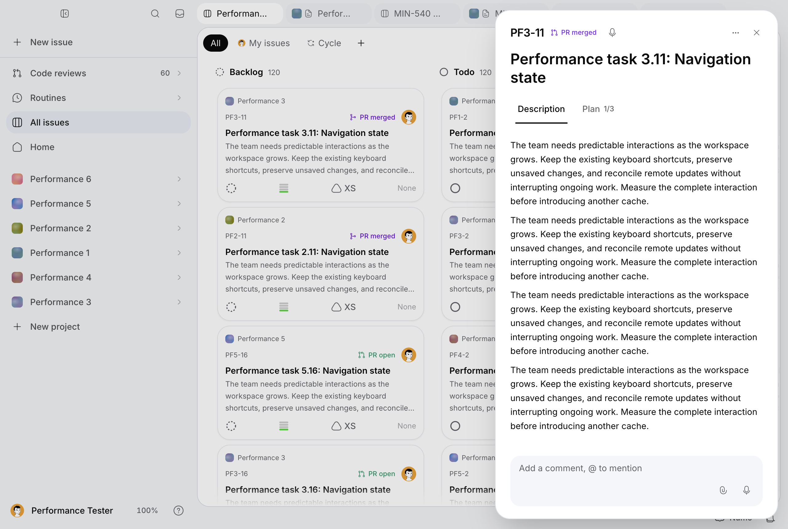
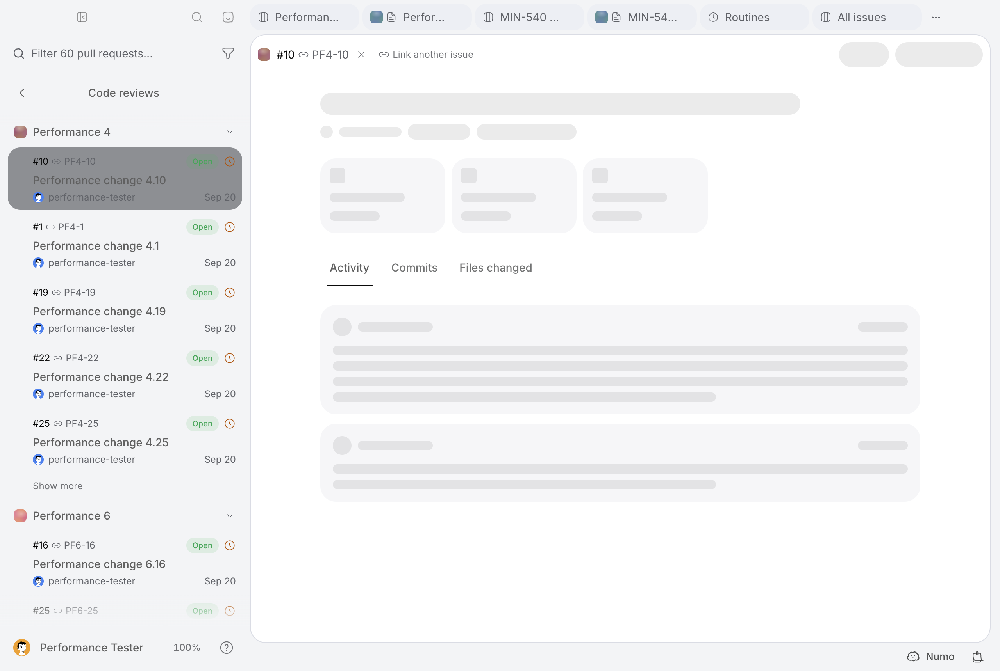

# MIN-614: encrypted desktop performance

Measured on October 2, 2026, against main commit `8ba5e265e`, after MIN-591.
This is a measured first delivery, not closure of all MIN-614 acceptance criteria.
The aggregate samples and build identifiers are in
[desktop-perf-min-614-results.json](desktop-perf-min-614-results.json).

## Method and scope

Reuse the existing MIN-540 tools in `scripts/performance/`, `server-timing.mjs`,
and the opt-in `lib/desktop/trace.ts` probe. The older reports live in
`docs/performance/min-540*.md`; the issue's `docs/audits/desktop-perf-*` path was
absent at the baseline.

Both candidates are production Next builds, served locally against the same
configured remote Supabase. Encryption remains enabled. The existing migrated,
marked benchmark account has six projects, 600 issues, 120 Pages of 80 blocks,
1,200 issue comments, 480 page comments and 180 stored PRs. No seeder was applied,
no business content was rewritten, and no encryption flag was disabled.
Repository preparation reads issues through `issueStore` and Pages through
`getPage`, checks the account marker and project identifiers, then creates fresh
ciphertext **only in memory** for the codec microbenchmarks. It never reads
encrypted columns outside their authorized repositories.

The native measurements use the actual unpackaged Electron 43.7.5 shell
(Chromium 150.0.7871.250), a fresh temporary profile per run, the native preload,
and the existing desktop trace flag. No installed account profile is copied.
The viewport is 1280 × 860 CSS pixels, with the account's dark theme. Supplemental
browser measurements use Playwright Chromium 153.0.8010.12 at 1440 × 1000. Do not
compare these two runtimes as equivalent. CPU is unthrottled. Builds and tests
are stopped before latency measurements.

Playwright's ordinary Electron launcher initially produced no attachable window.
On macOS, LaunchServices plus an initial local document made the actual renderer
attachable through CDP. The runner checks the native bridge and refuses an
occupied diagnostic port. It terminates only processes with its unique temporary
profile argument and removes that profile. Failed launches and diagnostic runs
are excluded from latency tables.

The three observations per interaction are small samples, not field INP or
credible p95 estimates. Readiness means the issue dialog is visible, the retained
board's first card is visible, the Page editor is visible, or a stored PR list
entry is visible. It does **not** mean every background read or forge detail has
finished. Renderer counters include a 350 ms observation tail; readiness excludes
that tail. Script and style counters are not additive. Cross-document PR
navigation resets CDP counters, so its script/style/layout deltas are omitted.
The first native baseline file originally reported the working directory's build
ID; the aggregate evidence corrects it from the actual archived baseline server.

## Measured causes and changes

### Repository identity reads

`listPullRequestsForUser` decoded the same encrypted repository identity once per
PR. Each verification also resolved the current blind-index writer key before
using the immutable version-one index. A 51-row read produced 111 upstream calls:
51 identity rows, 57 registry reads, and three underlying list/link/issue reads.
The first page spans two distinct repositories in this fixture.

`createRepositoryNameDecoder` now coalesces identical provider/token reads within
one authorized operation. Failed promises are evicted. Each new operation reads
and validates its identities again; no global plaintext cache is introduced.
Read verification uses the retained version-one blind-index key directly. Writers
still resolve the current key on every write, preserving rotation observation.
GCM context binding, HMAC identity verification, provider separation, RLS queries,
and access filters remain intact.

`listVisibleRepos`, `listPullRequestsForUser`, `readRepoSyncStates`, and the PR
route's agent-run decoration use operation-local decoders. Independent token and
identity reads run in parallel; sync-map and agent-run ordering is preserved.
`countPullRequestsForUser` still performs exact head-only counts through the
caller's client, with duplicate repository pairs removed before token lookup.

Fresh-process repository samples: four rounds each; the table reports the median
of rounds 1–3, excluding round 0. Upstream counts are identical across warm rounds.

| Authorized operation | Before ms | After ms | Calls before → after |
| --- | ---: | ---: | ---: |
| Six visible repositories | 224.6 | 153.7 | 13 → 7 |
| 51 stored PRs with linked issues | 749.4 | 454.8 | 111 → 11 |
| Open/draft PR badge | 458.6 | 173.0 | 7 → 7, parallelized |
| Six repository sync states | 908.8 | 258.4 | 19 → 13 |

### Native style invalidation

A native issue-opening trace showed five root subtree invalidations and repeated
`UpdateLayoutTree` passes over approximately 28,000 elements, taking 110–131 ms
per pass. The trace also recorded 4,326 `:has()` tracking invalidations. The root
invalidation stacks included document-title changes, React DOM commits and
scroll-lock stylesheet insertion. Full tracing generated a 167 MB diagnostic
file and materially changed timing; its latency is excluded from the tables.

Deleting the two rules at runtime did not eliminate the engine's existing
invalidation tracking. Removing broad native no-drag rules or disabling all
animations also failed to improve the symptom; neither experiment was shipped.
Replacing the two root `:has(.app-top-bar)` selectors in the served stylesheet
**before** a fresh native launch reduced first issue readiness from 1,236 to
293 ms. A normal source build then confirmed the result.

`AppTopBar` now maintains `data-app-top-bar` during its mounted lifetime, restoring
any previous marker on cleanup. The two CSS rules use this presence marker,
retaining their media queries and native drag-band behavior. Window dragging,
interactive no-drag controls, modal overlays, animations and rich cards remain.
The StrictMode marker lifecycle and the drag-band policy have regression coverage.

Supplemental CPU profiles identified synchronous activity-text overflow reads and
`restoreBoardScroll` geometry reads. `OneLine` now observes size after layout,
remeasures changed text on a frame, and preserves its paragraph/tooltip DOM and
focus when overflow changes. Scroll restoration avoids reading content dimensions
when its requested offset is already restored. These smaller changes have focused
behavioral coverage; the headline native gain is attributed to the CSS experiment,
not to an unisolated claim about either smaller change.

## Native before/after

The first candidate column is the normal production source build, not patched
compiled CSS. A second fresh-profile run is included rather than discarded when
remote latency worsened. Each median below contains three observations except
cold board and PR page, which contain one observation per run.

| Readiness | Baseline ms | Candidate ms | Candidate repeat ms |
| --- | ---: | ---: | ---: |
| First board, fresh document | 3,587 | 2,517 | 2,347 |
| Issue dialog, median | 1,210 | 316 | 328 |
| Page editor tab, median | 282 | 304 | 244 |
| Return to retained board, median | 1,430 | 1,151 | 1,108 |
| Authenticated PR list route, median | 1,400 | 739 | 3,709 |
| PR list visible after navigation | 2,722 | 1,821 | 2,280 |

Issue-opening style time falls from a median 785 ms to 138 ms (repeat: 133 ms).
Long-task time falls from 1,068 to 186 ms (repeat: 215 ms). Board-return style time
falls from 441 to 126 ms; board-return long-task time falls from 1,019 to 676 ms.
The board still produces substantial stalls. This delivery improves the measured
symptoms but does not establish smooth performance for every desktop interaction.

Local AES decoding with already-warm keys is small relative to the remote reads:
600 freshly encoded issue values decode in a median 18.1 → 17.1 ms; 20 freshly
encoded Page values in 3.9 → 4.1 ms. Both make zero warm registry calls. These are
in-memory repository-codec measurements, excluding per-row console audit output,
not end-to-end Page or issue loading times. The authorized 600-issue read is
437 → 492 ms in these small samples; no improvement is claimed for that path.

Ten sequential in-memory issue encodes still make ten current-key registry reads.
Typical rounds take 546–596 ms, but one baseline round takes **48,306 ms**, with
successful upstream statuses. The full outlier is retained in the JSON. Likewise,
the second native PR-route run is substantially slower despite the deterministic
reduction in repository calls. Remote latency remains a separate concern; removing
writer rotation checks or treating all loading time as AES CPU would be wrong.

## PostHog errors

Inspected the Minddy EU project `231975`, September 29–October 2 UTC, including
internal/test accounts. Read exception groups and sampled stacks; changed no
error status and suppressed no capture. Server stacks are minified and do not
reliably provide a route/release attribution. Representative groups:

- [Forge identity unavailable](https://eu.posthog.com/project/231975/error_tracking/01a0f3ec-a470-7f90-b7cb-3f35a808cb84): 22 occurrences, two users. Another group has eight occurrences. This is a real failure; coalescing reads does not repair missing registered identities.
- [Key version lookup](https://eu.posthog.com/project/231975/error_tracking/01a0f44a-a694-7651-8dbc-42c0de4a5e3e): 19 occurrences, four users, with an undefined error code.
- [Current key lookup](https://eu.posthog.com/project/231975/error_tracking/01a0f3d2-20d2-7a83-b4c1-cbf44254c294): 17 occurrences, three users. `SupabaseKeyRegistry` builds these messages from `error.code`; the sampled message alone cannot identify the transport failure.
- [HTML exception body](https://eu.posthog.com/project/231975/error_tracking/01a0f2ef-2903-7a61-a08f-537bc3d82bf0): ten occurrences, eight users; the sample is a Supabase Cloudflare 522 connection timeout. Do not publish its body or identify it as a decryption failure.
- [Missing PR link table in schema cache](https://eu.posthog.com/project/231975/error_tracking/01a0f801-26ee-7483-8f6e-973156e2c3a5): nine occurrences, one user, October 1 at 15:07–15:10 UTC. Verify production migration/schema-cache state; do not silently skip encrypted or linked data.

Pagination repeated some groups, so counts above are per group, not summed across
pages. PostHog supports the existence of these failures, not proof that they
caused every desktop frame drop. No replay evidence was available.

The native repeat also observed an admin API 503 and selected PR detail/comment/
commit/review endpoints returning 500. The fixture has no forge credentials, so
this audit covers stored PR list readiness and identity reads, not a successful
connected-forge detail/diff review. The light-mode screenshot shows that limitation
rather than fabricated forge content. Page errors and failed HTTP responses are
recorded separately in the aggregate evidence.

## Reproduction and verification

Required local environment: the configured Supabase URL/anon key, service role,
root encryption key, encryption enabled, and the existing marked fixture's
`CAPTURES_DEMO_PASSWORD`. Keep these values out of command output and commits.
Do not run the legacy plaintext seeder against this migrated fixture.

```sh
# Verify the existing fixture through authorized repositories and write workload.json.
MINDDY_PERF_LABEL=after node scripts/performance/run-min614-repositories.mjs

# Compile the actual desktop shell and a production web build.
node scripts/build-desktop.mjs
npm run build
npm run start -- -p 3111

# Run measurements separately from builds, tests and other UI runners.
MINDDY_PERF_LABEL=native-after node scripts/performance/measure-min614.mjs --electron
MINDDY_PERF_LABEL=browser-after node scripts/performance/measure-min614.mjs
# Diagnostic only; do not compare these timings to the latency series.
MINDDY_PERF_LABEL=native-profile node scripts/performance/measure-min614.mjs --electron --short --profile --trace
```

The existing fixture must already have its `Performance board` and
`Performance pages` tabs. The runner reads their current hrefs and uses only that
marked account. Application navigation can update that account's encrypted tab
state and snapshots normally. No forged network responses or paid agent actions
are introduced. Raw screenshots/traces/profiles stay in ignored
`output/playwright/performance/`; only aggregate evidence and a synthetic screenshot
are committed.





To compare server implementations, set `MINDDY_PERF_REFERENCE_ROOT` to an archived
checkout of `8ba5e265e`; the repository bundler resolves server imports there. To
compare native renders, build/serve that checkout separately, set
`MINDDY_PERF_BASE_URL` to its local origin and `MINDDY_PERF_REFERENCE_ROOT` to it.
The baseline used port 3112. Turbopack needs dependencies inside its project root;
an external `node_modules` symlink is not sufficient.

Validation: 44 focused tests across ten files, production build, TypeScript, lint,
owned-English prose, encrypted-access policy, encryption schema inventory and
`git diff --check`. Identity tests cover provider isolation, operation-local
coalescing, failure retry, ciphertext transplantation, rotation and wrong keys.
The consumer inventory retains the same reviewed access signatures; only line
metadata in changed files is refreshed. No schema, migration, key-cache policy,
RLS rule, locale catalog or mangue-ui source changes are included.

## Remaining acceptance work

- Attribute and reduce the remaining retained-board activation/effect work; the
  native median is still approximately 1.1 seconds with 600 rich cards.
- Repeat loaded feedback and agent workflows and connected-forge detail/diff
  navigation. The fixture exercises comments and empty agent/feedback endpoints,
  but does not cover a live agent stream, populated feedback, or forge permissions.
- Correlate production key/identity/schema errors with routes and release versions,
  then verify Supabase transport and migration state. These errors remain open.
- Confirm the candidate on the packaged app and representative connected accounts
  after review and deployment, with longer latency distributions. MIN-614 remains
  in progress; this report does not justify marking it done.
