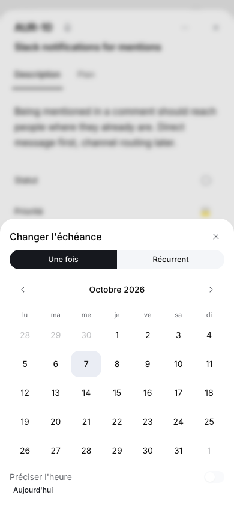
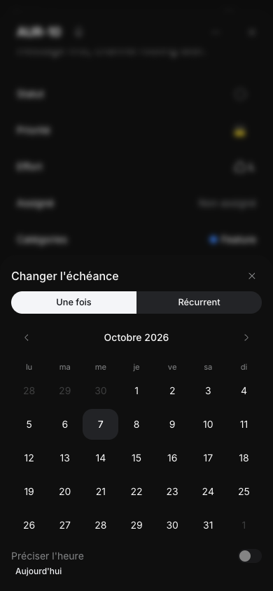

# MIN-636: mobile interface

The mobile shell uses the same 768px breakpoint as desktop chrome. Desktop
retains its account-backed tab strip. Phones use ordinary routes with no tab
query, tab restoration, tab writes, or retained desktop page host. Opening the
app through its Home entry point starts at Home, and reloading a mobile route
returns to Home. Explicit incoming URLs remain usable, including issue links.
Browser back/forward continues to navigate mobile routes. Editor departure
checks still flush pending saves before links and app-router navigation.

## Research and decisions

- [Linear, January 22, 2026](https://linear.app/changelog/2026-01-22-customize-your-navigation-in-linear-mobile)
  describes a mobile bottom toolbar with pinned destinations. Minddy uses five
  predictable slots: Home, navigation, search, Numo, and creation. Their dimensions
  never depend on scrolling, unread state, or the current destination.
- [Notion's mobile workspace guide](https://www.notion.com/en-us/help/workspaces-on-mobile)
  describes dedicated Home, search, inbox and creation entry points. Minddy's
  revealed sidebar groups project destinations and its fixed footer opens account options, while the
  search button opens the shared searchable index rather than a second capped list.
- [Jira's mobile Home design](https://community.atlassian.com/forums/discussion/2503400/october-2023-new-home-screen-reveal-for-jira-mobile)
  emphasizes scannable Home content and quick access. This supports a mobile
  starting point independent of the desktop's last active tab. This is a product
  choice for Minddy, not a claim about how those apps synchronize their tabs.

## Problems addressed

- `AppTabsProvider` previously mounted desktop persistence on mobile even though
  its tab strip was hidden. It now resolves the viewport before mounting account
  tabs and uses a separate mobile departure-guard provider.
- mangue-ui's bottom navigation shrank on captured document scroll events. The
  owned `MobileNavigation` has a fixed five-column bar with a 48px-high bar with centered controls,
  safe-area padding, and a matching content reserve.
- Dialogs and detail panels had a 480px drawer breakpoint, conflicting with the
  shell's 768px breakpoint. Local dialog and side-panel adapters use accessible
  modal bottom sheets across the full mobile range. Alert confirmations retain
  their alert-dialog semantics with matching mobile geometry.
- Shared field pickers, model/reasoning/spend controls, searchable action menus,
  conversation history, resource page search, and the inbox use modal sheets.
  Nested controls use the same Radix layer stack so a child picker does not
  dismiss its parent. Searchable action submenus become inline groups.
- Numo and worker chat use one mobile bottom-sheet size and a dimmed backdrop.
  The desktop compact/expanded preference remains desktop-only. Mobile hides the
  empty-conversation starter cards and uses sheets for both conversation model
  settings and the nested model catalog.
- The shared content header cannot scroll horizontally on mobile. Board views
  collapse into a searchable view selector with a current-view label, chevron
  and always-visible creation action; the desktop strip is retained.
  Wide boards, database tables, code, and diffs keep intentional local scrolling.
- Issue and objective creation use visible headings, labeled inputs, property
  tiles with selected values, prominent voice dictation, and independently
  scrolling form bodies. Submit controls stay visible at the bottom. Mobile
  title keyboards advance to the description. Smart Fill uses a full-width
  labeled switch; the property controls have a consistent transparent surface.
- The mobile navigation menu omits appearance options. Keyboard hints and the
  command-search input's Numo button are hidden on mobile. Destructive action
  icons inherit the same red as their labels, including the highlighted row.
- Mobile navigation keeps a separate stack of browsed levels. Project, resource,
  collection and settings rows display right chevrons and open their next level
  inside the sidebar. Backtracking leaves the current page untouched. Only final
  links or actions close the sidebar and navigate. Resource lists load for the
  project being browsed, independently of the page underneath.
- Single-column boards keep pagination outside the scrolling columns, at the
  bottom above the navigation bar. The current column follows scrolling and
  each dot has a 44px-high selection target. Below 640px this replaces the
  horizontal scrollbar on both project and global boards; wider boards retain
  their scrollbar. Pagination state no longer rerenders every board card.
- Mobile sheets focus their modal container on open. Search fields, rich editors,
  creation forms and the empty Numo composer no longer autofocus; tapping an
  input still focuses it. Desktop autofocus is retained.
- Sheet geometry follows `visualViewport` so software keyboards reduce the
  available height and move the sheet above the keyboard. Top and bottom device
  safe areas are included in the size budget.

## Sheet consistency

Mobile dialogs, pickers and assistant panels share `MobileSheetContent`. Their
close control sits 8px from the top-right corner with a 44px touch target and a
translated accessible label. Custom dismissal guards retain ownership of closing;
there is no decorative drag handle. Search occupies the first row next to the
close control, without a divider before the options. Explicit picker headings
remain visible when no search field is present.

Form and confirmation actions use equal-width columns: cancel on the left,
primary action on the right. A lone primary action spans the row. Draft
confirmations keep their two secondary actions above the full-width save action.
Wizard navigation uses the same order, with its actions pinned inside the sheet.
These styles apply to direct footer actions so embedded comment toolbars retain
their attachment and microphone dimensions and alignment.

Scrolling menu/form/panel bodies use small gradient overlays only on edges that
have hidden content. The overlays are siblings of the scrolling element, ignore
pointer events and avoid masking the whole scrolling layer. Decorative list,
header and footer separators are removed on mobile; selected-tab indicators and
content meaning are retained. Desktop surfaces preserve their existing markup,
anchoring, focus and layout.

## Sidebar reveal

The navigation-sheet presentation is replaced by a sidebar behind the page.
`SidebarFrame`, `SidebarRow` and the pinned account/usage/help footer are shared
with desktop. The shared top band includes the same ticket-creation control,
while the project context and route-owned filters match desktop. Mobile adds
the Inbox row to the root navigation, and browsing levels leave the page
untouched. The account button keeps the same single-line name as desktop, with
no plan or email subtitle. Account, usage and help controls open
ordinary bottom sheets; their dismissal returns to the sidebar.

The page and bottom bar translate together without shrinking, dimming or being
covered by the sidebar. The drawer occupies 296px at a 320px viewport and 351px
at 390px, with a 360px cap on wider phones to stay close to desktop's 320px column.
Rightward swipes across the page reveal it; a left swipe, the exposed page strip or Escape
restores the page. Its left corners grow from 0 to 24px with reveal progress,
using the same animation curve as translation. The clipped surface preserves
visible curvature when its header and footer paint their backgrounds. The
workspace underneath follows `--sidebar`, including the corner cutouts beyond
the drawer's width. Inputs, board-column interactions and nested modals
retain their gestures. Safe-area padding, a fixed footer, focus containment,
inert page content and reduced motion are handled at the reveal boundary.

Mobile keeps desktop typography, icons and controls while selectable rows have
at least 44px height. Page-tree expansion, options and creation buttons have
44 × 44px targets and remain visible without hover. This follows the enhanced
[W3C target-size guidance](https://www.w3.org/WAI/WCAG22/Understanding/target-size-enhanced/)
for those controls; it does not claim a complete application accessibility audit.
Desktop retains its original compact target sizes.

This follows the historical Twitter interaction documented in Axel Kee's
[container/layout analysis](https://fluffy.es/twitter-slide-menu-1/) and
[gesture analysis](https://fluffy.es/twitter-slide-menu-2/): moving the main
container reveals navigation beside it. These references describe the historical
interaction, rather than asserting identical behavior in every current X build.

## Collection navigation and page content

On mobile, active collection pages expose their existing filters, lists and
creation controls in the revealed sidebar through a route-scoped portal host.
The page retains ownership of selection and filters, and selecting a destination
closes the sidebar. Expanding a group or changing a filter keeps it open. Reopening
the menu starts at the current collection level; Back browses its project or the
root without navigating. Wiki folders expand inside the desktop page tree;
there is no separate folder menu or collection overview step.
Pull requests, routines, triage, feedback, objectives, settings, trash and admin
content stay visible without an inline navigation list or a list-back button.
Loading placeholders follow the same arrangement. Content keeps its existing
mobile gutters and centered desktop maximum widths.

The account footer shows only the user name, matching desktop without a plan
or email subtitle. The project context row shows the same project icon as
desktop. The triage duplicate-picker memo
now runs before loading returns, fixing the hook-order error on a cold load.

## Verification

Regression coverage checks mobile tab isolation, initial deep links, reloads,
editor departure checks, nested picker selection, content event forwarding,
sheet dismissal, mobile view-picker-to-creation transitions, explicit input
focus, desktop autofocus, and mobile navigation clearance. Browser verification uses the
existing demo account on localhost without submitting issues or Numo messages.
The targeted runs passed 262 tests in 27 files, including navigation and overlay
regressions. Lint, owned-English and
`git diff --check` passed. TypeScript passed with the repository exclusions plus
`output/` excluded using a task-local configuration; the standard command also
includes pre-existing, untracked preview sources under `output/` and reports
errors in those unrelated artifacts. They were preserved.

A Chromium sweep covered 13 routes at both 320px and 767px: Home, All issues,
code review, routines, account settings, statistics, billing, trash, and the
project board, objectives, pages, feedback and project settings. None produced
horizontal document or header overflow, runtime errors or desktop-tab API calls.
Creation bodies and their fixed footers were also checked at 320, 390, 600 and
767px, including Smart Fill disabled and nested status/date selection. The five
navigation icons have zero vertical offset from the bar center. Desktop tabs and
centered dialogs were checked at 1366px. A follow-up sweep checked navigation,
command search, view selection and both nested Numo model sheets at 320, 390,
600 and 767px with a 667px viewport height. It found no editable autofocus,
keyboard hints, appearance choices or horizontal overflow. Destructive icon
and label colors match both before and after highlighting the action.

The navigation/pagination follow-up passed 59 tests across 14 files, including
project browsing, backtracking, final-link dismissal, clamped last-column
selection, and returning from multiple columns to one. Browser checks covered
320, 390, 600, 640, 767 and 1366px widths. Pagination stayed above the fixed bar
at 320 × 460px, and global boards used the same layout. Browsing another project's
objectives and a nested wiki folder left the URL unchanged; selecting the final
destination navigated and closed the sheet. Project and account settings were
reachable without an intermediate redirect. No runtime errors or horizontal
document overflow appeared. Lint, scoped TypeScript, owned-English and
`git diff --check` passed.

The sheet-consistency follow-up passed 85 tests across 11 files, including
nested close behavior, scroll/click forwarding and fade-edge changes. A browser
sweep checked 40 sheet openings across 320 × 460, 390 × 844, 600 × 667 and
767 × 667: navigation, command search, view selection, creation menus, issue and
objective forms, issue detail, Numo and its two nested model sheets. All retained
one 44px close control at the same inset, no visible decorative list separator,
no editable autofocus, and no horizontal overflow. Creation footers fit within
the viewport. Additional composer checks cover empty and populated comments at
320, 390, 767 and desktop widths without posting them. Inbox, three-action draft
confirmations and view-creation footers were checked at 320, 390 and 767px.
Confirmations explicitly clear the desktop centering translation across the full
mobile breakpoint so cancel remains reachable on wider phones. The project wizard
was checked at 320 × 460px with Back on the left, Continue on the right and both
actions reachable after scrolling.

The collection-navigation follow-up passed 61 tests across 14 files. Coverage
includes available/missing billing plans, project icons, page-owned selection
across menu dismissal, category selection and retained desktop sidebar state.
The browser checked routines, triage, feedback, Pages, objectives, project/account
settings and trash at 320 × 460, 390 × 844 and 767 × 667. No visible inline
navigation list, list-back control, horizontal overflow or runtime error remained.
Settings and trash selections closed the menu. Project icons and nested wiki
levels were checked and their screenshots refreshed.

Populated pull requests and objectives used GET-only browser fixtures because
the demo account has no linked PRs or objectives. Selection, filter persistence,
dismissal and 16px content gutters passed at the same mobile sizes; desktop
content retained its centered 768px maximum width at 1366px. Synthetic PR IDs
cannot resolve realtime topics in the demo backend, so these fixture checks
validate client layout and navigation rather than provider synchronization.
Admin navigation uses the same tested menu host; its capabilities remain covered
by the existing admin-tab tests. Lint, scoped TypeScript, owned-English and
`git diff --check` passed. No application content was created or submitted.

The sidebar-reveal follow-up passed 73 tests across 17 files. Browser checks
covered 320 × 460, 390 × 844, 600 × 667 and 767 × 667, plus desktop at 1366px.
The full-width page and bottom bar move together, the footer stays pinned and
the document has no horizontal overflow. Touch input opened and dismissed the
sidebar; a vertical gesture did not open it and a closing swipe did not activate
a navigation link. Keyboard focus stays inside, Escape restores the trigger,
nested account/help/usage sheets return to the sidebar, and canceling sign-out
keeps the account active. Browsing Beacon's objectives kept Aurora's URL until
the final link was chosen. Reduced motion and resizing an open drawer to desktop
were checked. The collection-route, populated PR and objective checks were
repeated with the reveal layout, retaining filters, selection and 16px gutters.
No runtime errors appeared. Lint, scoped TypeScript, owned-English and
`git diff --check` passed; navigation screenshots were refreshed.

The desktop-parity and touch-target follow-up passed 72 tests in 17 files.
The command band, project switcher, secondary back/filter rows and one-line
account trigger are shared with desktop. Mobile adds only the Inbox entry and
its browse-before-navigation behavior, with no custom title or close button.
The command band stays 50px tall; mobile rows and account controls reach 44px,
while desktop retains 36px rows and its 40px account trigger. Opening and
canceling issue creation worked at 320/390/600/767px. Actual touch drags sampled
both corner radii from 2.87px through 24px, proportional to page displacement;
the workspace color matched the sidebar throughout. A cold-loaded project adopts its route panel without resetting deliberate
browsing. A round-trip resize to desktop and back retains the reveal styles and clears inert state correctly.
Filters and project switching kept the route until a final destination was
chosen. Page-tree, routines, feedback, objectives, settings and trash selection
were checked across 320/390/767px, including target heights and absence of
horizontal overflow. Populated PR/objective fixtures retained selection and
content gutters. Captures were refreshed; lint, scoped TypeScript, owned-English
and diff checks passed.

The demo account was used without submitting issues, objectives or Numo messages.
Keyboard, focus and scroll checks used browser emulation, not physical devices.

Light-mode screenshots (390 × 844):

- [Board](images/min-636/board.png)
- [Navigation](images/min-636/navigation.png)
- [Project selection](images/min-636/navigation-projects.png)
- [Project switcher](images/min-636/project-picker.png)
- [Objectives level](images/min-636/navigation-objectives.png)
- [Wiki navigation](images/min-636/navigation-pages.png)
- [Pull-request content](images/min-636/pull-request-content.png)
- [Pull-request collection menu](images/min-636/pull-request-menu.png)
- [Routine collection menu](images/min-636/routines-menu.png)
- [Search](images/min-636/search.png)
- [View picker](images/min-636/view-picker.png)
- [Numo](images/min-636/numo.png)
- [Numo model picker](images/min-636/model-picker.png)
- [Draft confirmation](images/min-636/confirmation.png)
- [Ticket detail and comment composer](images/min-636/ticket-detail.png)
- [Destructive ticket action](images/min-636/destructive-action.png)
- [Issue creation](images/min-636/create-issue.png)
- [Objective creation](images/min-636/create-objective.png)
- [Objective detail](images/min-636/objective-detail.png)

Physical iOS/Android software-keyboard behavior still warrants device validation;
browser viewport emulation checks the geometry and focus/scroll contracts.

The mobile hierarchy now reuses `SidebarPanelTransition` and the desktop panel
spring. The command/filter band and account footer remain pinned while levels
slide and fade inside one stable body. Exiting controls are immediately inert.
Only the active browse panel owns the filter band; the current route's collection
host remains mounted across back/forward browsing to preserve filters and input
identity. Reduced motion uses an immediate transition.

The PR's CI failures came from importing `radix-ui` through an undeclared
transitive dependency. The scroll surface now imports the narrower
`@radix-ui/react-slot` package declared directly in both lockfiles. Offline pnpm
lockfile validation passed. Both complete unit shards passed (10,007 tests), and
focused regressions also cover the slotted scrolling surface, inert exits, active
filter ownership, and persistent route-owned portals. The first concurrent full
run hit a worker-stop import timeout; that unchanged suite passed alone and the
complete shard passed on rerun. Lint, scoped TypeScript, owned-English, and diff
checks passed.

The collection-parity follow-up removes the simplified intermediate lists.
`MobileProjectMenu` now lazy-loads the actual pull-request, routine, objective,
page, triage, feedback and settings owners in browse-only mode. `CollectionSidebar`
uses their existing rows, project/review groups, badges, schedule summaries,
filters, empty/loading states and creation controls. Only final destination
clicks navigate; expanding groups and filtering remain local. Browse owners do
not mount detail editors or replace the page's Numo/current-view context.
Settings retain their real tab indicators, section search and audience filtering.

`MobileCollectionStateProvider` preserves searches and collection filters between
browsing and opening a route for the mobile session. Project collections use
separate keys; desktop control state stays local. Page folders expand in the same
`PageTree` as desktop, with visible 44px expansion and action targets. Animated
outgoing panels remain inert and do not own the filter band.

Browser checks compared the actual PR and routine row contents with desktop at
1366px and exercised browse-to-selection at 320 × 460, 390 × 844 and 767 × 667.
PR skeletons and empty PR/routine messages were checked without redirecting.
Additional checks covered objectives, the page tree, triage and feedback, retained
searches, project-settings section search and tab indicators, and account settings.
No content was submitted and no browser runtime errors appeared. Populated PRs,
routines, objectives and triage used GET-only fixtures; the underlying demo data
was preserved. Updated light-mode screenshots show the actual collection rows.
Regression tests cover final-only click forwarding, group/header actions, portal
ownership, retained mobile controls, project isolation and desktop state isolation.

The complete unit suite passed: 1,107 files and 10,010 tests, with 19 files and
113 tests skipped. Six focused regression files passed 16 tests. Lint, scoped
TypeScript, owned-English and `git diff --check` passed.

The gesture and spacing follow-up removes the Home hint on mobile, keeps it on
desktop, and accepts sidebar-opening swipes from the full page width. Editors,
horizontal scroll containers, board columns, sliders, carousels and explicit
drag locks retain their gestures. The old invisible edge overlay is removed so
it cannot intercept ordinary page taps. The page uses `touch-action: pan-y
pinch-zoom`; native horizontal scrollers keep their own panning according to
the nearest-scroll-container rules in the
[W3C Pointer Events specification](https://www.w3.org/TR/pointerevents/latest/).
Root horizontal overscroll is disabled where supported. This does not guarantee
replacement of Safari's OS-level history gesture: a
[WebKit report](https://bugs.webkit.org/show_bug.cgi?id=240183) describes history
navigation ignoring horizontal overscroll suppression. Physical iPhone testing
remains necessary before claiming that behavior across browsers.

Board pagination centers are now 32px apart, with separate 32 × 44px targets.
These meet the minimum
[WCAG 2.5.8 target-size guidance](https://www.w3.org/WAI/WCAG22/Understanding/target-size-minimum/).
Mobile sheet overlays blur the underlying page by 4px, including nested pickers
and confirmations. Header buttons reach 44 × 44px; ticket More and Numo New
Conversation have an 8px gap before Close. Shared ticket, PR and objective
property rows reach 52px with 44px minimum interactive targets. These styles
apply only below the mobile breakpoint.

Chromium native touch input opened and closed the sidebar from x=8, 145 and
230px without navigating. A native horizontal carousel retained both swipe
directions, and the actual Kanban changed its selected column without revealing
the sidebar. Ticket and Numo headers, nested picker blur, property rows and
overflow were checked at 320 × 460, 390 × 844 and 767 × 667. Desktop retained
the Home hint and an unblurred assistant overlay. Gesture regressions cover
link click suppression, reserved regions, vertical movement, a second finger
and pointer cancellation.

GET-only PR and objective fixtures confirmed 52px property rows and minimum
44px controls at all three mobile widths; desktop kept its original 36px rows
and compact controls. No horizontal overflow or runtime errors appeared. The
nine focused gesture, navigation and overlay test files passed 56 tests. Lint,
scoped TypeScript, owned-English and diff checks passed. Light-mode board,
ticket, Numo, nested-action, PR and objective captures were refreshed.

Ordinary mobile command search now keeps destinations, ticket results and
navigation panels, with the existing translated `Nav.searchPlaceholder`.
Theme changes, view creation and contextual action submenus are omitted;
saved views still open their destination. Rows without contextual actions no
longer attach swipe handlers or open an actions popup. Ticket results retain
their direct panel-opening callback rather than the desktop-tab destination
filter, which intentionally excludes transient issue panels. Explicit board
selection actions retain their bulk-edit workflow, and desktop search retains
its full command set and placeholder.

The project picker uses the translated `Nav.switchProject` heading instead
of the current project name. Browser checks at 320, 390 and 767px verified
the short placeholder, absent action rows/submenus, ticket selection and
project browsing without navigation. Desktop theme selection still opens its
inline options. Search and project-picker captures were refreshed. The four
destination, provider, search-locale and bulk-mode regression files passed
35 tests; lint and scoped TypeScript passed.

Bulk verification exposed a floating selection toolbar underneath the mobile
navbar. It now sits above the shared navigation clearance with 44px controls
and a constrained, truncating count on narrow screens. At 320 and 390px its
bottom is 12px above the navigation controls, with no viewport overflow;
desktop keeps its original position and 32px buttons. Opening and canceling
bulk status options worked without submitting changes. Navigation-clearance
and bulk-lifecycle tests passed all 11 cases; owned-English and diff checks
passed.

A first-use bulk launch also exposed a Strict Mode effect replay that reset
selection mode when the lazy palette initially mounted closed. Mode now resets
only after an actual open-to-closed transition. The new regression failed on
the original behavior and passed after the correction. All five focused
search, destination, provider, bulk and navigation-clearance files passed
42 tests.

The calendar follow-up distributes its seven columns across the mobile sheet's
content width, with centered month navigation and 44px-tall day controls.
Previous/next month targets are 44 × 44px. The loading placeholder also fills
the available width. Desktop keeps its 252px calendar, 36px days and 28px
navigation buttons. The accepted mobile sidebar icon is `LayoutAlignLeftIcon`.

Sheets retain their existing visual-viewport keyboard clearance without an
additional page backing. That workaround was withdrawn at the user's request:
native iOS shadows would still expose the separation. Its observer, styling
and dedicated regression suite have been removed.

Chromium verified calendar widths, month changes, light/dark themes and desktop
geometry at 320 × 460, 390 × 844, 767 × 667 and 1366 × 900. Calendar columns
filled the sheet width without overflow. After backing removal, simulated
keyboard resizing/panning still lifted ticket, calendar and Numo sheets, and
no backing remained in the page or stylesheet. Native iOS rendering requires
device verification.

Updated captures at 390 × 844:

| Calendar | Calendar in dark mode | Sidebar icon |
| --- | --- | --- |
|  |  |  |

The selected sidebar icon is retained. Its mobile trigger suppresses outlines
and focus rings while keeping a muted background for keyboard focus. Chromium
verified repeated Escape dismissal, exposed-page taps and native touch swipes:
focus returns to the trigger with no outline or shadow; pointer/touch closure
leaves its background transparent. Tab navigation retains a visible focus cue.
The existing navigation and reveal suites passed seven tests; lint, scoped
TypeScript, owned-English and diff checks passed.

After backing removal, all 18 tests in the four responsive-surface, navigation,
reveal and clearance suites passed. The 23-state browser sweep retained calendar
layout, sheet keyboard positioning and desktop behavior without adding a backing.
