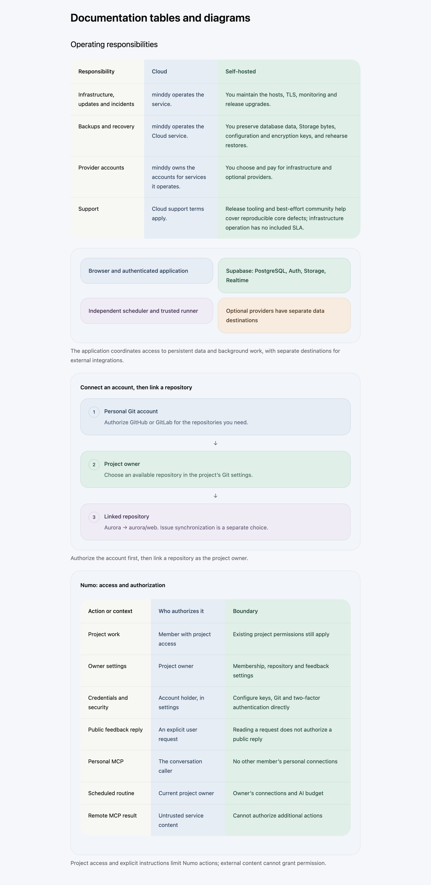
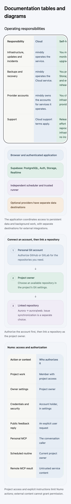

# Documentation visual and editorial cleanup

The follow-up removes illustrations that repeat ordinary forms or nearby prose,
shares the pricing table's pastel surfaces with documentation tables, and
refreshes small application controls at native 2x density in all six locales.

## Published changes

- Removed 54 redundant figure references across the six languages: login,
  signup, recovery, masked MFA enrollment, duplicated feedback moderation,
  the responsibilities diagram, a generic loading error, a plain-text partial
  Numo response and an empty administrator lookup. Procedures remain in text;
  the responsibilities table remains the explanation of operating duties.
- Removed dot-in-circle markers from 60 collection SVG fallbacks and the shared
  responsive renderer. Ordered workflows retain numbered steps. Matrix diagrams
  now use native tables with the same pastel styling as article reference tables.
- Refreshed 138 screenshots: 23 controls per locale, including account settings,
  AI preferences and usage, automation controls, import/export, MCP setup,
  mobile issue details, paused routines and installation choices. Captures use
  light mode, native device pixels, PNG output, sRGB and grayscale text rendering.
  Transient settings-arrival rings and incidental field focus are allowed to
  clear before capture. The control's inherited light background is preserved;
  only the outer margin is transparent. No image was enlarged to invent detail.
- The three dedicated editorial agents reviewed all 252 articles. Their body
  edits tighten repeated explanations and dense formulations while preserving
  useful qualifications. A further caption pass replaces 60 repeated inventories
  with one useful relationship sentence per collection diagram.
- Updated 38 guide revision sets, including source/translation review parity.
  Explicit anchors and fenced executable examples are unchanged.

The final capture register records runtime, native scale, display dimensions,
response-only localization and file hashes. Hosted captures show actual shipped
controls without starting a second local development stack. They do not rerun
candidate installation, restore, paid models, external writes or native desktop
acceptance. Older operational screenshots remain where they supply useful real
execution evidence; they were not relabeled as newly captured images.

## Verification

- Documentation release check: 252 locale articles, 90/90 workflows published.
- 12 Node tests covering publication rules and screenshot pixel preservation,
  light mode, native density and cleanup after failure.
- 24 targeted Vitest tests, with one worker and file parallelism disabled,
  covering Markdown-rich accessible tables, diagram markers, publication,
  contents and help links.
- Scoped static previews of the actual React renderers in desktop light,
  mobile light and desktop dark. Checks cover native captions, valid nesting,
  no page overflow and horizontal table scrolling from the keyboard.
- TypeScript, scoped lint, owned-English and whitespace checks.

Static preview screenshots are in
[the cleanup preview folder](../screenshots/pr-documentation-cleanup).
These exercise the changed renderers without navigating the entire application.

## Resource incident and prevention

The earlier local capture attempt overlapped a Supabase Docker stack, a second
Next server and browser work. A temporary candidate workaround broadened the
Turbopack root to `/`. An orphan PostCSS worker was then observed using 287.6%
CPU. This combination is a plausible contributor to the reported machine-wide
hang; no measurement from the peak establishes whether memory pressure, CPU
saturation or both caused it.

The temporary candidate root was restored, the three local launchers were
renamed to disable accidental reuse, and repository agent instructions now
prohibit broad compiler roots and concurrent heavy local workflows. The resumed
captures used one browser/context/page, batches of at most three screens, no
Docker or additional local server, immediate stop on failure and resource
checks between batches. Swap stayed near 1190 MB during the resumed batches.
Tests and the scoped renderer compiler ran separately from browser captures.
