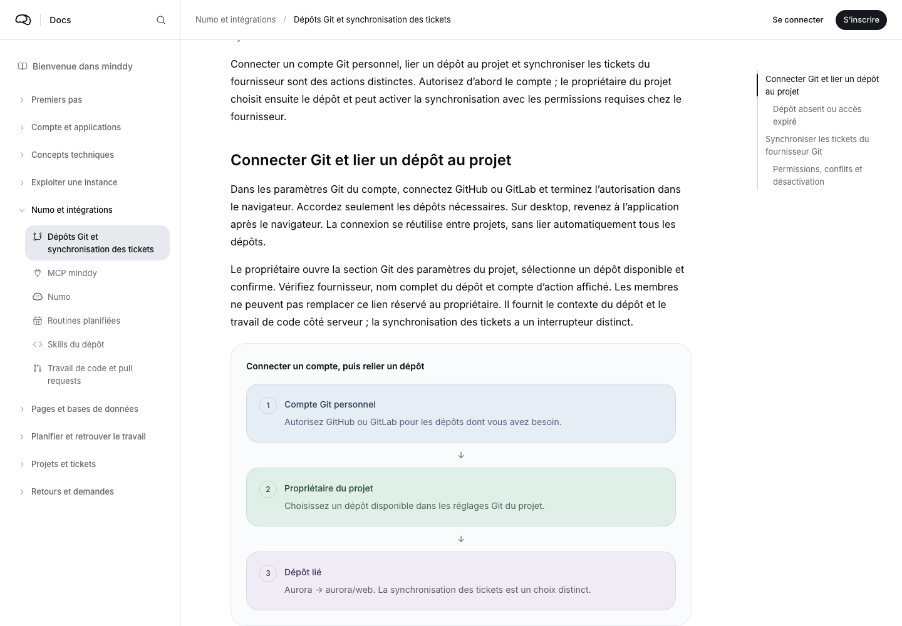
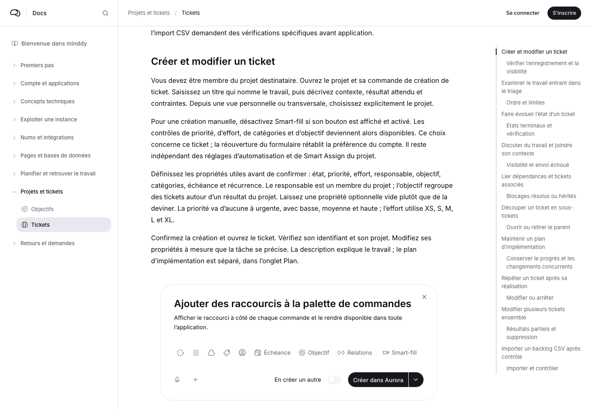
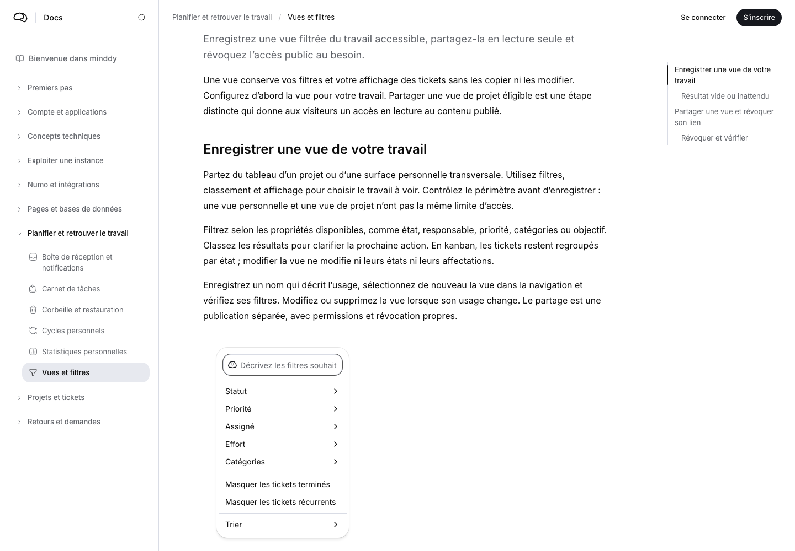
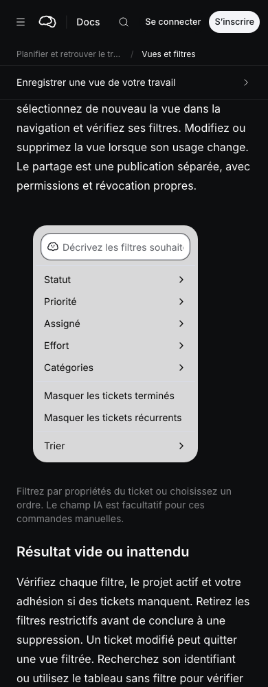

# Documentation illustrations and screenshot framing

Reviewed on 2026-10-09 against the local 0.11.1 candidate.

## Result

The six-language corpus uses 22 responsive code illustrations per locale for
concepts, responsibilities, workflow steps and authorization boundaries. These
reuse the landing's pastel palette, render selectable text, and reflow on
phones. SVG fallbacks retain the same localized content and palette. Git
account authorization and project repository linking now share one diagram
instead of two disconnected-account screenshots. Redundant empty MCP access
and zero-record import illustrations were removed; the procedures remain.

All 462 retained screenshots contain 24 CSS pixels of transparent margin in
the asset itself. Articles display them directly, without a gray container or
CSS padding. Display dimensions describe the image crop at its original CSS
scale, including the margin. The filter popover therefore retains its normal
size. The image viewer remains available.

Sixty controls were captured again in the real application, including issue
creation, statuses, recurrence, filters, dependencies, link resources, sharing
and export. Framing includes the full control and footer, hides unrelated
content, preserves the actual popover surface, and expands the browser height
when needed to avoid clipping the bottom margin. The remaining 402 images
retain exactly the same decoded UI pixels as their previous versions.

Inbox shows localized demonstration mentions, assignments and comments with
read and unread states. These response-only fixtures do not create real
notifications. Other captures retain their existing demonstration state; no
issue, publication, import or external action was submitted for these images.

## Verification

- 72 diagram render checks across six locales, desktop, mobile, light and dark.
- 54 final screenshot render checks across the same locale and layout matrix:
  no page overflow, no CSS frame, integrated transparent edges, no enlarged
  filter popover, and a working image viewer.
- All 462 screenshot display dimensions and margins checked. Decoded pixel
  comparisons confirm preservation of all 402 existing UI images.
- Documentation publication check: 252 articles and all 90 workflows remain
  published in the six languages.
- Documentation checker tests: 8 passed, including invalid diagram content and
  incomplete authorization rows. Documentation and OG tests: 15 passed.
- TypeScript, lint, owned-English checks and `git diff --check` passed.

Capture and pixel-comparison evidence is saved in
`content/documentation/reviews/*2026-10-09.json`. The capture records report the
initial browser size; framing may increase its height. The figure viewport is
the actual PNG display size.

## Screenshots

Representative article screenshots and the browser check records are in
[the illustration review folder](../screenshots/pr-documentation-illustrations).
The existing pull request's title and description are preserved as required by
the repository workflow.

