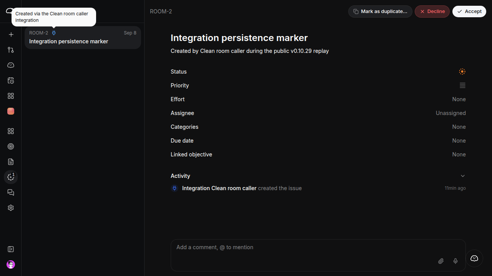

# MIN-407 public v0.10.29 → v0.10.30 acceptance

Status: **automated lifecycle passed; human acceptance blocked by MIN-508**. Both public
releases verify. An independent AI operator installed the full profile, created
its first account and data, recovered from an injected stop, updated to v0.10.30,
and restored the saved v0.10.29 release onto blank storage at a new origin.
The separate first-time human session is tracked by blocking issue MIN-508.

This report extends the [historical v0.10.27 → v0.10.28 report](min-407-public-v27-v28-2026-09-08.md).
Those releases remain immutable; their failed ARM64 account-confirmation result
has not been reclassified as a pass.

## Public source release

| Identity | v0.10.29 |
| --- | --- |
| Annotated tag object | `a9c6968d6c7f4aec3f9c504f26eb94ec443c4623` |
| Commit | `ec9fafd59beae57d793f611d3009810e798897cf` |
| OCI digest | `sha256:0c60f2cb0cf05847ac753f3a88bd101917e61b29bbcfc4767dfa86c88eb61688` |
| Registry | `ghcr.io/mangue-dev/minddy` |

The protected [public release workflow](https://github.com/mangue-dev/minddy/actions/runs/34259512177)
succeeded. The [GitHub Release](https://github.com/mangue-dev/minddy/releases/tag/v0.10.29)
contains six core artifacts and their SHA256SUMS file. Its linux/amd64 and
linux/arm64 builds both executed a real native PNG operation successfully.
The fixed-high/critical vulnerability gate, signing, provenance and publication
steps passed.

Before the application installation, anonymous checks in the new VM ran from
18:10:25 to 18:10:47 UTC. Every asset checksum passed; the annotated tag, commit,
manifest and container identity matched. Cosign verification used the exact
published `release.yml@refs/heads/production` identity and the GitHub Actions
OIDC issuer. Both Linux architectures have SPDX 2.3 SBOMs and SLSA provenance
with the expected source revision and pinned build inputs. Additional GitHub
attestation verification passed on the host using its authenticated GitHub CLI;
that check is not anonymous-VM evidence.

The source and migration archives produced locally on macOS have different
compressed bytes from the published Linux-generated archives. Their decompressed
TAR bytes are identical. This comparison establishes content identity, not
cross-platform identity of gzip output.

## Isolated operator environment

The new `min407-public-029` Lima VM runs Ubuntu 26.04 on ARM64 with four vCPUs,
8 GiB RAM and a 60 GiB sparse virtual disk. It started with no Docker objects,
application configuration, provider credentials, host mounts or forwarded SSH
agent. General prerequisites and a disposable browser were provisioned before
the operator run. Older test VMs were stopped and their data retained.

The independent agent received public documentation and release identities,
plus the disposable VM's access and prerequisite details. It did not receive
the maintainer checkout, previous bug findings, patches or product workarounds.
Its source checkout is the unmodified public v0.10.29 tag. Synthetic account
credentials, TOTP material, recovery codes and integration keys stay in private
VM files and are excluded from this report.

The agent found the deployment and operations guidance in 103 seconds and
selected the full profile because it had no managed Supabase account.
Installation started at 18:14:37 UTC and reached its first passing doctor at
18:24:00 UTC: **9 minutes 23 seconds**, including retries and the harness
correction below. Dependency installation and upstream fetching were timed
separately. Both ordinary diagnostic reports passed.

Account confirmation, TOTP enrollment, retention of ten recovery codes, fresh
password/TOTP login and administrator access passed. The agent created the
Clean Room project and ROOM-1 with the requested status, priority, effort and
marker description. Its 25-byte attachment downloaded unchanged, with SHA-256
`c314b7c37b0649174ba8834fb579baa63a60dff59cc32c82742e716c5a90564b`.
The local issues integration created ROOM-2 with HTTP 201; revocation through
the UI made the same key return HTTP 401 without creating another issue.
A fresh password/TOTP login could still read ROOM-1 and its attachment.
Final counts were one account, one project, two issues, one attachment and
one Storage object. No update or restore is implied by these first-data checks.

The [original independent report](min-407-public-docs-v29-2026-09-08.md) is
preserved unchanged. Its initial missing-integration-badge claim was corrected
by a subsequent visual readback: the triage list has the blue integration icon,
and the detail activity names Clean room caller as the issue creator. The
earlier text-only snapshot was insufficient evidence of a product gap.
The [evidence record](min-407-v29-v30-evidence-2026-09-08.json) preserves the
exact prompt, timings, data identifiers, diagnostic reports, capture summaries
and original source-evidence checksums.

The [supplement](min-407-public-docs-v29-supplement-2026-09-08.md) records the
visual attribution check and a standard HAR capture from a fresh browser
context. Its 497 requests, from 18:58:27 to 19:02:29 UTC, all used localhost
(494 HTTP 200 responses and three WebSocket 101 responses). That window covered
password/TOTP login, issue and attachment readback, and triage attribution.
The private HAR was deleted after extracting host, method, status and time.
This supplements the two direct 300-second application/scheduler/runner network
captures, which observed internal and loopback destinations with zero kernel
drops. Whole-host traffic attribution and universal absence of egress are not
claimed; Chromium/npm background traffic remains outside the page-context claim.

Two test-environment observations are recorded separately from product findings:

- Docker Hub manifest HEAD requests timed out on several pulls. An unchanged
  retry succeeded; ordinary host and VM registry probes passed TLS verification.
- The harness initially fetched upstream files under umask 077, making Kong's
  bind-mounted script unreadable. The agent regenerated the same pinned public
  upstream content under normal file permissions, retained the environment and
  checkpoint, and retried the unchanged installer. This was a harness correction,
  not a patch to the published application.

## Target release and remaining acceptance

PR [#163](https://github.com/mangue-dev/minddy/pull/163) prepares v0.10.30 at
`9332261a186f57fc4fb2ab5406718d352aa19137`. It changes version metadata and the
matching compatibility entry only. Dependency graphs, runtime pins and schema
are unchanged. Exact-candidate CI, CodeQL, deployment preview and artifact
checks passed; no migration is introduced.

The protected [production promotion](https://github.com/mangue-dev/minddy/actions/runs/34264254705)
succeeded at 18:43:28 UTC. The production branch and live HTTPS version endpoint
both matched that commit after completion. The separately approved
[public publication](https://github.com/mangue-dev/minddy/actions/runs/34264921085)
also succeeded. The [release](https://github.com/mangue-dev/minddy/releases/tag/v0.10.30)
has annotated tag object `5f9e352e0a5faed471a207fc395462cb2ca20791` and image
`ghcr.io/mangue-dev/minddy@sha256:8d720d570c95fdc1be39649aacbb302cc1717dbae22485512420ded3e4ef1ebd`.
All six core asset checksums, tag/manifest/container identities and Cosign
verification pass. Both architectures have SPDX 2.3 SBOMs with 257 packages
and matching SLSA provenance. Their native PNG operations passed, as did the
fixed-high/critical vulnerability gate. GitHub attestation verification also
passed using the authenticated host CLI. The public pair preflight passes on
the host; the independent VM operator verifies it separately before updating.

The published injected-fault procedure passed: the agent stopped minddy and
reran the installer from 19:05:21 to 19:05:40 UTC, recovering in **19 seconds**.
The environment checksum, v0.10.29 digest and source were unchanged; the
installer reused the existing checkpoint and recorded its resumed phases.
The subsequent doctor passed with all 16 services running. Before/after data
identifiers and fields matched exactly.

The v0.10.29 cold backup was sealed and its encrypted second local copy verified.
The v0.10.30 update passed both maintenance and ordinary diagnostics. Its write
outage lasted **155 seconds**, from 19:08:26 to 19:11:01 UTC. Fresh browser
verification completed at 19:13:13 UTC: password/TOTP login, original row IDs and
issue fields, exact attachment bytes, visible integration attribution and the
revoked key's HTTP 401 all passed. The upstream pins and migration history are
unchanged across this metadata-only release pair.

The final lifecycle check restored the complete pre-update v0.10.29 backup
onto blank storage with new database-key and auxiliary volumes at the distinct
private origin `http://127.0.0.1`. This exercises the documented saved-release
rollback after the successful update. Source directories and both backups are
retained; blank-target facts were recorded before extracting the backup.
Restored browser readback completed at 19:21:00 UTC. Both doctors passed, as did
fresh password/TOTP login, the original account/project/issue/attachment/Storage
identities and counts, byte-identical attachment download, integration activity
attribution and the revoked key's HTTP 401. OAuth and MCP metadata use the new
origin. The image was not rebuilt for that origin change.

The [independent lifecycle report](min-407-public-lifecycle-v29-v30-2026-09-08.md)
records the exact chronology, blank-target evidence, backup components and
comparisons. Restored health took about **58 seconds** from the blank-target
checkpoint; fresh password/TOTP and data readback took about **4 minutes
34 seconds**. The second backup copies stayed local to the disposable VM;
off-host disaster recovery was not tested. v0.10.29 was installed before
v0.10.30 was published; verification of both public releases and the pair
preflight preceded the update/restore phase.

The final no-provider AI check displayed the expected configuration guidance
and a local settings link. Its restored browser context recorded 498 requests,
all to `127.0.0.1`; the action's own observation window contained one local
request. The private HAR was deleted. The shared marketing copy/pricing links
on the unauthenticated root remain a presentation observation: authenticated
managed billing controls were absent, and no billing flow was activated.

After all four operator evidence sets were copied and their checksum manifests
verified, the VM was stopped. The restored v0.10.29 data, original source data,
both versioned backups, encrypted local copies and release checkouts are
retained. No further test is scheduled.

## Verification and remaining gate

The published pair preflight and all 15 clean-room tests pass. Owned-English,
local Markdown links, evidence checksum verification, credential-pattern review
and whitespace checks pass. The report preserves the original independent
observations and explicitly supersedes the initial attribution hypothesis with
the visual supplement. Runtime source, dependency locks and migrations are
untouched by this documentation change. Release evidence reuses the approved
policy-2.0 reviews; no new broad security assessment was run.

MIN-508 records the unavailable first-time human operator and measurable
acceptance criteria. The AI run cannot establish that person's comprehension.
MIN-407 remains open for that human acceptance requirement. The public technical
lifecycle closes the publication/replay gates tracked by MIN-503, MIN-506 and
MIN-507; it does not substitute for MIN-508.
