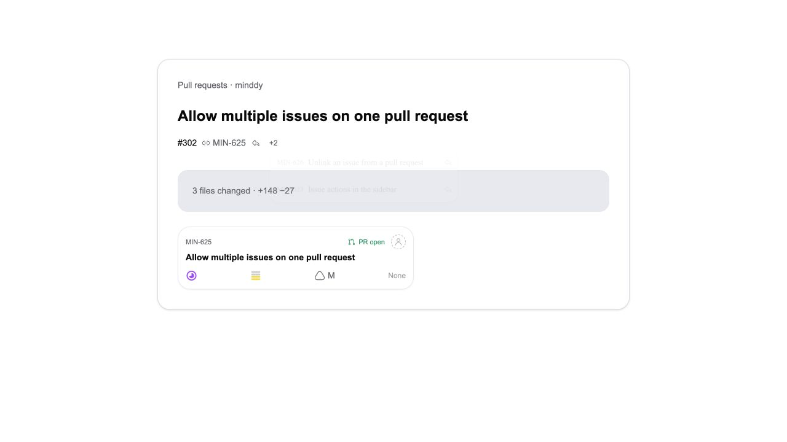
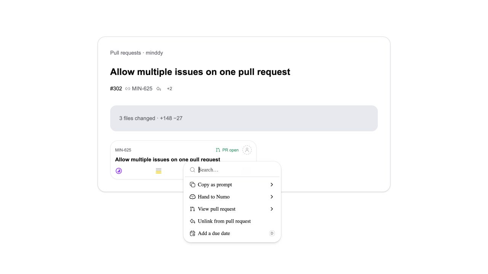

# MIN-625 and MIN-626 UI validation

These light-mode screenshots render the actual `PrLinkedIssues` and `IssueCard` components in an isolated local preview, using the shared mutation hook and English catalog. Authentication, navigation, and API responses are mocked; this is not a capture of the full authenticated application.

Browser interaction checks covered opening a secondary issue, a failed unlink that preserves the association, a successful retry that removes only that issue, and primary removal through the card menu. Cache invalidation refreshed both surfaces, promoted the remaining issue in the preview, and removed the detached card's PR chip. The issue retained its review status.

The two committed SQL regression files were also executed against the actual new migrations in isolated PostgreSQL (PGlite) with a reduced prerequisite schema. This verifies append/replay, live-PR conflicts, primary promotion, unlink suppression, manual relinking, and RPC grants. A complete local Supabase stack was unavailable because the Docker daemon was not running.
