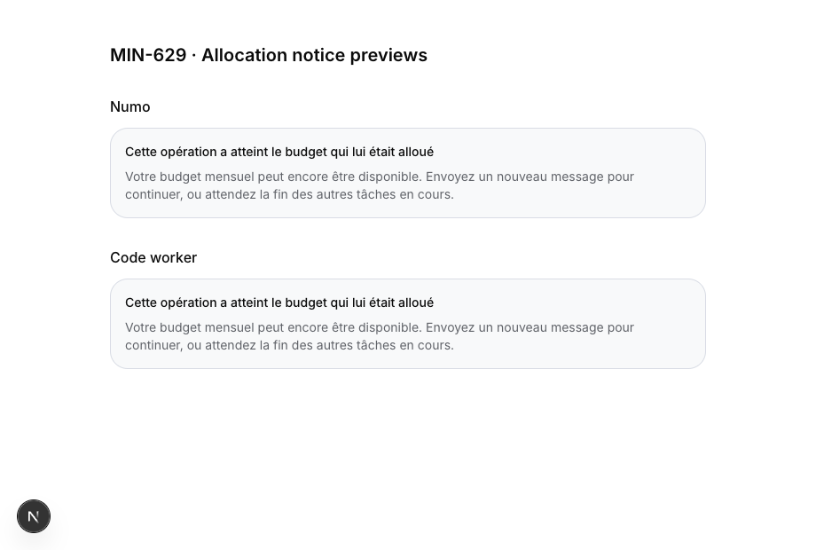
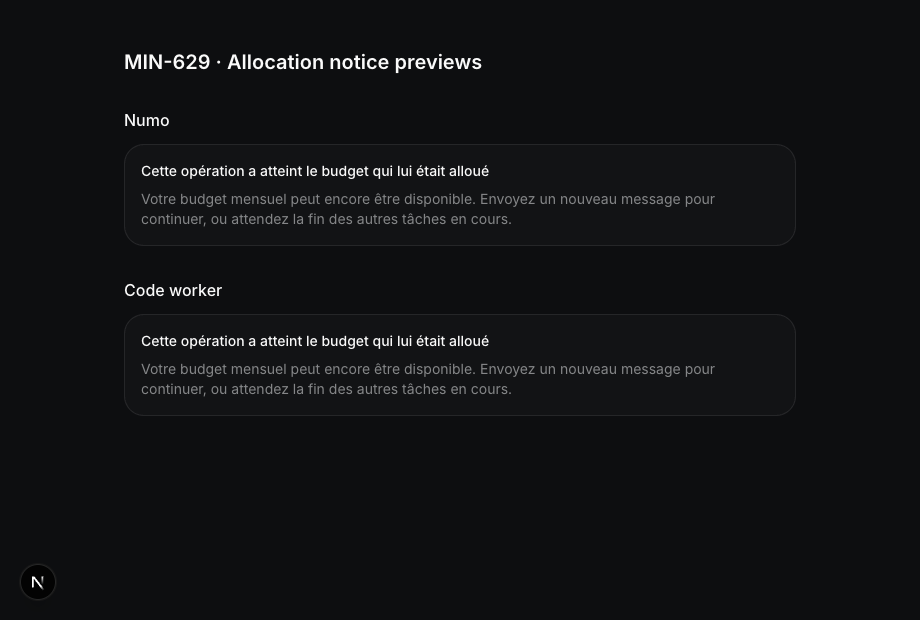

# MIN-629: Numo admission during delegated work

## Diagnosis

Read-only queries of the correlated October 1 run found a managed reservation of
$14.956727 on both its Numo parent and worker. The account currently resolves to
Pro ($15 included usage), with no Stripe cycle and no October quota reset. The
ledger before parent admission totaled $0.043273, exactly matching the difference
between the account cap and the reservation.

At 15:23:11 UTC, recorded platform usage totaled $0.117023 and the parent operation
had spent $0.072202. Its unspent reservation was therefore $14.884525. The old
admission arithmetic yielded no available capacity, while the usage indicator
could display 99% remaining. Worker charges belong to the parent reservation;
counting the worker again would be incorrect.

These are reconstructed ledger amounts, not the original refusal response. The
exact failed request ID, response and historical admission logs were not captured.
The worker and parent are now completed, so their reservation is no longer active.

## Change

Each new atomic grant leaves the smaller of $1 and 10% of the currently available
capacity uncommitted. For example, a $15 account with $0.15 used grants $13.85 to
its first operation and leaves $1 for subsequent operations. Four concurrent
Numo admissions can receive $0.9, $0.09, $0.009 and $0.0009 in serialized order.
Small explicit routine requests keep their requested cap when capacity permits.
The margin is allocation policy, not a charge or a separate monthly limit.

The same rule applies to ordinary Numo admission, standalone worker creation,
first managed delegation from a BYOK parent, and both worker continuation RPCs.
Existing delegated workers still share their parent's single reservation. Posted
platform spend plus active unspent reservations cannot exceed the allocation cap.
Grants truncate to six decimal places instead of rounding above available funds.

Worker key caps preserve the grant precision through the provisioning request.
The [OpenRouter key API](https://openrouter.ai/docs/api/api-reference/api-keys/create-keys)
defines `limit` as a numeric USD amount. Removing cent rounding keeps $0.009 from
becoming $0.01 and $0.0009 from becoming zero, including on continuation and legacy
account ceilings. Regression tests cover these amounts and the smallest positive
stored grant ($0.000001), including the serialized provisioning payload. These
tests mock provisioning; they do not establish a live provider generation result.

Numo checks its platform allocation before each provider generation, separately
from actual monthly usage and routine caps. A reservation-only refusal returns
409 `usage_budget_reserved` with authoritative spent/reserved diagnostics. Actual
monthly exhaustion retains 403 `usage_budget_exceeded`. Numo and worker allocation
notices explain how to continue without proposing an upgrade or a monthly reset.

A stopped parent retains its reservation while any child remains queued/running.
Unused capacity is released after the last live child settles. Continuations store
a cumulative cap including prior platform spend once; BYOK spend still counts
against routine caps but does not inflate a platform reservation.

## Verification

- Eight real PostgreSQL tests load the current budget RPC definitions onto a
  reduced schema. They reproduce the original rejection, then exercise a live
  worker record, four parallel SQL connections, idempotent admission, actual
  worker-stop RPC, terminal release, standalone runs, mixed-key warm resume,
  message resume, billing/reset boundaries, tiny grants and monthly exhaustion.
- 211 targeted Vitest tests pass across admission, Numo execution, worker landing,
  control plane, cancellation, account usage and run creation.
- Typecheck, lint, owned-English, encrypted-access and encryption-schema checks
  pass, along with `git diff --check`.
- Playwright rendered the real notice components in French in both light and dark
  modes. The allocation notices have no upgrade controls. A temporary local
  preview route was removed after capture.

Run the database suite against an isolated PostgreSQL 17 container:

```sh
docker run -d --name minddy-min629-db -e POSTGRES_HOST_AUTH_METHOD=trust postgres:17
MINDDY_BUDGET_DB_TEST=true node --test scripts/numo-budget-concurrency.integration.test.mjs
docker rm -f minddy-min629-db
```

The database suite stubs project access and repository-binding helpers and does
not install the complete encryption trigger graph or execute provider/sandbox
work. Its worker records and SQL connections establish admission behavior;
they do not establish a production end-to-end user interaction.

## Encryption and rollout review

The migration adds no application columns, plaintext payloads, historical ledger
rewrites or client grants. Its pure numeric helper is callable only by the service
role/owner. Existing RPCs are changed using guarded replacements of their current
definitions, preserving encryption handling, access checks, request receipts,
account locks and ACLs. The SQL consumer inventory records the five affected
function definitions from isolated PostgreSQL; existing RPC security-definer
flags, search paths and ACLs were compared before updating the inventory.

Deploy the forward migration before the application. Unexpected RPC definitions
abort the migration transaction instead of silently dropping newer guards. Do
not shrink an existing issued worker key/reservation: existing allocations settle
normally, and the margin applies on fresh admission or continuation.

Production deployment was not requested. After an authorized deployment, verify
the actual UI before, during and after a real worker, several simultaneous Numo
messages, and Stop. Capture admission responses and logs with the billing window,
spent/reserved amounts and request IDs. Accounting still follows the existing
post-hoc provider/compute ledger model: a final in-flight charge can overrun a
pre-generation check, and unrelated background AI operations do not use these
operation reservations. This change does not claim a zero-overrun global ledger.




