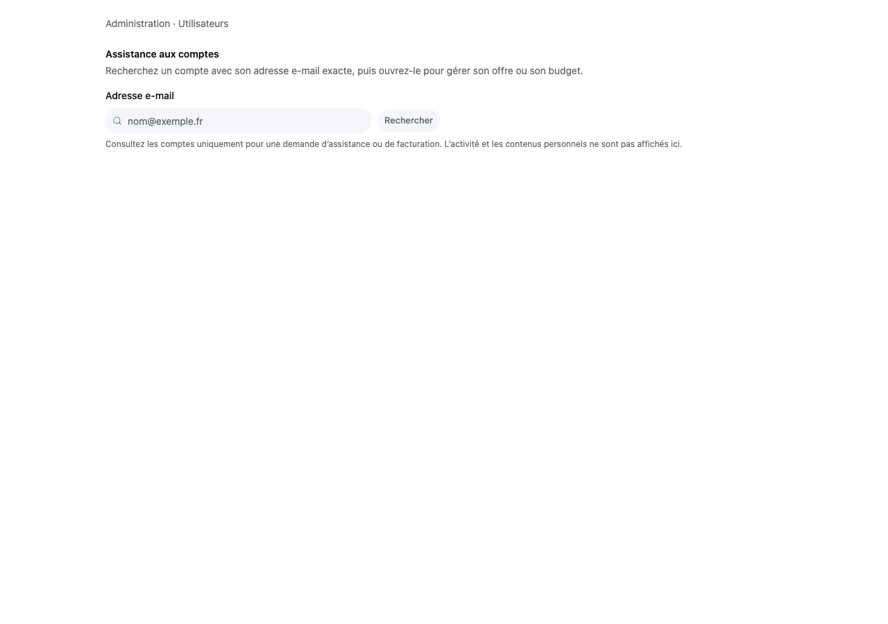
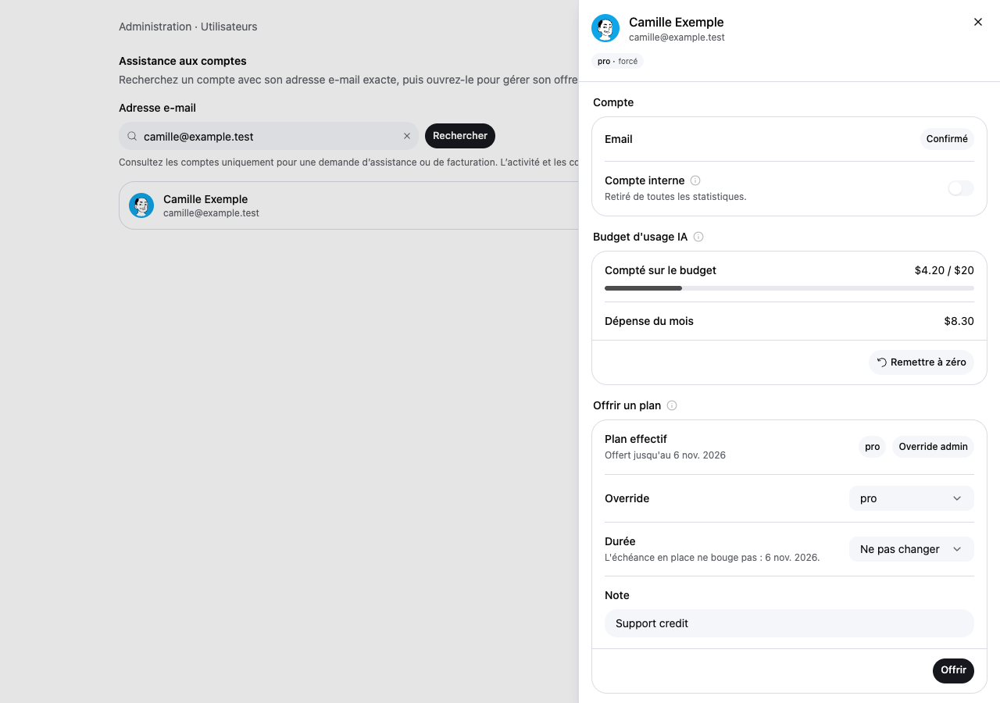

# MIN-637 validation

## Automated checks

- 98 tests passed in the focused admin, onboarding, locale, billing-route, billing-override and gift suites (12 files).
- `node --test scripts/admin-data-minimisation.integration.test.mjs` passed against an isolated PostgreSQL 17 container. It verifies deleted/internal accounts, exact lookup including literal wildcard characters, bounded stable pages, member/owner existence signals, metadata projection and anon/authenticated denial. Usage, activity, avatar and BYOK tables are deliberately absent from that fixture.
- `npm run typecheck`, `npm run lint`, `npm run check:owned-english` and `git diff --check` passed. Stale local generated route types and the TypeScript incremental cache were regenerated after removing the old API.
- Existing live admin/MFA authorization tests passed. Authorization is rechecked before data access; no positive result cache was introduced.

## Performance evidence

A local PostgreSQL 17 benchmark used 2,000 accounts, 2,000 owned projects, 10,000 issues, 20,000 AI usage rows and 20,000 activity events. Relevant baseline indexes were present. It compared the baseline `get_admin_users_overview(NULL, 500, 0)` function with `get_admin_onboarding_signals(500, 0)` using `EXPLAIN (ANALYZE, FORMAT JSON)` and three warm executions after one warmup.

| Same 500-account reporting page | Before | After |
| --- | ---: | ---: |
| Median SQL execution | 369.273 ms | 3.331 ms |
| Serialized JSON bytes | 349,892 | 119,500 |

The exact-email lookup took 1.351 ms in that fixture. Raw observations are in [benchmark.json](benchmark.json). These are synthetic query measurements, not a production latency guarantee or a full HTTP/page-load measurement. Both reporting scans still scale with account count. Membership patterns, real data, concurrent writes, network and live authorization latency can change the result.

The support tab makes no account request on mount or typing; submitting makes one minimal lookup. Opening an account adds its detail and reset-register reads. The overview no longer reads BYOK IDs or loads the retired Jev screen. The shell imports panels only when selected.

## Visual and interaction review

Playwright CLI reviewed the real `AdminUsersDashboard`, shared settings rows and Mangue UI primitives in an isolated browser fixture, using compiled application CSS, French messages, mocked capabilities and fictional account responses. It exercised lookup, opening and closing the sheet at 1280×900 and 390×844. Request instrumentation recorded only the lookup, selected-account read and reset-register read; no horizontal overflow was present on mobile. The full authenticated app shell and live production data were not used.

## Rollout and data review

Apply `20270109200030_admin_data_minimisation.sql` together with the updated app: it drops the old profile-directory RPC and introduces two service-role-only RPCs. An old app still calling the removed RPC will fail its admin reads. No production migration or deployment was performed. The change does not delete historical usage or evaluation records.

The [admin data review](../../rgpd/admin-console.md) records each view's purpose, retained data, access controls and remaining organisational GDPR responsibilities. Admin access and small aggregates do not establish a legal basis or guarantee anonymity.
