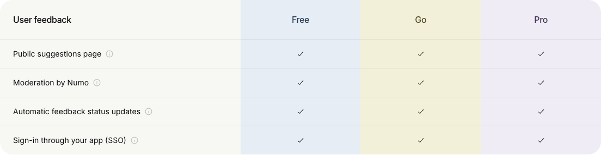

# MIN-653: remove custom domains

Public feedback boards, shared views and published pages use the application's
origin with `/f/<token>`, `/share/<token>` and `/p/<token>`. Settings, sharing
links, navigation, SSO and cookies no longer depend on hostname mappings.
The configured `MINDDY_PUBLIC_APP_URL` still supports self-hosted instances.

Domain settings, API routes, cron schedules, Vercel domain calls, DNS verification
backfill, capability flags, analytics properties, locale strings, pricing promises
and the custom-domain terms section have been removed.

## Database verification

`20270109200029_remove_custom_domains.sql` removes the four domain tables,
eleven dedicated functions, target triggers and domain provider reservations.
It retains the advisory lock, row lock and service-only grants on
`revoke_view_share_guarded`. Historical migrations remain unchanged.

The isolated PostgreSQL 17 regression uses the actual baseline definitions for
the affected tables, historical domain migrations and populated board/view/page
mappings. It verifies that public rows and tokens survive, other table definitions
and provider reservations remain intact, domain functions and triggers disappear,
revocation is idempotent, and board/page/project updates work afterward. This is
an affected-schema rehearsal, not a replay of the entire Supabase stack.

Run it against a disposable PostgreSQL container with:

```sh
MINDDY_DOMAIN_REMOVAL_TEST_CONTAINER=<container> node --test scripts/remove-custom-domains.integration.test.mjs
```

The test creates and drops its own database. The schema, SQL consumer and
application consumer inventories were refreshed from the reviewed change and the
introspected replacement RPC.

## Application verification

The targeted suite covers public navigation, password unlocks, sharing and
revocation, SSO, project icons, host routing, proxy headers, capabilities,
optional integrations, schedulers and encryption maintenance. English ownership,
TypeScript, lint, encryption schema/access and diff checks also pass.

Playwright verified the pricing feedback section in light mode and the terms
page, including the remaining section numbering. Authenticated settings were
not exercised in a live account.



## Deployment scope

No production deployment or provider account change was performed. Application
removal does not delete DNS records or Vercel domain registrations held outside
the database. Those registrations require operator cleanup during the
infrastructure migration tracked by MIN-654.
