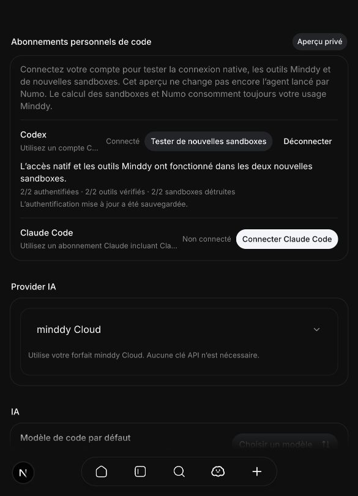
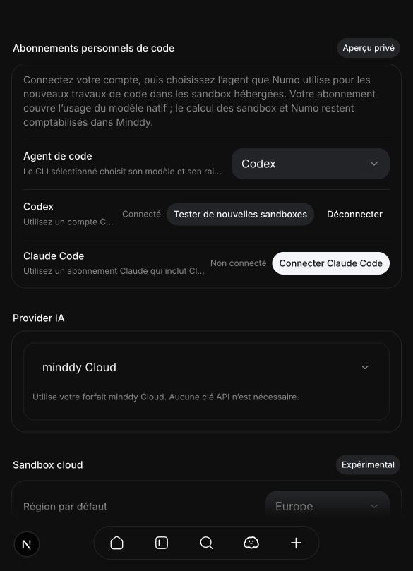
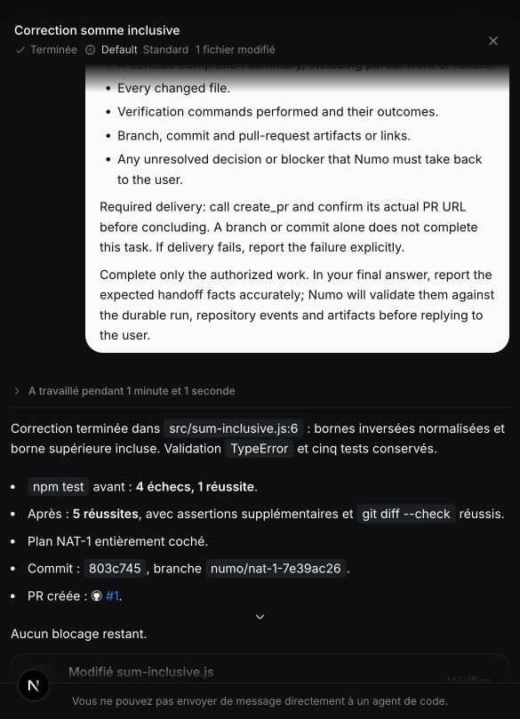
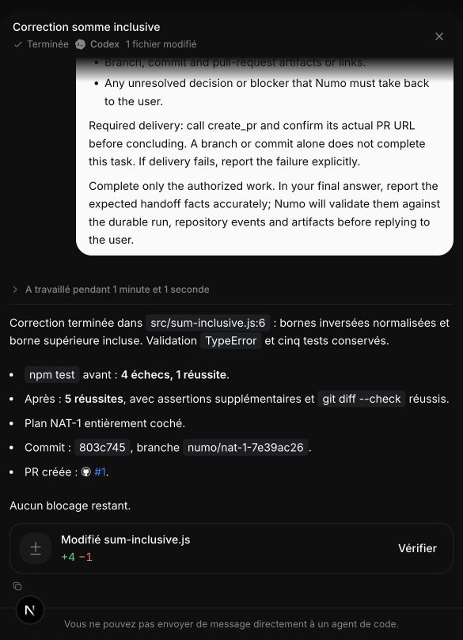
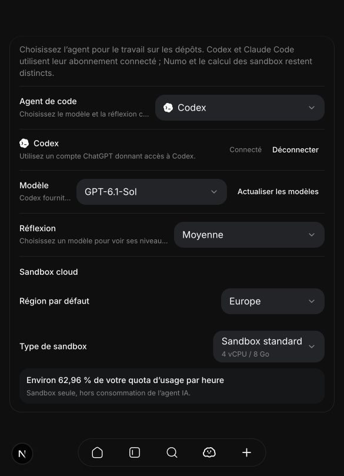
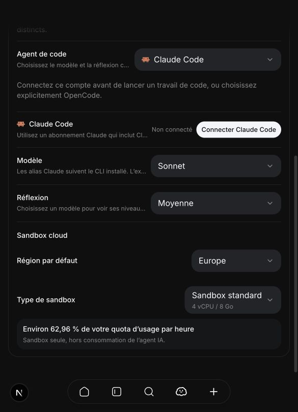

# MIN-676: Native harness interface evidence

Date: 2026-10-10. Reviewer: Codex, acting as an agent reviewer.
Scope: read-only Minddy and pinned open-source repository inspection, official
documentation and unmodified public CLI help/schema generation. This is not a hosted authentication,
inference, security-isolation or erasure rehearsal.

Related design: [hosted native harness plan](../plans/min-676-native-agent-harnesses.md).
Repository baseline: `823b4b8765dffbb8e6fcbe4bdf59bdd182a7f63f`.
CLI inspection host: macOS with Node.js `v24.11.1`.

Current decision: the later [hosted readiness review](#hosted-readiness-and-credential-lifecycle-review-2026-10-10)
supersedes earlier permission conclusions in this log. Historical successful
Codex execution remains technical evidence; the current official app-server auth
restriction prevents declaring this hosted authentication design ready for use.

## Published versions inspected

Existing executables reported Codex `0.146.0` and Claude Code `2.1.251`.
To avoid treating those older installations as the current interface, subsequent
probes used exactly pinned public npm packages. No global installation, account
sign-in, credential-file inspection or model request was performed.

| Package | Pinned version | Registry integrity |
| --- | --- | --- |
| `@openai/codex` | `0.162.1` | `sha512-NWZdi/kxyjv/8EUGFupziGU38YyleugZRM4JXgY5XFH7FUmaFA33NZS2Bmq0HPazf7S3jJQQWsZ/jAK9jsrV3Q==` |
| `@anthropic-ai/claude-code` | `2.1.296` | `sha512-OX/k/rpcthMqnFKOWcpNcbiLsMKtAjLOpQNJHlYiDCFUznWCIwdRTyl/p9SdHVrsrzZuPMCNqZjnpakIni6upw==` |

Registry metadata lists Codex Linux x64/arm64 distributions and Claude Code's
Node.js requirement of `>=22.0.0`. Minddy selects `node24` in
`lib/server/agent/repo-host.ts`. This is a compatibility indication only;
neither binary was executed inside a Vercel allocation during this study.

## Reproduce the non-authenticated interface checks

```sh
npm view @openai/codex@0.162.1 engines optionalDependencies dist.integrity --json
npm view @anthropic-ai/claude-code@2.1.296 engines dist.integrity --json
npm exec --yes --package=@openai/codex@0.162.1 -- codex --version
npm exec --yes --package=@openai/codex@0.162.1 -- codex login --help
npm exec --yes --package=@anthropic-ai/claude-code@2.1.296 -- claude --version
npm exec --yes --package=@anthropic-ai/claude-code@2.1.296 -- claude auth login --help
npm exec --yes --package=@anthropic-ai/claude-code@2.1.296 -- claude --help
npm exec --yes --package=@anthropic-ai/claude-code@2.1.296 -- claude setup-token --help
npm exec --yes --package=@openai/codex@0.162.1 -- codex mcp --help
npm exec --yes --package=@anthropic-ai/claude-code@2.1.296 -- claude mcp --help
MIN676_PROBE_DIR=$(mktemp -d /tmp/minddy-min676-probe.XXXXXX)
npm exec --yes --package=@openai/codex@0.162.1 -- codex app-server generate-json-schema --out "$MIN676_PROBE_DIR/codex-schema"
```

The executed checks exited successfully. Generated schemas were held outside
the repository. They are reproducible public artifacts, not account state;
the full generated tree is intentionally not committed.

## Codex schema findings

Generation produced 317 JSON files. The observed schema-tree SHA-256 is
`d56de014b2f9312defddbec6915371e2f995fa17b25b5389e5137a5ebb734fd9`.
For reproducibility, sort all `.json` files by their relative POSIX path, then
hash each UTF-8 relative path, a NUL byte, the raw file bytes and another NUL byte
in that order. This fingerprint describes the generated tree, not the binary.

| Schema | Observed interface | Implication |
| --- | --- | --- |
| `ClientRequest.json` | `account/login/start`, `account/login/cancel`, `account/logout`, `account/read` | A supervisor can drive native login without implementing its own token exchange. |
| `ClientRequest.json:LoginAccountParams` | `chatgpt` and `chatgptDeviceCode` variants | Device login is represented in the pinned protocol, not just a documentation example. |
| `ClientRequest.json:LoginAccountParams` | `chatgptAuthTokens` described as unstable and internal-only | Exclude external native-token injection from the proposed Minddy implementation. |
| `ClientRequest.json` | `model/list`, `thread/start`, `thread/resume`, `turn/start`, `turn/steer`, `turn/interrupt` | Native orchestration has the required lifecycle operations; their behavior still needs live tests. |
| `ServerRequest.json` | `item/tool/requestUserInput` | User questions require a response bridge, not text-only stream rendering. |
| `v2/ThreadResumeParams.json` | `threadId` and configuration overrides; no `history` field | Do not promise cold reconstruction through arbitrary history injection. |

CLI login help also exposes `--device-auth`. No device code was requested and
no app-server was started against an existing personal account. The public
[app-server documentation](https://learn.chatgpt.com/docs/app-server) supplies
the protocol behavior; this probe establishes only schema/flag availability.

## Claude CLI findings

Pinned help identifies `claude auth login --claudeai` as the subscription login
route and `--console` as a different billing route. It advertises stream JSON
input/output, partial messages, resume, tool selection, permission handling,
explicit settings and strict MCP configuration.

The important negative finding is **bare mode does not read OAuth credentials**.
`--bare` uses API authentication or supported third-party credentials instead.
The [headless guide](https://code.claude.com/docs/en/headless) confirms this.
Thus a generic recommendation to use bare mode for unattended execution would
break MIN-676's central requirement.

`--safe-mode` preserves authentication but disables customizations, including
MCP/hooks, so it does not by itself prove the proposed guarded Minddy tool
configuration works. `--restricted`, `--setting-sources`, `--settings`,
`--tools` and `--strict-mcp-config` are candidate controls to validate together.
No permission bypass was enabled and no prompt was sent to a model.

The [authentication guide](https://code.claude.com/docs/en/authentication)
documents remote browser-code entry. Whether the published CLI works with a
bounded owner-only browser PTY on Minddy's actual Vercel environment remains a
hosted-pilot acceptance test.

## Sandbox and database inspection

The installed `@vercel/sandbox@3.5.0` declarations expose
`Session.openInteractive()` returning a WebSocket URL and token. Unlike
`Sandbox.openInteractive()`, the session operation is documented without
automatically resuming the sandbox. No transport was opened during inspection.
The declaration does not claim a login-command-only capability.

`sandbox.ts` uses `persistent: false`, and `drain.ts` sets the idle reap threshold
to five minutes. The historical DB baseline constrains `agent_engine` to
`loop`/`opencode` and `key_mode` to `platform`/`byok`; those are not native
subscription contracts. `launchAgentRun` rejects local execution and resolves
account worker settings. `vm/main.ts` dispatches OpenCode only.

`recordSandboxUsage` in `lib/server/usage.ts` records server-priced compute
separately from inference. Native subscription implementation must preserve
that separation and include authentication wait time rather than equating
external inference with free hosted compute.

## Verification limits and follow-up

Passed interface checks establish installable public packages, compatible
declared platform targets and inspectable orchestration primitives. They do
not establish personal subscription entitlement, commercial hosting permission,
Linux runtime behavior, native MCP/hook isolation, cold restore, end-to-end
login, token refresh or provider revocation.

On an authorized authentication route, hosted acceptance must execute the matrix using
consenting test accounts and actual Minddy allocations. Store sanitized evidence
of outcomes, exact versions and allocation profile; never retain callback
codes, tokens, login transcripts or production account data as proof.

Repository checks for this documentation-only delivery are recorded in the PR.
No runtime or public-manual behavior is changed by these two internal documents.

## Durable account connection refinement

The owner's follow-up makes persistent account authentication mandatory, with
Codex and Claude Code as the initial native engines. An already authenticated
live allocation does not demonstrate acceptance. Setup must work in account AI
settings without an issue, project, run or locally installed agent.

Three additional pinned help commands above exited successfully. Claude's
`setup-token --help` confirms a long-lived subscription-token command; the
MCP commands confirm server-management interfaces in both binaries. These
checks requested help only: no token was generated, MCP server configured,
credential file opened or account authenticated. Token lifetime and restoration
behavior below are documentary evidence, not results from these help probes.

| Primary source reviewed on 2026-10-10 | Established scope | Remaining validation |
| --- | --- | --- |
| [Codex CI authentication](https://learn.chatgpt.com/docs/auth/ci-cd-auth) | Private trusted runners restore native auth and save refreshed state; serialize use. The guide excludes public/open-source repositories. | Does not override the current app-server hosted-auth exclusion. A Minddy-authorized auth route plus encrypted renewal, lease/crash and cold-execution evidence is required. |
| [Claude authentication](https://code.claude.com/docs/en/authentication), [GitHub Actions](https://code.claude.com/docs/en/github-actions) | Native cached credentials and subscription CI tokens provide technical repeated-run mechanisms. | The hosted native permission does not resolve [third-party token-storage restrictions](https://code.claude.com/docs/en/legal-and-compliance) for a Minddy account vault. |
| [Codex MCP](https://learn.chatgpt.com/docs/extend/mcp?surface=cli), [Claude MCP](https://code.claude.com/docs/en/mcp) | Both native clients support configured MCP servers. | Actual admitted Minddy tools, strict configuration, startup errors, mutation acknowledgement and Numo mediation. |
| [Linear coding sessions](https://linear.app/docs/coding-sessions), [AI credits](https://linear.app/docs/ai-credits), [Codex in Linear](https://learn.chatgpt.com/docs/third-party/linear) | Integrated Linear coding sessions use workspace credits; the separate ChatGPT-account integration starts provider cloud chats. | No inspected source discloses native personal credential storage in Linear-hosted ephemeral workers. |

The encryption inspection found user-scoped `EncryptedStore` primitives in
`lib/server/encryption/store.ts` and ownership-aware API-key access in
`lib/server/user-ai-key-content.ts`. This is reusable infrastructure, not an
implemented native vault. Its legacy/feature-flag fallback must not become an
unencrypted path for new subscription credentials. New entities require their
own guarded access, encryption policy, inventory and recovery/deletion tests.

Before public enablement of either native engine, record sanitized evidence for:

- One native account login, destruction of its setup sandbox, and two later
  cold allocations that use the same personal subscription without browser
  reauthentication or a warm VM.
- A real native renewal followed by versioned encrypted write-back and cold
  restore of the updated credential; concurrent/late writers and crash windows
  cannot restore an old seed or revive a disconnected connection.
- Complete cleanup of runtime plaintext while the authorized encrypted account
  profile survives; disconnect and account deletion fence active allocations
  and saved-state recovery, including restored backups.
- Every Numo launch mode resolving the selected account harness, and verified
  MCP operations or acknowledged Numo mediation of unsupported capabilities.
- Exception-only reconnect for unusable provider access, honest provider quota
  errors, separate Minddy compute/Numo charges and no automatic API fallback.

None of these live outcomes was exercised in this refinement. Provider custody
authorization, secret-free transport and OS isolation are release gates; a
documented capability or another product's implementation is not a passed test.

## Open-source implementation evidence

Read-only inspections on 2026-10-10 used immutable source revisions. No project
was installed or run against an account, and no hosted inference or credentials
were accessed. Repository license evidence concerns code reuse only.

| Repository and revision | Concrete evidence inspected | What it does not verify |
| --- | --- | --- |
| [T3 Code](https://github.com/pingdotgg/t3code/tree/a11f464133291122e0f6381b35e1b245d0aa9c73), `a11f464133291122e0f6381b35e1b245d0aa9c73`, MIT | `CodexChatGptAuth.ts`, `CodexChatGptSessionLock.ts`, `CodexManagedRuntime.ts`, `CodexChatGptHandoff.ts`, `ServerSecretStore.ts`, `CodexAdapterV2.ts`, `ClaudeAdapterV2.ts` and provider/remote guides. Managed Codex token sharing differs from native login; both adapters inject HTTP MCP. | The default file store is not encrypted. Remote machine persistence is not disposable SaaS recovery. No exact Minddy custody permission. |
| [opencompany](https://github.com/useopencompany/opencompany/tree/274f4d1c0ba7a2348b619b469dd3e284215715c2), `274f4d1c0ba7a2348b619b469dd3e284215715c2`, MIT | Native device login in a bounded E2B allocation, owner-bound encrypted auth, `codex-chat.ts` restore and `codex.ts:persistRefreshedCodexAuth` compare-and-swap write-back; Claude ACP/SDK transport and attempt-scoped MCP tests. | Refresh locks in custom inference code do not serialize native CLI turns. Retained worker sandboxes do not prove cold history restore. Source does not grant provider permission. |
| [project-sandbox](https://github.com/pkrusche/project-sandbox/tree/796590c9b9f8bfa48ffc177d2e9f11b6629d3959), `796590c9b9f8bfa48ffc177d2e9f11b6629d3959`, MIT | `oauth_refresh.py` native status commands under a host lock and security documentation of selected credential staging. | It explicitly warns that container-only renewal can be discarded. Status command success is not proof of refresh; auth outside checkout remains readable to container processes. |
| [Coral Centaur](https://github.com/Coral-Protocol/coral_centaur/tree/b5be00c1cd54574d9483232ad0e08f6b9a31c139), `b5be00c1cd54574d9483232ad0e08f6b9a31c139`, Apache-2.0/MIT | `claude-app-wrapper.py` native stream transport, `proxy_config.py` placeholder/proxy configuration and production token-broker instructions. | Shared vault, dedicated account and broker-owned OAuth renewal do not match Minddy's native per-user design and are not permission evidence. |

The source comparisons narrow the first live experiment: reproduce the native
Codex restore/write-back pattern with mandatory account encryption, add a lease
covering the entire native process lifetime, and prove actual rotated-state
recovery after destruction. Use a private fixture repository rather than
claiming the Codex CI guide authorizes public repository automation. For Claude,
retain the published CLI's login and authentication methods; test native profile
persistence without representing it as an approved public SaaS custody model.

The [2026-10-07 Claude SDK subscription update](https://support.claude.com/en/articles/15036540-use-the-claude-agent-sdk-with-your-claude-plan)
is billing evidence, not a waiver of credential restrictions. Published native
hosting conditions and customer CI token persistence justify advancing a
private prototype; provider outreach is not a universal prerequisite to
adapter development. Before public enablement, record the exact remaining
custody conclusion separately from successful tests. The full source links,
provider conditions and prototype sequence are in the related design.

Repository verification for this refinement: `check:documentation`,
`check:knowledge`, `check:owned-english`, relative documentation links and
`git diff --check` passed. Only the two internal study/evidence documents changed;
public manuals and runtime source remain untouched.

## Private prototype implementation and hosted probes (2026-10-10)

The subsequent implementation adds private account connection routes/settings,
mandatory encrypted native profiles and runtime cleanup descriptors, exclusive
fenced leases, published native controllers and a fixed two-allocation MCP pilot.
See [activation and pilot instructions](min-676-private-native-prototype.md).
At this milestone, ordinary Numo workers still used OpenCode. The subsequent
worker integration is recorded below; public enablement remains gated.

Actual authless hosted probes used fresh Vercel `node24`, `iad1`, 2-vCPU,
nonpersistent allocations, with no native personal profile, login or model turn:

| Probe | Actual result | Boundary |
| --- | --- | --- |
| Codex 0.162.1 published installation and controller bootstrap | Passed after correcting Linux capabilities and runtime paths. | npm success alone was insufficient; early native exits failed closed and those allocations were deleted. |
| Native Codex kernel isolation, completed before 16:28:07 UTC | Passed twice. Native exit 0 only after denied reads of synthetic profile bytes, controller source, transport directory and controller `/proc` environment, file descriptor and memory surfaces. Allocation stopped and deleted. | No paid inference or live profile restored. Same native permission profile is required before a fixture turn. |
| Claude Code 2.1.296, 16:29:40–16:29:54 UTC | Published binary `--version` exited 0; controller started; native account status returned unauthenticated; allocation stopped and deleted. | No Claude login, paid subscription or model turn. |

Codex's Linux subprocesses clear bounding, inheritable and ambient capabilities
and set no-new-privileges before native sandbox helpers start. Vercel's inherited
capabilities otherwise caused bubblewrap to reject startup. Published CLI code
lives outside the denied private controller/auth root; Node's actual runtime
directory is explicitly added to the child's allowlisted PATH. `/proc` and
`/sys` are denied, in addition to the native private PID namespace. Native MCP
and controller bearer tokens are separate, so the model's MCP connection cannot
export a profile or operate the controller.

Claude's published main npm launcher is a placeholder replaced by postinstall.
With lifecycle scripts disabled, bootstrap explicitly links the already
installed, version-pinned optional Linux platform binary. This deterministic
packaging correction was verified on the actual hosted allocation.

For the owner pilot, an isolated Docker Supabase project uses API port 55321 and
PostgreSQL port 55322. All 244 migrations applied and native SQL regressions
passed against actual PostgreSQL. The account and project are fictional local
fixtures; no remote Minddy data is copied. Existing Docker volumes and the
repository's `.env.local` are preserved. The connected remote database has not
received the native migration; the only migration command against it was a
dry run, before the user selected the local Docker database.

The owner then completed the native Codex device approval with a paid Pro
account. The login profile was stored in mandatory format-3 account ciphertext,
and its login allocation was stopped and deleted before Connected appeared.
No developer workstation profile was imported.

The first real cold attempt authenticated but failed its MCP completion proof;
its allocation was deleted and the connection remained recoverable. The MCP
relay was corrected to negotiate Streamable HTTP versions, advertise the tool's
read-only annotations, reject unsupported optional methods with JSON-RPC errors
and return HTTP 405 for unsupported SSE. A native catalogue preflight now checks
that the expected tool is registered before inference. Those combined changes
passed the next real pilot; their individual contribution to the initial failure
was not isolated.

The successful paid Codex pilot completed two distinct fresh hosted allocations:
both authenticated from the saved profile, called the actual owner-scoped
`minddy_list_projects` handler through MCP, emitted the required marker, and
were stopped and deleted. Native token objects changed and were written back to
the encrypted vault. Local database metadata confirmed format 3, connected
status, no runtime descriptor and no remaining lease. Its usage ledger records
separate compute sequences 1 and 2, without API inference billing.

A second successful real pilot strengthened the proof: after deleting the first
allocation, the control plane decrypted the just-saved profile from the database
before creating and authenticating the second allocation. Both MCP calls and
both deletions passed again, with native token-state changes observed. Final
metadata showed revision 38, format 3 and cleared runtime/lease fields. The
successful requests completed in 84 and 87 seconds respectively.



This proves the observed native auth-file update and encrypted persistence path;
it does not establish expiration or revocation behavior after days. Live Claude
remains unverified because no eligible paid account has been supplied. The
private pilot does not settle authorization for a public multi-user credential
custody service or implement ordinary Numo worker selection.

Repository checks for this private implementation passed: 81 focused Vitest
tests, actual local PostgreSQL native SQL regressions, full application build,
typecheck, lint, native VM bundle build, encrypted-column/schema inventories,
documentation, knowledge, owned-English and whitespace checks. Public impact is
limited to the six `ai-settings-and-usage` guides and their revision-8 review;
full Numo engine selection and public native rollout remain pending.

The follow-up also fixes the existing scheduler test's native-cleanup mock and
tests that queue draining continues after cleanup failure. The publication scan
uses an exact fixture-path/address exception for the non-routable synthetic
account; no real identity or credential is exempted. The PR commit range passed
the redacted secret/data-marker scan.


## Account-selected native Numo workers (2026-10-10)

The next private phase wires the selected account harness into ordinary code
worker launches. Codex and Claude Code have separate native adapters, frozen
connection generations, subscription inference and managed hosted compute.
OpenCode remains the default for accounts that have not selected a native agent.
A native connection failure refuses work without changing its payer or harness.
Numo receives explicit capability context and mediates worker questions; native
builtin shell, images and subagents are unavailable.

The actual settings page saved Codex as the account default. An initial UI
failure exposed the old preference helper's field allowlist and non-atomic
unprotected upsert; the partial-upsert RPC now preserves unrelated preferences.
All six public locales describe the selection, recovery and billing behavior.



Before restoring a real profile, a fresh hosted production repository-host probe
passed at 17:35:14 UTC: pinned installation, kernel isolation verification,
write/read and isolated command execution all succeeded. The probe included
private credential sentinel and controller process environment, descriptor and
memory denial. Its allocation was stopped and deleted without authentication
or inference.

Two early fixture-driver failures were cleaned up: duplicate private-directory
creation failed before import; reading the detached SDK command's old exit
object then caused conservative auth invalidation. The latter required a new
owner device approval. The driver now checks the freshly fetched finished
command and records safe proof before teardown. These failures are not counted
as successful worker acceptance.

A real paid Codex worker pair then passed repository work and Minddy MCP. After
source review disabled Codex's default apps, plugins and hooks and aligned tool
events with the existing UI contract, a final pair repeated the test using that
restricted runtime. Both final turns used the actual native supervisor,
production kernel host, pinned CLI, native network policy, worker leases and
mandatory encrypted profile restore/write-back. The owner-scoped `read_issue`
handler read a disposable local fixture; the worker wrote and reread a marker
file, then ran a command verifying the marker and denied access to the private
controller/auth root, `/proc` and `/sys`.

| Final turn | Actual supervisor duration | Verified result |
| --- | --- | --- |
| First fresh allocation | 26,873 ms | Completed; one successful Minddy read; guarded write/read/command observed; marker verified; native profile exported and saved; allocation stopped and deleted. |
| Second distinct fresh allocation | 27,778 ms | Completed with the same proofs after restoring the first turn's saved database profile, with no new owner approval; allocation stopped and deleted. |

The final database state was connected, generation 2, revision 84, format 3,
with cleared lease/runtime metadata. Both allocation-ledger entries were cleaned
and had no pending provider request. Only two sandbox-compute usage rows were
written for the final pair; no API inference usage was recorded. Safe structured
proof is retained in [the worker proof artifact](assets/min-676-native-worker-proof.json).
The four successful worker turns required no intervening browser approval.

The fixture uses a private SDK mailbox because the Docker-backed control plane
is on localhost. It verifies the production supervisor and actual owner tool
handler, vault and physical cleanup; it does not exercise the deployed HTTP
control plane or the complete settings-to-ticket-to-pull-request UI flow. No Git
remote or pull request was published. Normal workers require a reachable HTTPS
control-plane origin and an authorized forge binding. Launch, HTTP authority,
resume, delivery and legacy behavior are covered by focused repository tests.
Live Claude subscription execution, long-lived refresh/revocation and public
credential-custody authorization remain separate unvalidated boundaries.

Watchdog recovery now atomically claims the exact stale run snapshot and revokes
native execution before SDK cleanup. Heartbeat/checkpoint stamps reject a
recovery claim. Recovery retains a retryable stop claim if cleanup is uncertain;
a terminal failure is published only after physical cleanup. Completion landing
retains its original rest-claim authority so a late callback cannot overwrite
recovery. A completion claim abandoned for more than 20 minutes can be recovered with a
new rest timestamp, exceeding the hosted callback's 60-second lifetime; an old
completion writer retains the old timestamp and cannot land afterward. Local
SQL regressions run with transaction rollback; all 248 migrations
were applied only to the isolated Docker database.

Final local verification passed: 3,070 focused agent/Numo/assistant/settings tests
(26 intentionally skipped), full application build, typecheck, lint, VM bundle
build, actual PostgreSQL native/partial-preference/recovery regressions,
encryption access/schema inventories, documentation, knowledge, owned-English
and whitespace checks. The publication scan uses file-aware redacted Git diff
input so existing exact synthetic-token fixture exceptions remain scoped.

## Ordinary issue interface to Codex pull request (2026-10-10)

The owner authorized a temporary HTTPS control plane, a private fixture
repository and an actual launch from the Minddy interface, retaining the local
Docker database and leaving paid Claude execution untested. The connected
account and saved Codex default were reused without another provider approval.

A Cloudflare Quick Tunnel forwards only `/api/agent-vm/*` to the local app.
Public UI, account and database paths return 404; unsigned control-plane calls
return 403. Two genuine Vercel OIDC calls from a disposable unauthenticated
sandbox passed signature, audience, tenant and sandbox-name admission and
reached the expected unknown-run response. That allocation was stopped and
deleted. Behind Next development's reverse proxy, the route now reconstructs
the expected audience from the explicit server `AGENT_CONTROL_ORIGIN`, never
from incoming Host headers. Real SDK JWT regression tests reject incorrect
audiences, signatures, tenants and invalid origin configuration.

The private fixture repository was linked through the existing GitHub App
connection and `bindRepo` path. Its installation token was verified to authorize
exactly that repository; no PAT or user token was stored. Issue synchronization
was disabled. The UI-created NAT-1 requested a minimal inclusive-range sum fix,
preserving the five existing tests and invalid-input validation.

The real UI launch exposed two defects that the prior SDK fixture did not:
credential restore needed to create the harness parent before VM startup, and
the pinned Codex kernel sandbox automatically made `.git` read-only. Both were
fixed with focused regressions. An actual unauthenticated kernel probe reproduced
the Git lock failure before the explicit metadata permission and verified stage,
commit and a clean tree afterward. Read-only workers retain their Git protection;
private profiles, controller process files, `/proc` and `/sys` remain denied.
The failed worker's profile was saved before its allocation was deleted, and the
successful retry restored that saved connection in another fresh allocation.

From the issue's **Entrust to Numo → Implement issue** action and subsequent
Numo conversation, the ordinary `launchAgentRun`/`execute` path selected
`codex`, froze subscription funding and connection generation, cloned the
private repository and started the detached native supervisor. Its real HTTPS
callbacks recorded successful `read_issue`, plan-update and `create_pr` calls.
The worker published [fixture PR #1](https://github.com/mangue-dev/minddy-min676-codex-e2e/pull/1),
branch `numo/nat-1-7e39ac26`, head `803c745b75cce4dcbd96bd6a6f814f034a4c6372`.
Minddy's bot authored the commit with a matching DCO trailer; the PR was open,
non-draft and mergeable when reviewed. It was not manually created or merged.

Independent verification fetched that exact PR head. Only
`src/sum-inclusive.js` changed, with four additions and one deletion. Tests,
README and package manifest were unchanged. Baseline tests yielded four
failures and one pass; the PR head passed all five. Another 441 range-oracle
checks and 16 invalid-input checks passed, along with whitespace and commit-range
secret scans. The diff normalizes reversed bounds and includes the upper endpoint.



The successful run completed with no error. Its allocation ledger was cleaned,
with no pending provider operation, and a fresh Vercel SDK lookup returned 404.
The two preceding UI allocations also returned 404. The encrypted connection
remained connected at generation 2, revision 103, with lease, runtime and worker
bindings cleared. No idle allocation or new browser login was used between the
failed and successful repository workers. Native CLI inference was subscription
funded; this successful run recorded $0.007856 of sandbox compute and $0.000183
for the existing API short-title enrichment. Numo conversation API usage remains
separately metered. These auxiliary calls are not native Codex inference.

Failure handling now explicitly distinguishes native publication failure from
missing required PR delivery in all six UI locales. Unpublished files cannot
survive native sandbox deletion. Final MCP edits are detected before fallback
publication; a failed push clears the success outcome and suppresses a success
summary. A real Git/MCP regression covers the failed fallback without `create_pr`.
The public manual's existing instruction to inspect the saved branch and PR
before retrying remains accurate; this phase adds internal pilot evidence and
configuration guidance rather than new public controls.

Final checks for this phase passed: 207 focused control-plane, credential,
native-worker and landing tests; rebuilt VM bundle; application typecheck and
lint; documentation, knowledge, owned-English and whitespace checks.

Safe structured acceptance data is retained in
[the UI-to-PR proof artifact](assets/min-676-ui-pr-proof.json). The local app and
temporary HTTPS bridge remain available for the private account. No production
deployment or linked remote database migration was performed. Paid Claude
execution, long-lived renewal/revocation and public credential custody remain
unvalidated boundaries.

## Frozen harness identity and Numo context (2026-10-10)

Before this follow-up, PR #404 head
`4650e2575e44eba28187424fa2afc1a294b4c687` passed its complete GitHub CI,
edition builds, both unit-test shards, dependency audit, DCO and CodeQL checks.
No failure from that accepted head remained to repair.

The account settings reuse the existing MCP Codex and Claude Code brand marks.
Run detail, issue-run and session-list responses expose only the frozen engine
identifier, alongside their existing safe metadata. Worker cards, their detail
headers, issue activity chips, conversation controls and startup activity use that identity rather
than an API provider label or the account's current selection. Unknown and
historical engine identities remain generic. Native workers show CLI-selected
defaults instead of API model and reasoning controls. Unsupported direct native
attachments are hidden; image requests are mediated through Numo.

The existing completed Codex worker was inspected in the actual Docker-backed
Minddy UI. Its header showed the Codex logo and name, its unchanged successful
summary and the real fixture PR. Settings showed the Codex default and connected
state, with Claude Code visible and not connected. No provider login, Claude
execution or extra worker inference was performed for this identity inspection.




Numo now receives a bounded safe account-worker selection snapshot when an
ordinary turn begins. It contains engine, native eligibility and connection
status, tested adapter capabilities and API model defaults only for OpenCode.
It excludes profile contents, connection identifiers and other personal account
fields. Launch, continuation and validated handoff context name the actual frozen
engine, which takes precedence over later account changes. Failed preference
reads leave selection unknown; they neither invent an engine nor stop unrelated
Numo work. Routine instructions distinguish API from native subscription defaults.

Ordinary hosted Codex readiness is tracked in
[the private prototype runbook](min-676-private-native-prototype.md#codex-ordinary-use-readiness).
This UI adaptation does not remove the server allowlist, make the temporary
control-plane host permanent, establish long-lived credential renewal or prove
first-attempt delivery after the preceding retries. Paid Claude execution stays
explicitly untested.

This follow-up passed 145 focused tests covering worker metadata/privacy,
identity rendering, native settings, stop controls, safe account context and
durable Numo delegation. Typecheck, lint, the VM bundle build, encrypted column
access, documentation (including release coverage), knowledge, owned-English
and whitespace checks also passed. The three affected public guides were
updated and reviewed in all six locales; their existing operational evidence
and provider acceptance boundaries remain explicit.

## Hosted readiness and credential lifecycle review (2026-10-10)

The readiness pass fetched the current official OpenAI documentation rather than
inferring authorization from OSS implementations or prior successful runs.
The [app-server authentication reference](https://learn.chatgpt.com/docs/app-server#auth-endpoints)
explicitly excludes its native authentication from commercial or hosted services.
The [Sign in with ChatGPT overview](https://developers.openai.com/siwc/token-sharing-open-source)
limits the published OSS registration flow to local/self-hosted applications and
directs remotely hosted applications to the hosted integration interest process.
Minddy's zero-user, zero-revenue state does not change its hosted execution scope.
These statements supersede the earlier recommendation to keep validating a
hosted device-login pilot without first resolving the auth route. No provider
contact, application or access grant was made during this pass.

The existing fixture PR, real MCP acknowledgements and 404 deletion probes
remain valid historical technical results. They do not prove authorization,
first-attempt orchestration, credential expiry or remote revocation. The current
pass performed no real provider login, refresh, revocation or inference and
never read or printed ambient personal authentication files.

Local verification passed **96 tests in six files**:

- `lib/server/agent/native-agent-credentials.test.ts`
- `lib/server/agent/native-worker-connections.test.ts`
- `lib/server/agent/native-prototype/connections.test.ts`
- `lib/server/agent/vm/native-prototype/controller.test.ts`
- `lib/server/agent-vm-route.test.ts`
- `lib/server/agent/sandbox-network-policy.test.ts`

These cover owner/provider/connection-bound ciphertext, stale-write fences,
exclusive ownership, synthetic refreshed-profile write-back followed by
destruction and cold reload, cleanup and signed audience/tenant admission.
Controller subprocesses and allocation mocks are synthetic. In particular,
the successful changed-token fixture is not a real expired-token renewal.

The following existing SQL regressions were replayed against the isolated
Docker database container `supabase_db_minddy-min676-local`. Each script was
checked to start with `BEGIN`, end with `ROLLBACK` and contain no `COMMIT` before
execution with `psql -X -v ON_ERROR_STOP=1 -U postgres -d postgres`:

| Regression | Actual result | Boundary |
| --- | --- | --- |
| `supabase/tests/native_agent_connections.test.sql` | Exit 0; final `ROLLBACK` | Owner and service-only privileges, concurrent leases, revision fences, disconnect and expiry |
| `supabase/tests/native_subscription_workers.test.sql` | Exit 0; final `ROLLBACK` | Frozen worker binding, admission, generation and allocation authority |
| `supabase/tests/native_worker_recovery.test.sql` | Exit 0; final `ROLLBACK` | Recovery claims, abandoned-worker fencing and retry ownership |

No fixture transaction persisted. No remote Supabase database or genuine saved
Codex connection was changed. The SQL results prove local database contracts,
not remote provider token rotation or account revocation.

The source audit found that `disconnectNativePrototype()` clears Minddy's copy,
fences writers and deletes allocations; it does not confirm remote OAuth-session
revocation. The [official session lifecycle](https://developers.openai.com/siwc/token-sharing-open-source/profiles-and-sessions)
requires an authorized integration to manage serialized replacement-token
renewal and remote renewable-session revocation separately from local deletion.
Those provider actions were deliberately not exercised on the owner's account.

The supported next design uses an approved Minddy OAuth registration, validated
consent and identity, PKCE/state/nonce, a stable host identifier and the encrypted
account vault. The [official app-server provider route](https://developers.openai.com/siwc/token-sharing-open-source/codex-app-server)
supplies a plan-authorized access token to a Responses provider and makes the
parent application responsible for renewal. This is a distinct authentication
implementation; injecting restored native CLI files is not equivalent to it.
The hosted access/client contract must be established before its live tests.

The three remaining acceptance areas are therefore still open:

1. A fresh ordinary issue-to-PR launch without manual retries, plus questions,
   stop and recovery across the supported entry points. Existing UI success
   followed infrastructure fixes and retries.
2. Genuine credential expiry, renewal, encrypted replacement write-back and
   reuse after destruction, then remote revocation and explicit reconnect on
   the authorized route. Local fencing tests alone are insufficient.
3. A durable hosted HTTPS control plane with genuine OIDC callbacks and cleanup,
   plus multi-user custody, key rotation, backups and erasure evidence. The
   current origin helper supports deployment-affine HTTPS, but the development
   process and Quick Tunnel are temporary and no deployment was performed.

The local Docker database is retained. Claude's paid execution remains untested
and cannot be inferred from transport fixtures or the Codex results.

### Account AI interface acceptance (2026-10-10)

The actual Docker-backed development interface at
`http://localhost:6463/settings?tab=agent` was inspected in a 585 × 810 dark-mode
viewport. It separates general Minddy AI API configuration from the code agent.
The code card contains its sandbox region and size, with no experimental or
private-preview badge and no user-facing cold-sandbox diagnostic button.

The interface started with the saved connected Codex choice. Selecting
unconnected Claude Code saved the preference and displayed only Claude's
connection controls and a connection-required message; no login was started.
Selecting OpenCode displayed its Minddy Cloud funding and model/reasoning
controls with no native connection row. The API payer behavior for a configured
text key is covered by local UI regression tests, not a real provider-key
change. The Codex account choice was restored afterwards, with the connection
still shown as connected. No native worker or provider inference was launched.

Actual internal screenshots:

- `assets/min-676-reorganized-ai-codex.png`: Minddy AI and connected Codex.
- `assets/min-676-reorganized-ai-claude-unconnected.png`: selected unconnected
  Claude Code; this is interface evidence, not paid Claude acceptance.
- `assets/min-676-reorganized-ai-opencode.png`: OpenCode model controls.
- `assets/min-676-reorganized-ai-sandbox.png`: OpenCode funding, model,
  reasoning and sandbox in the same code-agent card.

Combined checks: 163 local behavior tests across 12 files; three native SQL
regressions passed in Docker with final `ROLLBACK`. Typecheck, lint, both native
and general VM bundles, encrypted-access/schema, documentation release,
knowledge, owned-English and whitespace checks pass. These checks do not
establish real expiry/renewal, remote revocation, a fresh seamless Codex
UI-to-PR launch, durable HTTPS deployment or authorization of the hosted auth
mechanism. Claude paid execution remains untested.

### Private renewal and cold-restoration follow-up (2026-10-10)

The owner authorized further private personal-subscription reliability work after
reviewing the hosted-authentication boundary. The server account allowlist and
Docker-only database scope remain; no public activation or deployment occurred.

Runs `3639e69c-6c12-4e09-847a-928a31431b81` and
`79928046-851b-4a12-8386-27e626038023` completed with Codex 0.162.1 in two distinct
fresh Vercel sandboxes. Each made one successful real Minddy `read_issue` call and
passed guarded repository write/read/command and marker assertions. Both access
and refresh tokens changed in each turn with unchanged provider account identity.
The first allocation returned typed SDK 404 after deletion and again before the
second was allocated; the second returned typed SDK 404 after deletion. The vault
remained connected at generation 2/revision 138, with no lease or user re-login.

The test uses production worker lifecycle components with a private SDK MCP
mailbox, not a new interface-to-PR run. Access JWTs were not expired at either
start: actual requested native refresh/rotation and durable restoration are
verified; natural-expiry recovery and provider revocation remain unverified.
Initial-login lost-response and cleanup-retry behavior is covered synthetically,
without repeating real provider sign-in. Claude paid execution remains untested.

The final code includes atomic encrypted profile/descriptor commits, saved-state
cleanup reconciliation, strict shared subscription/account-continuity validation,
physical-close shutdown fences and retryable durable staging. Four earlier
pre-inference failures exposed non-idempotent SDK directory creation; production
restore now uses checked `mkdir -p`. All six allocation records were cleaned and
unused queued fixtures canceled. The exact allocation IDs, timings and check
results are recorded in the [private reliability evidence](min-676-private-native-prototype.md#private-session-reliability-validation-2026-10-10).

## Native model controls and scoped Codex revocation (2026-10-10)

PR #404's existing checks were all successful before this phase. The local
Docker database received migration `20270109200039`; no linked hosted database
or production deployment was used. Safe evidence is recorded in
`assets/min-676-reconnect-model-proof.json`.

The published Codex 0.162.1 CLI's `logout` invokes refresh-token revocation for
its isolated `CODEX_HOME` profile. Source reviewed:
[`login.rs`](https://github.com/openai/codex/blob/rust-v0.162.1/codex-rs/cli/src/login.rs)
and [`revoke.rs`](https://github.com/openai/codex/blob/rust-v0.162.1/codex-rs/login/src/auth/revoke.rs).
One new private allocation restored the pilot profile, ran that official logout,
then restored the old in-memory profile to ask the native authentication check
again. Logout succeeded and the old refresh token was rejected. The production
owner disconnect path fenced account custody, moved generation 2 to 3 and
released the lease after typed SDK 404 confirmed physical deletion. This was a
provider auth-check rejection followed by explicit owner disconnect, not a full
failed worker run. Other ChatGPT sessions were not globally logged out.

The actual Minddy settings showed the disconnected Codex choice. Clicking
**Connect Codex** started native device approval; the owner manually approved on
the official provider page, and the settings then displayed **Connected**.
**Refresh models** retrieved eight model entries through authenticated
`model/list`. The UI selected `gpt-6.1-sol` and `medium` from supported choices.
The refreshed catalog and any renewed profile commit atomically under the
exclusive lease; discovery cleanup destroys its temporary allocation.

Two subsequent real cold workers completed with that exact model and effort:

| Run | Real operations | Renewal and cleanup |
| --- | --- | --- |
| `10e74e03-c228-4999-8d0c-f5a8eebabd4d` | One successful Minddy `read_issue`, guarded file write/read/command and exact marker verification. | Access and refresh tokens changed, provider account matched, inference API cost was zero, typed SDK 404 confirmed destruction. |
| `0770bf5e-fb73-4d70-b90c-99eaa34d435c` | Same real operations, same frozen `gpt-6.1-sol` and `medium`. | Same renewal/account/cost/deletion assertions; the first allocation was confirmed absent again before this allocation was created. |

Natural expired-access recovery remains unvalidated. The authentic token used
for the revocation test was valid until `2026-10-20T21:06:53Z`; no authentic
expired snapshot was available. Neither signed JWT claims nor the host clock
were modified. Forced native refresh and real rotation do not prove natural
expiry recovery. A future acceptance run needs an authentically expired access
token with a valid refresh token. Paid Claude execution remains untested.

The runtime now treats missing ChatGPT authentication and structured
`unauthorized` as permanent authentication failures. It suppresses stale profile
export after confirmed child stop so existing control-plane recovery requires
reconnection. Transient network and quota failures retain safe profile write-back.
Focused fixtures verify that distinction; they are not additional provider runs.

The UI also displayed Claude's `sonnet`, `opus` and `haiku` aliases and its
supported effort controls without starting Claude login or inference. OpenCode's
existing active-provider catalog and reasoning controls remained available.
Changing the account engine during the cold-worker pair did not change the saved
Codex workers; Codex was restored as the final account default.




